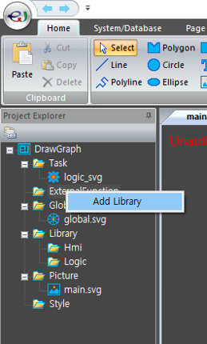
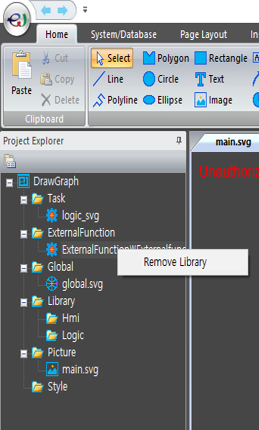

# 외부함수 등록 방법

enuSpace에서는 외부함수를 등록할 수 있는 모듈을 지원한다.

내부에서 지원하는 Script 함수 외에 필요한 함수를 사용자가 직접 C++코드에서 작성하여 Script에서 사용할 수 있다.

## 외부함수 등록 모듈 생성 방법
---


Visual Studio에서 MFC 동적 연결 라이브러리로 새 프로젝트를 만든다. 

## 외부함수 작성 방법
---

```cpp
#define USE_SDK
#include "enuspace_sdk/x64/header/enuLibrary.h" // EnuSpace SDK Include는 필수!!!

int Adder(lua_State* L)
{
	/// /////////////////////////////////////////////////////////
	// 외부함수 사용시 디폴트 파라미터 영역입니다. 아래영역은 수정하지 마세요.
	const char* str;
	str = luaL_checkstring(L, 1);
	CString strPageName(str);

	str = luaL_checkstring(L, 2);
	CString strScriptName(str);
	/// /////////////////////////////////////////////////////////

	int first = lua_tonumber(L, 3);
	int second = lua_tonumber(L, 4);
	int cc = first + second;

	lua_pushnumber(L, cc);  //출력하는 값
	return 1;
}


extern "C" __declspec(dllexport) bool OnLoad()
{
	enuRegisterFunction(L"UserAdder", Adder);   // enuRegisterFunction(L"script에 등록할 함수 명", 등록할 함수 포인터)
	return true;
}
extern "C" __declspec(dllexport) bool OnUnload()
{
	enuDeleteFunction(L"UserAdder", Formula);  // enuDeleteFunction(L"script에서 제거할 함수 명", 제거할 함수 포인터)
	return true;
}

```
* Script로부터 입력받는 Parameter 설정

```cpp
lua_tonumber(L, 3); // 함수의 첫 번쨰 Parameter
lua_tonumber(L, 4); // 함수의 두 번쨰 Parameter

// 입력받는 인자가 number일 때는 lua_tonumber 사용
// 입력받는 인자가 string일 때는 luaL_checkstring 사용
```

* 출력 값 설정

```cpp
lua_pushnumber(L, cc);  // 출력하는 값이 number
lua_pushstring(L, str); // 출력하는 값이 string

// 출력하는 값이 number일 때는 lua_pushnumber 사용
// 출력하는 값이 string일 때는 lua_pushstring 사용

return 1; // 출력하는 값의 개수를 return 한다.

// 만약 출력하는 값이 없을 때는 return 0;
```

## 주의사항
---

1) 외부함수 등록 함수(enuRegisterFunction)는 Onload()에서 수행하고, 외부함수 제거 함수(enuDeleteFunction)는 OnUnload()에서 수행한다.

```cpp
extern "C" __declspec(dllexport) bool OnLoad()
{
	enuRegisterFunction(L"UserAdder", Adder);   // enuRegisterFunction(L"script에 등록할 함수 명", 등록할 함수 포인터)
	return true;
}
extern "C" __declspec(dllexport) bool OnUnload()
{
	enuDeleteFunction(L"UserAdder", Formula);  // enuDeleteFunction(L"script에서 제거할 함수 명", 제거할 함수 포인터)
	return true;
}
```
참조 : [enuRegisterFunction](./sdk_api_enuregisterfunction.md), [enuDeleteFunction](./sdk_api_enudeletefunction.md)

2) [Deadlock 발생 가능성](./dev_warning.md)

등록한 외부함수로 작동하는 함수 내부에서 동기 함수(예: enuGetObjectById)를 사용 시 지속적인 return 대기가 발생, 즉 DeadLock 발생 가능성이 있다.

## 환경설정
---

1) enuspace_sdk의 enuLibrary.h를 include한다. SvgDefine.h를 enuLibrary.h 내부에서 include 하도록 설정되어 있다.
```cpp
#define USE_SDK
#include "enuspace_sdk/x64/header/enuLibrary.h" // EnuSpace SDK Include는 필수!!!
```

2) 속성 페이지에서 추가 종속성 설정한다.

enuSpaceLib.lib와 lua53.lib를 추가 종속성에 설정한다.

* 구성속성 -> 링커 -> 입력 -> 추가종속성 설정
	* enuspace_sdk\x64\lib\enuSpaceLib.lib
	* enuspace_sdk\x64\header\lua53\lua53.lib

3) 디버깅 설정

외부함수 등록 모듈을 통해 바로 enuSpace를 실행시켜 디버깅 할 수 있도록 설정한다. 

\[필수\]
* 구성속성 -> 디버깅 -> 명령
	* 실행 파일인 enuspace.exe의 Path를 입력한다.
	* 예시 : D:\Git\enuspace.exe

\[선택 사항\]
* 구성속성 -> 디버깅 -> 명령 인수
	* 실행 하려는 프로젝트의 파일을 입력한다. 이곳에 입력시 enuSpace.exe에서 프로젝트파일 설정 없이 바로 프로젝트가 열린다.
	* 예시 : D:\Git\Sample\Sample.enup

## enuSpace에서 함수 등록 방법

Project tree 창에서 ExternalFunction 폴더 마우스 우 클릭 이벤트를 통해 외부함수 등록 모듈을 추가와 제거한다.

 

외부함수 등록 모듈이 EnuSpace 등록에 성공할 시, 아래의 그림처럼 외부함수 등록 모듈이 Project tree에 나타난다.


---
외부 함수 등록 성공 시 출력 창에 아래와 같은 메세지가 출력된다.
* 출력 창 메세지
	* 등록 성공 시 : RegisterFunction Sucess
	* 해제 성공 시 : DeleteFunction Success

---
## 등록된 외부함수 Script에서 사용방법

```lua
	function Sample()
		local a = 3
		local b = 4
		local c = UserAdder(a,b) -- 등록된 위부함수 사용
	end
```
Script에서 위와 같이 외부 함수를 사용한다.


