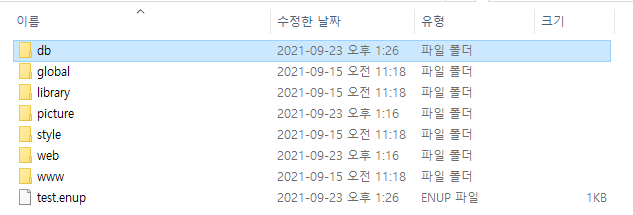
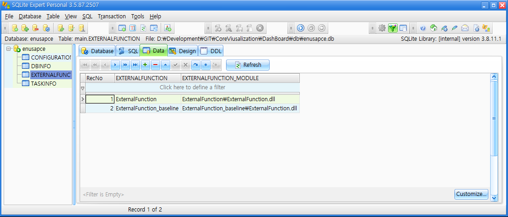
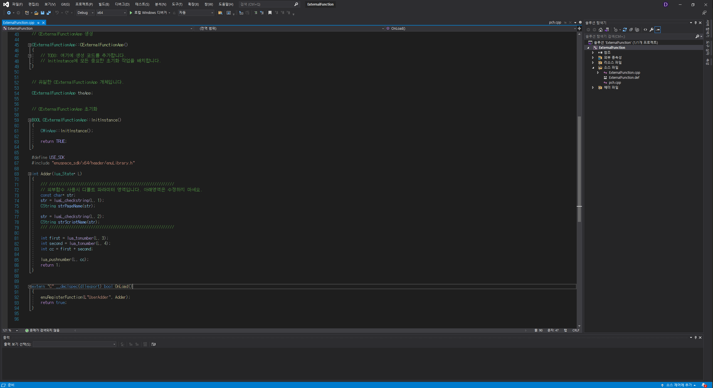

# 외부함수 등록 방법

enuSpace에서는 외부함수를 등록할 수 있는 모듈을 지원한다.

내부에서 지원하는 Script 함수 외에 필요한 함수를 사용자가 직접 C++코드에서 작성하여 Script에서 사용할 수 있다.

외부 함수 등록 모듈은 ExternalFunction.dll로 만들어진다.

_내부에서 ExternalFunction.dll로 접근하는 방법으로는 ./db/enusapce.db의 EXTERNALFUNTION 테이블의 정보를 참조하여 이뤄진다._

_EXTERNALFUNTION 테이블에는 저장된 폴더 컬럼과 ExternalFunction.dll로 접근하는 경로 컬럼이 있다._

_ExternalFunction.dll로 접근하는 경로의 컬럼에는 프로젝트 폴더를 기준으로 한 경로를 저장한다._

## 외부함수 등록 모듈 생성 방법
---


MFC 동적 연결 라이브러리로 새 프로젝트를 만든다. 


## 외부함수 등록 모듈을 enuSpace에 등록 방법
---


Project tree 창에서 ExternalFunction 폴더 마우스 우 클릭 시, 위와 같은 버튼이 나타난다. 

이 버튼을 클릭해 EXTERNALFUNTION.dll의 을 등록한다.




외부함수 등록 모듈이 EnuSpace 등록에 성공할 시, 위의 그림처럼 외부함수 등록 모듈이 Project tree에 나타난다.

## 외부함수 작성 방법
---

```cpp
#define USE_SDK
#include "enuspace_sdk/x64/header/enuLibrary.h" // EnuSpace SDK Include는 필수!!!

int Adder(lua_State* L)
{
	/// /////////////////////////////////////////////////////////
	// 외부함수 사용시 디폴트 파라미터 영역입니다. 아래영역은 수정하지 마세요.
	const char* str;
	str = luaL_checkstring(L, 1);
	CString strPageName(str);

	str = luaL_checkstring(L, 2);
	CString strScriptName(str);
	/// /////////////////////////////////////////////////////////

	int first = lua_tonumber(L, 3);
	int second = lua_tonumber(L, 4);
	int cc = first + second;

	lua_pushnumber(L, cc);  //출력하는 값
	return 1;
}


extern "C" __declspec(dllexport) bool OnLoad()
{
	enuRegisterFunction(L"UserAdder", Adder);   // enuRegisterFunction(L"script에서 사용할 함수 명", 작성한 함수)
	return true;
}
```
참조 : [enuRegisterFunction](enusappapi_enuregisterfunction)

* Script로부터 입력받는 Parameter 설정

```cpp
lua_tonumber(L, 3); // 함수의 첫 번쨰 Parameter
lua_tonumber(L, 4); // 함수의 두 번쨰 Parameter

// 입력받는 인자가 number일 때는 lua_tonumber 사용
// 입력받는 인자가 string일 때는 luaL_checkstring 사용
```

* 출력 값 설정

```cpp
lua_pushnumber(L, cc);  // 출력하는 값이 number
lua_pushstring(L, str); // 출력하는 값이 string

// 출력하는 값이 number일 때는 lua_pushnumber 사용
// 출력하는 값이 string일 때는 lua_pushstring 사용

return 1; // 출력하는 값의 개수를 return 한다.

// 만약 출력하는 값이 없을 때는 return 0;
```

## 외부 함수 사용
---


외부 함수 등록 성공 시 Debug 창에 위와 같은 메세지가 표현된다.



Script에서 위와 같이 외부 함수를 사용한다.

