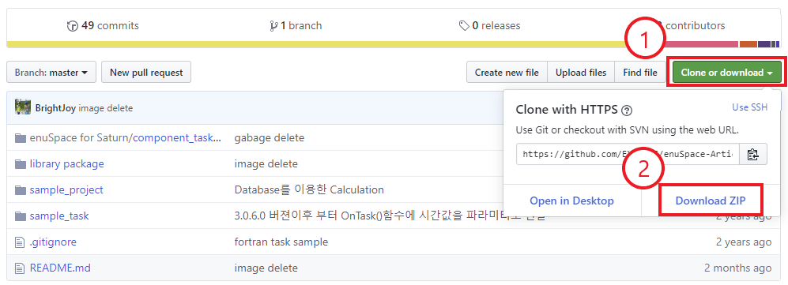
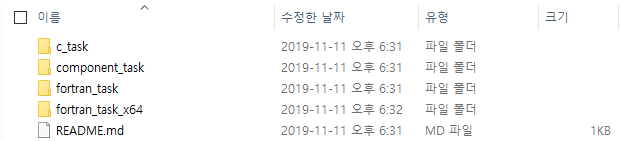
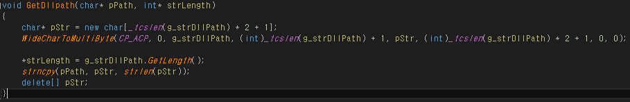
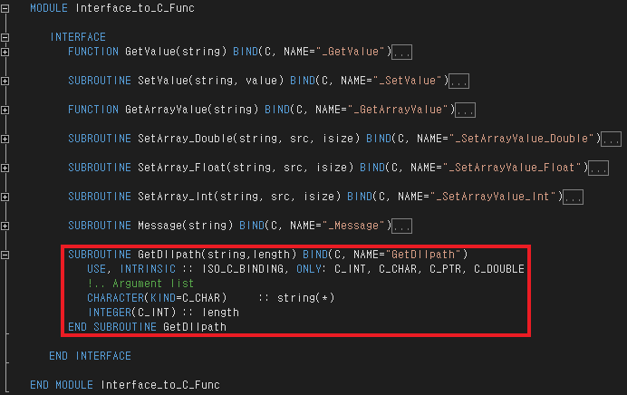

# C++ 에서 Fortran으로 Project Path 보내기

---

C++에서 Fortran으로 Project Path보내는 방법에 대하여 설명합니다.

우선 아래 링크로 접속하여 샘플프로젝트를 다운 받습니다.

**reference sample : **[**https://github.com/EXPNUNI/enuSpace-Article/tree/maste**](https://github.com/EXPNUNI/enuSpace-Article/tree/master)**r**

위 링크로 접속하면 아래와 같은 화면이 나옵니다.위 화면에서 1번 2번 순서대로 마우스클릭하면 샐픔 프로젝트를 다운 받을 수 있습니다.

다운받은 압축 파일을 임의의 폴더에 풀어 주시고 sample\_task폴더에 들어갑니다.

여기서 enuSpace 64비트 버전을 쓰고계신분은 'fortran\_task\_x64'를 그렇지 않은 분은 'fortran\_task'폴더로 들어가시면 됩니다.\(32비트, 64비트 버전의 설명은 동일합니다. enuSpace와 버전을 동일하게 맞춰야 task dll 이 정상 동작합니다.\)



이후 task -&gt; CoreTaskF 폴더로 들어가서 'CoreTask.sln' 파일을 실행합니다.

※ CoreTask프로젝트는 2008 버전에서 생성된 프로젝트입니다.

---

# C++\) Project Path 보내는 함수 생성

---

CoreTask 프로젝트를 실행하고 'CoreTask.cpp'파일을 열어줍니다.


'CoreTask.cpp'에서 extern "C" 부분을 찾아서 위 그림의 빨간 네모부분을 추가해 줍니다. \( void GetDllpath\(char\*pPath, int\* strLength\)

이후 소스파일 맨 아래에 위 그림과 같이 소스를 추가해 줍니다.

※ 소스

void GetDllpath\(char\* pPath, int\* strLength\)  
{  
    char\* pStr = new char\[\_tcslen\(g\_strDllPath\) \* 2 + 1\];

```
WideCharToMultiByte\(CP\_ACP, 0, g\_strDllPath, \(int\)\_tcslen\(g\_strDllPath\) + 1, pStr, \(int\)\_tcslen\(g\_strDllPath\) \* 2 + 1, 0, 0\);

\*strLength = g\_strDllPath.GetLength\(\);

strncpy\(pPath, pStr, strlen\(pStr\)\);

delete\[\] pStr;
```

}

---

# Fortran\) Project Path 받는 서브루틴 생성

---

우선 Fortran 프로젝트에서 interface.f90 파일을 열어줍니다.



'MODULE Interface\_to\_C\_Func' 부분으로 이동하여 위 그림의 빨간 네모와 같이 소스를 추가해줍니다.

※ 소스

```
     SUBROUTINE GetDllpath\(string,length\) BIND\(C, NAME="GetDllpath"\)

        USE, INTRINSIC :: ISO\_C\_BINDING, ONLY: C\_INT, C\_CHAR, C\_PTR, C\_DOUBLE

        !.. Argument list

        CHARACTER\(KIND=C\_CHAR\)     :: string\(\*\)

        INTEGER\(C\_INT\) :: length

     END SUBROUTINE GetDllpath
```


위 단계를 모두 수행하고, 서브루틴을 사용하고자 하는 Fortran 파일에 위 그림과 같이 Project Path를 받아올 변수를 생성합니다.

※ 변수 생성은 사용하고자하는 파일에 계속 생성해야합니다.

※ 소스

integer :: path\_length

character\(300\) :: dll\_path, file\_name, full\_path

common /path/ path\_length,dll\_path,file\_name,full\_path


변수 생성 후 서브루틴을 호출하려면 위 그림과 같이 호출한 후 'dll\_path'문자열을 사용하면 됩니다.  
\(위 그림의 첫번째 줄에서 project path와 project path 길이를 가져옵니다. 이후 두번째 줄에서 project path 길이 만큼 문자열을 잘라서 사용할 수 있도록 하였습니다.\)

※ 소스

call GetDllPath\(dll\_path, path\_length\)

dll\_path = dll\_path\(1:path\_length\)

