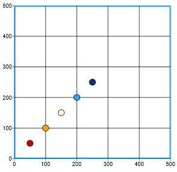
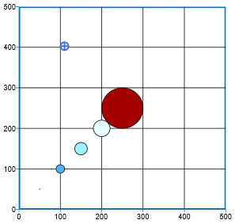

Revision 2019.02.21 - enuSpace for saturn \(v4.0\)

# Chart Series elevation

---

차트의 시리즈의 elevation 속성을 이용하여 데이터를 가시화합니다.

### Series의 Scatter 차트 \(color\)

---

#### Series Attribute

-&gt; series-type : scatter

-&gt; data : 50,50 100,100 150,150 200,200 250,250

#### Series Attribute \(elevation\)

-&gt; elevation-type : color

-&gt; color-min : 0

-&gt; color-max : 300

-&gt; color-elevation : rgb\(10,50,120\);rgb\(15,75,165\);rgb\(30,110,200\);rgb\(60,160,240\);rgb\(80,180,250\);rgb\(130,210,255\);rgb\(160,240,255\);rgb\(200,250,255\);rgb\(230,255,255\);rgb\(255,250,220\);rgb\(255,232,120\);rgb\(255,192,60\);rgb\(255,160,0\);rgb\(255,96,0\);rgb\(255,50,0\);rgb\(225,20,0\);rgb\(192,0,0\);rgb\(165,0,0\)

-&gt; elevation-data : 250 200 150 50 0

Display Result\) Elevation 타입을 색상으로 설정, 색상의 최소, 최대값, 컬러 색상표 그리고 elevation 데이터를 지정하였을 경우 아래와 같이 elevation 데이터의 값에 따라서 Scatter 차트의 시리즈 색상이 설정된다.

-&gt; elevation-data : 0 50 150 200 250

Display Result\) elevation 데이터를 반대로 지정하였을 경우.

\_

#### Series의 Scatter 차트 \(volume\)

---

#### Series Attribute \(elevation\)

-&gt; elevation-type : volume

-&gt; volume-type : cx+cy

-&gt; volume-min : 0

-&gt; volume-max : 250

-&gt; volume-elevation : 1;100

-&gt; elevation-data : 0 50 75 100 250

Display Result\) elevation 타입을 volume으로 지정. elevation-data의 데이터값에 맞는 볼륨의 최소, 최대값 설정한다. 설정된 볼륨 최소 및 최대값에 따라서 지정한 volume-elevation 값으로 심볼의 사이즈값으로 나타난다.

-&gt; volume-type : cx, cy, height, position-x, position-y

Display Result\) 볼륨 타입 설정에 따른 디스플레이 결과 \(left -&gt; right\)

\_

#### Series의 Scatter 차트 \(color+volume\)

---

#### Series Attribute \(elevation\)

-&gt; elevation-type : color+volume

-&gt; color-min : 0

-&gt; color-max : 250

-&gt; color-elevation : rgb\(10,50,120\);rgb\(15,75,165\);rgb\(30,110,200\);rgb\(60,160,240\);rgb\(80,180,250\);rgb\(130,210,255\);rgb\(160,240,255\);rgb\(200,250,255\);rgb\(230,255,255\);rgb\(255,250,220\);rgb\(255,232,120\);rgb\(255,192,60\);rgb\(255,160,0\);rgb\(255,96,0\);rgb\(255,50,0\);rgb\(225,20,0\);rgb\(192,0,0\);rgb\(165,0,0\)

-&gt; volume-type : cx+cy

-&gt; volume-min : 0

-&gt; volume-max : 250

-&gt; volume-elevation : 1;100

-&gt; elevation-data : 0,0 50,50 75,75 100,100 250,250

Display Result\) 색상과 볼륨을 elevation-data의 값에 따라서 표현된다.

