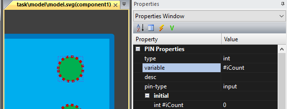
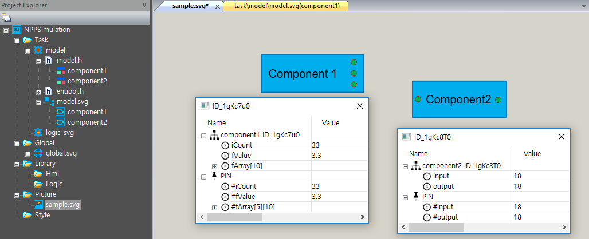

# External Task - Component Task

##### \(enuSpace for saturn\)

---

External Task-Component기반의 Task를 구성하는 방법에 대하여 설명합니다.

Component Task는 그래픽 객체와 모델의 구조체 정보와 연동하는 방법입니다.


enuSpace for saturn 버젼에서는 C++ 해더 구조체 정보를 이용하여 Task의 메모리를 동적 생성합니다.

### Component Task 구성

Componet Task를 구성하기 위해서 태스크의 타입을 TASK\_TYPE\_OBJECTARRAY로 정의합니다.

```cpp
extern "C" __declspec(dllexport) int GetTaskType()
{
    return TASK_TYPE_OBJECTARRAY;
}
```

enuSpace는 태스크의 타입정보를 확인하여 타입에 맞는 extern함수를 호출합니다.

TASK\_TYPE\_OBJECTARRAY 설정시 enuSpace에서 모델 객체를 추가한 객체정보를 배열형태로 Task의 함수 OnSetObjectArray\(CPtrArray\* object\)를 통하여 전달합니다.

```cpp
extern "C" __declspec(dllexport) void OnSetObjectArray(CPtrArray* Object)
{
    if (Object)    enuObject = Object;
}
```

### 모델 구현

Component 기반의 Task를 개발하기 개별 Component의 구조체를 선언하고 해당 Component의 동작 모델을 구현합니다.

구조체 선언 예시.

```cpp
#pragma once

#include "..\model\model\GlobalHeader.h"
#include <string>
#include <vector>
#include <afxcoll.h>
#include "EnuObj.h"

#ifndef _MODEL_HEADER__
#define _MODEL_HEADER__

extern CPtrArray *enuObject;
extern double g_DT;

#pragma pack(push, 1) 

struct component1 : EnuObject
{
    int iCount;
    double fValue;
    double fArray[5][10];
    component1()
    {
        iCount = 0;
        fValue = 0;
    }
    void Simulation(void);
};
struct component2 : EnuObject
{
    int input;
    int output;
    component2()
    {
        input = 0;
        output = 0;
    }
    void Simulation(void);
};
#pragma pack(pop) 

///////////////////////////////////////////////////////////////////////////
void InitModel();
void TaskModel();
///////////////////////////////////////////////////////////////////////////


#endif
```

Componet1과 Component2의 구조체를 선언합니다.

각 컴포넌트에 해당하는 동작 모델 구현 예시.

```cpp
#include "stdafx.h"
#include "..\model.h"


void InitModel()
{

}

void TaskModel()
{
    for (int index = 0; index < enuObject->GetSize(); ++index)
    {
        EnuObject *pObj = (EnuObject *)(enuObject->GetAt(index));

        if (wcscmp(pObj->type, L"component1") == 0)
            ((component1*)pObj)->Simulation();
        else if (wcscmp(pObj->type, L"component2") == 0)
            ((component2*)pObj)->Simulation();
    }
}

void component1::Simulation(void)
{
    iCount = iCount + 1;
    fValue = fValue + 0.1;
}

void component2::Simulation(void)
{
    output = input;
}
```

enuSpace는 설정된 Task의 Cycle에 따라서 매주기 Task의 메인 함수 OnTask\(\)함수를 호출합니다.

```cpp
extern "C" __declspec(dllexport) bool OnTask(__int64 time)
{
    try
    {
        if (g_fcbGetValue)
        {
            VariableStruct data;
            data = g_fcbGetValue(L"dt.model");
            if (data.type == DEF_DOUBLE)
                g_DT = *(double*)data.pValue;
        }

        TaskModel();            
        return true;
    }
    catch (...)
    {

    }
    return false;
}

void TaskModel()
{
    for (int index = 0; index < enuObject->GetSize(); ++index)
    {
        EnuObject *pObj = (EnuObject *)(enuObject->GetAt(index));

        if (wcscmp(pObj->type, L"component1") == 0)
            ((component1*)pObj)->Simulation();
        else if (wcscmp(pObj->type, L"component2") == 0)
            ((component2*)pObj)->Simulation();
    }
}
```

### Component Symbol 제작

Task 모델이 위치한 동일한 위치에 svg 파일에 심볼을 정의합니다. enuSpace for Saturn 스튜디오를 이용하여 Svg 심볼을 제작합니다.


Component 심볼을 그래픽 객체를 통하여 디자인을 수행합니다. Component의 구조체 정보를 설정합니다. 모델에서 추가된 구조체 정보가 DropDown 박스를 통하여 나타납니다.

외부와 연동하기 위한 pin 객체를 추가합니다.

추가한 pin 객체의 속성은 별도의 변수로 적용할 수 있으며, 구조체의 변수를 참조변수로 선언할 수 있습니다.  참조변수로 설정하려면 \# 문자를 변수 이름앞에 추가합니다. \#문자는 외부 변수의 참조를 뜻합니다.



Task 모델과 그래픽 심볼설정이 완료후, 픽쳐 페이지를 통하여 해당 컴포넌트를 추가하여 시뮬레이션을 수행합니다.



### enuSpace와 Task간의 인터페이스 함수.

```cpp
//////////////////////////////////////////////////////////////////////////////////////////////
// enuSpace interface function pointer.
void(*g_fcbSetValue)(wchar_t*, double) = NULL;
VariableStruct(*g_fcbGetValue)(wchar_t*) = NULL;
void(*g_fcbSetArrayValue)(wchar_t*, void*, int, int) = NULL;
void(*g_fcbSetReShapeArrayValue)(wchar_t*, void*, int, int) = NULL;
void(*g_fcbSetPinInterfaceVariable)(wchar_t*, void*, int, int) = NULL;
VariableStruct(*g_fcbGetArrayValue)(wchar_t*) = NULL;
void(*g_fcbPrintMessage)(wchar_t*, wchar_t*) = NULL;

//////////////////////////////////////////////////////////////////////////////////////////////
// enuSpace interface functions.
extern "C" __declspec(dllexport) void SetCallBack_SetValue(void fcbSetValue(wchar_t*, double));
extern "C" __declspec(dllexport) void SetCallBack_GetValue(VariableStruct fcbGetValue(wchar_t*));
extern "C" __declspec(dllexport) void SetCallBack_SetArrayValue(void fcbSetArrayValue(wchar_t*, void*, int, int));
extern "C" __declspec(dllexport) void SetCallBack_GetArrayValue(VariableStruct fcbGetArrayValue(wchar_t*));
extern "C" __declspec(dllexport) void SetCallBack_SetReShapeArrayValue(void fcbSetReShapeArrayValue(wchar_t*, void*, int, int));
extern "C" __declspec(dllexport) void SetCallBack_SetPinInterfaceVariable(void fcbSetPinInterfaceVariable(wchar_t*, void*, int, int));
extern "C" __declspec(dllexport) void SetCallBack_PrintMessage(void fcbPrintMessage(wchar_t*, wchar_t*));

extern "C" __declspec(dllexport) int GetTaskType();
extern "C" __declspec(dllexport) bool IsEnableTransfer(wchar_t* pMyType,wchar_t* pFromType, wchar_t* pToType);
extern "C" __declspec(dllexport) bool IsTaskStopWhenModify();

extern "C" __declspec(dllexport) bool OnInit();
extern "C" __declspec(dllexport) bool OnLoad();
extern "C" __declspec(dllexport) bool OnUnload();
extern "C" __declspec(dllexport) bool OnTask(__int64 time);
extern "C" __declspec(dllexport) void OnModeChange(int iMode);
extern "C" __declspec(dllexport) void ExecuteFunction(wchar_t* pStrFunction);

extern "C" __declspec(dllexport) void OnEditComponent(wchar_t* pStrSymbolName, wchar_t* pStrID);
extern "C" __declspec(dllexport) void OnShowComponent(wchar_t* pStrSymbolName, wchar_t* pStrID);
extern "C" __declspec(dllexport) bool OnShowHelp(wchar_t* pStrSymbolName);

extern "C" __declspec(dllexport) void OnSetObjectArray(CPtrArray* Object);
//////////////////////////////////////////////////////////////////////////////////////////////

//////////////////////////////////////////////////////////////////////////////////////////////
extern "C" __declspec(dllexport) void SetCallBack_SetValue(void fcbSetValue(wchar_t*, double))
{
    g_fcbSetValue = fcbSetValue;
}

extern "C" __declspec(dllexport) void SetCallBack_GetValue(VariableStruct fcbGetValue(wchar_t*))
{
    g_fcbGetValue = fcbGetValue;
}

extern "C" __declspec(dllexport) void SetCallBack_SetArrayValue(void fcbSetArrayValue(wchar_t*, void*, int, int))
{
    g_fcbSetArrayValue = fcbSetArrayValue;
}

extern "C" __declspec(dllexport) void SetCallBack_GetArrayValue(VariableStruct fcbGetArrayValue(wchar_t*))
{
    g_fcbGetArrayValue = fcbGetArrayValue;
}

extern "C" __declspec(dllexport) void SetCallBack_SetReShapeArrayValue(void fcbSetReShapeArrayValue(wchar_t*, void*, int, int))
{
    g_fcbSetReShapeArrayValue = fcbSetReShapeArrayValue;
}

extern "C" __declspec(dllexport) void SetCallBack_SetPinInterfaceVariable(void fcbSetPinInterfaceVariable(wchar_t*, void*, int, int))
{
    g_fcbSetPinInterfaceVariable = fcbSetPinInterfaceVariable;
}

extern "C" __declspec(dllexport) void SetCallBack_PrintMessage(void fcbPrintMessage(wchar_t*, wchar_t*))
{
    g_fcbPrintMessage = fcbPrintMessage;
}

extern "C" __declspec(dllexport) void OnSetObjectArray(CPtrArray* Object)
{
    if (Object)    enuObject = Object;
}

extern "C" __declspec(dllexport) bool OnLoad()
{
    return true;
}

extern "C" __declspec(dllexport) bool OnInit()
{
    try
    {
        if (g_fcbGetValue)
        {
            VariableStruct data;
            data = g_fcbGetValue(L"dt.model");
            if (data.type == DEF_DOUBLE)
                g_DT = *(double*)data.pValue;
        }
        InitModel();

        return true;
    }
    catch (...)
    {

    }
    return false;
}

extern "C" __declspec(dllexport) bool OnTask(__int64 time)
{
    try
    {
        if (g_fcbGetValue)
        {
            VariableStruct data;
            data = g_fcbGetValue(L"dt.model");
            if (data.type == DEF_DOUBLE)
                g_DT = *(double*)data.pValue;
        }
        TaskModel();
        return true;
    }
    catch (...)
    {

    }
    return false;
}

extern "C" __declspec(dllexport) bool OnUnload()
{
    return true;
}

extern "C" __declspec(dllexport) void OnEditComponent(wchar_t* pStrSymbolName, wchar_t* pStrID)
{

}

extern "C" __declspec(dllexport) void OnShowComponent(wchar_t* pStrSymbolName, wchar_t* pStrID)
{

}

extern "C" __declspec(dllexport) void OnModeChange(int iMode)
{

}

extern "C" __declspec(dllexport) void ExecuteFunction(wchar_t* pStrFunction)
{

}

extern "C" __declspec(dllexport) bool OnShowHelp(wchar_t* pStrSymbolName)
{
    return true;
}

extern "C" __declspec(dllexport) int GetTaskType()
{
    return TASK_TYPE_OBJECTARRAY;
}

extern "C" __declspec(dllexport) bool IsEnableTransfer(wchar_t* pMyType,wchar_t* pFromType, wchar_t* pToType)
{
    return true;
}

extern "C" __declspec(dllexport) bool IsTaskStopWhenModify()
{
    return true;
}
```


