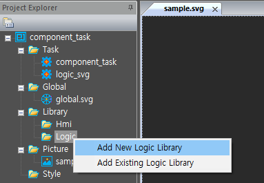

# External Task - Component Task 

\(enuSpace for jupiter\)

---

External Task-Component기반의 Task를 구성하는 방법에 대하여 설명합니다.

reference sample : [https://github.com/EXPNUNI/enuSpace-Article/tree/master/sample\_task/component\_task](https://github.com/EXPNUNI/enuSpace-Article/tree/master/sample_task/component_task)

Component Task는 그래픽 객체를 통하여 모델을 연동하는 방법입니다.

enuSpace에서 추가된 모델 컴포넌트 핀객체가 외부 테스크의 메모리를 지시하도록 설정합니다. enuSpace의 모델 컴포넌트 핀객체가 외부 테스크의 변수를 지시함으로서 태스크 제어 및 모니터링이 가능하게 됩니다. enuSpace는 외부 태스크 로드시 해당 외부 태스크에게 핀변수 인터페이스를 위한 함수\(SetPinInterfaceVariable\)를 제공하고, 외부 태스크는 제공된 함수를 이용하여 자신의 변수정보를 enuSpace의 핀객체에 전달함으로서 컴포넌트 태스크 구성이 마무리됩니다.


## SVG 그래픽 구성

Component Task는 해당 Task의 디렉토리에 dll, svg파일이 존재하여야 합니다. enuSpace가 프로젝트를 로딩 수행시 해당 Task의 dll, svg파일을 읽어와 매칭작업을 수행합니다.

컴포넌트용 SVG 파일을 생성하는 방법은 enuSpace스튜디오에서 제공하는 로직라이브러리 생성 기능을 활용합니다. 구현이 완료된 SVG파일은 해당 Task의 디렉토리에 옮긴후, 작업된 SVG파일은 제거를 수행합니다.



로직 라이브러리 생성방법에 따라서 아래 그림과 같이 핀객체를 추가하고, 핀객체의 속성정보를 입력합니다. 핀의 변수명에 해당하는 속성은 name 입니다. name은 일반 변수형태로 이름을 입력하거나, 배열변수명으로 정의가 가능합니다.

예\) m\_output, m\_output\[10\], m\_output\[10\]\[10\]

변수명을 정의하였다면, 해당하는 핀의 변수 타입정보를 지정합니다. 변수의 타입은 bool, int, float, double, string을 지정할수 있습니다. 해당 핀의 입,출력정보를 지정합니다.


PIN객체의 속성 테이블

| 속성 | 설명 |
| :--- | :--- |
| name | 객체의 멤버변수 이름 |
| desc | 변수 설명 |
| pin-type | input, output, const |
| default-value | 초기값 |
| var-type | bool, int, float, double, string |
| auto | 핀객체의 자동 변경 옵션 |

데이터 입출력 핀정보를 모두 구성하였다면, 해당 라이브러리를 저장합니다. 저장된 라이브러리 파일을 dll 파일의 위치로 이동시킨후 편집기를 통하여 추가된 라이브러리를 제거합니다.

## Component Task 구성

reference code : [https://github.com/EXPNUNI/enuSpace-Article/blob/master/sample\_task/component\_task/Task/component\_task/component\_task/CoreTask.cpp](https://github.com/EXPNUNI/enuSpace-Article/blob/master/sample_task/component_task/Task/component_task/component_task/CoreTask.cpp)

reference code : [https://github.com/EXPNUNI/enuSpace-Article/blob/master/sample\_task/component\_task/Task/component\_task/component\_task/component.h](https://github.com/EXPNUNI/enuSpace-Article/blob/master/sample_task/component_task/Task/component_task/component_task/component.h)

Componet Task를 구성하기 위해서 태스크의 타입을 TASK\_TYPE\_FLOW\_COMPONENT\_PAGE로 정의합니다. enuSpace는 본 타입정보를 확인하여 픽쳐 페이지별로 플로우 네트워크 정보가 포함된 json 파일을 생성합니다. 생성된 json 파일은 외부 태스크에서 초기화 루틴에서 읽어와 활용합니다.

```cpp
extern "C" __declspec(dllexport) int GetTaskType()
{
    return TASK_TYPE_FLOW_COMPONENT_PAGE;
}
```

아래의 함수는 enuSpace에서 핀변수 인터페이스를 위한 함수포인터를 제공하는 함수입니다.

```cpp
extern "C" __declspec(dllexport) void SetCallBack_SetPinInterfaceVariable(void fcbSetPinInterfaceVariable(wchar_t*, void*, int, int))
{
    g_fcbSetPinInterfaceVariable = fcbSetPinInterfaceVariable;
}
```

enuSpace는 외부 태스크를 실행할 경우, 초기화 함수 OnInit\(\)를 호출합니다. 플로우 네트워크 정보가 포함된 json 파일로 로드하여 해당 컴포넌트의 타입에 맞는 모델 객체를 생성합니다.

```cpp
void component_input(component *pcomponent, std::string id, Json::Value pInputItem)
{
    int iSize = (int)pInputItem.size();
    for (int subindex = 0; subindex < iSize; ++subindex)
    {
        Json::Value ItemValue = pInputItem[subindex];

        std::string strPinName = ItemValue.get("pin-name", "").asString();                                
        std::string strPinType = ItemValue.get("pin-type", "").asString();                                
        std::string strPinInitial = ItemValue.get("pin-initial", "").asString();                        
        std::string strPinDataType = ItemValue.get("pin-datatype", "").asString();                
        std::string strPinShape = ItemValue.get("pin-shape", "").asString();        

        std::string strVariable = id + "." + strPinName;

        VariableStruct* pData = NULL;
        std::wstring widestr = std::wstring(strVariable.begin(), strVariable.end());
        g_DBMapList.Lookup((wchar_t*)widestr.c_str(), pData);

        if (g_fcbGetValue && pData == NULL)
        {
            VariableStruct Data = g_fcbGetValue((wchar_t*)widestr.c_str());
            if (Data.pValue)
            {
                if (!pcomponent->SetInitValue(strPinName, &Data))
                {
                    CString strMsg;
                    strMsg.Format(L"warning : %s - Interface variable missed.", widestr.c_str());
                    PrintMessage(strMsg);
                }
            }
        }
    }
}

bool Init_component(std::string config_doc, std::string page_name)
{
    Json::Value root;
    Json::Reader reader;

    bool parsingSuccessful = reader.parse(config_doc, root);
    if (!parsingSuccessful)
    {
        return false;
    }

    Json::Value InputItem;
    const Json::Value plugins = root["object"];
    for (int index = 0; index < (int)plugins.size(); ++index)
    {
        Json::Value Item = plugins[index];

        std::string strSymbolName = Item.get("symbol-name", "").asString();
        std::string strId = Item.get("id", "").asString();

        if (strSymbolName == "#component")
        {
            ObjectInfo* pObj = nullptr;
            const std::map<std::string, ObjectInfo*>::const_iterator aLookup = m_ObjectMapList.find(strId);
            const bool bExists = aLookup != m_ObjectMapList.end();
            if (bExists == false)
            {
                component *pComponent = new component();
                std::wstring widestr = std::wstring(strId.begin(), strId.end());

                Json::Value InputItem = Item["input"];
                component_input(pComponent, strId, InputItem);

                pComponent->SetInterface(widestr.c_str(), g_fcbSetPinInterfaceVariable);

                ObjectInfo* pCreateObj = new ObjectInfo;
                pCreateObj->pObject = pComponent;
                pCreateObj->id = strId;

                m_ObjectMapList.insert(std::pair<std::string, ObjectInfo*>(strId, pCreateObj));
            }
        }
    }

    return true;
}

extern "C" __declspec(dllexport) bool OnInit()
{
    try
    {
        ObjectMapClear();
        InterfaceDataMapClear();

        CString dirName = g_strDllPath;
        CString strExt = L"/*.json";

        CFileFind finder;

        BOOL bWorking = finder.FindFile(dirName + strExt);

        while (bWorking)
        {
            bWorking = finder.FindNextFile();
            if (finder.IsDots())
            {
                continue;
            }

            CString logic_file = finder.GetFilePath();

            std::string filename = CStringToString(logic_file);

            CString str;
            CFile pFile;

            if (pFile.Open(logic_file, CFile::modeRead | CFile::typeBinary))
            {
                pFile.Seek(2, CFile::begin);
                size_t fLength = (size_t)pFile.GetLength() - 2;
                TCHAR *th = (TCHAR*)malloc(fLength + sizeof(TCHAR));
                memset(th, 0, fLength + sizeof(TCHAR));
                pFile.Read(th, fLength);

                str = th;
                free(th);
                pFile.Close();

                std::string covertStr;
                covertStr = CStringToString(str);

                WCHAR drive[_MAX_DRIVE];
                WCHAR dir[_MAX_DIR];
                WCHAR fname[_MAX_FNAME];
                WCHAR ext[_MAX_EXT];
                _wsplitpath_s(logic_file, drive, dir, fname, ext);

                std::string pagename;
                pagename = CStringToString(fname);

                Init_component(covertStr, pagename);
            }
        }
        finder.Close();
        return true;
    }
    catch (...)
    {

    }
    return false;
}

extern "C" __declspec(dllexport) bool OnTask()
{
    std::map<std::string, ObjectInfo*>::iterator vit;
    for (vit = m_ObjectMapList.begin(); vit != m_ObjectMapList.end(); ++vit)
    {
        ObjectInfo* pTar = vit->second;
        ((component*)pTar->pObject)->Simulation();
    }

    return true;
}
```

## 모델 예시

SetInterface\(\)함수에서는 객체의 멤버변수의 주소 정보를 그래픽 객체의 핀정보에 전달하여, enuSpace에서 모니터링 및 제어를 수행할 수 있도록 메모리를 할당합니다.

```cpp
#pragma once

#include "GlobalHeader.h"
#include <string>

class component
{
public:
    component()
    {
        m_up = false;
        m_down = false;
        m_output = 0;
        memset(m_output_d, 0, sizeof(double) * 10);
    }

    ~component();

    bool SetInitValue(std::string strVar, VariableStruct* pData)
    {
        if (strVar == "m_output" && pData->type == DEF_INT)                m_output = *(int*)pData->pValue;
        else if (strVar == "m_up" && pData->type == DEF_BOOL)            m_up = *(bool*)pData->pValue;
        else if (strVar == "m_down" && pData->type == DEF_BOOL)            m_down = *(bool*)pData->pValue;
        else if (strVar == "m_output_d" && pData->type == DEF_DOUBLE)    memcpy(m_output_d, (double*)pData->pValue, sizeof(double) * 10);
        else    return false;
        return true;
    }

    bool SetInterface(const wchar_t* id, void fcbSetPinInterfaceVariable(wchar_t*, void*, int, int))
    {
        CString strVariable;
        strVariable.Format(L"%s.%s", id, L"m_output");    fcbSetPinInterfaceVariable(strVariable.GetBuffer(0), &m_output, DEF_INT, 0);

        strVariable.Format(L"%s.%s", id, L"m_up");        fcbSetPinInterfaceVariable(strVariable.GetBuffer(0), &m_up, DEF_BOOL, 0);
        strVariable.Format(L"%s.%s", id, L"m_down");        fcbSetPinInterfaceVariable(strVariable.GetBuffer(0), &m_down, DEF_BOOL, 0);

        strVariable.Format(L"%s.%s", id, L"m_output_d");    fcbSetPinInterfaceVariable(strVariable.GetBuffer(0), &m_output_d, DEF_DOUBLE, 10);

        return true;
    }

    bool m_up;
    bool m_down;

    int m_output;

    double m_output_d[10];

    ///////////////////////////////////////////////////////////////////////////
    void Simulation(void);
    ///////////////////////////////////////////////////////////////////////////
};

#include "stdafx.h"
#include "component.h"

component::~component()
{

}

void component::Simulation(void)
{
    if (m_up)
    {
        m_output = m_output + 1;

        for (int i = 0; i < 10; i++)
        {
            m_output_d[i] = m_output_d[i] + 1;
        }
    }

    else if (m_down)
    {
        m_output = m_output - 1;

        for (int i = 0; i < 10; i++)
        {
            m_output_d[i] = m_output_d[i] - 1;
        }
    }
}
```

## Component Task Control and Monitoring

위와 같이 샘플 코드를 구성하여 dll 파일과 svg 파일이 준비되었다면, 해당 태스크를 등록하고 픽처에 태스크의 컴포넌트 객체를 추가하여 그래픽 기반의 모델을 생성합니다. 생성된 모델을 실행하기 위해서 Task Operation-&gt;Run버튼을 클릭하여 실행합니다.

심볼 컴포넌트를 더블클릭하면 심볼 테이블이 나타나며, 입력 핀변수의 값을 변경하여 출력값을 확인합니다.


