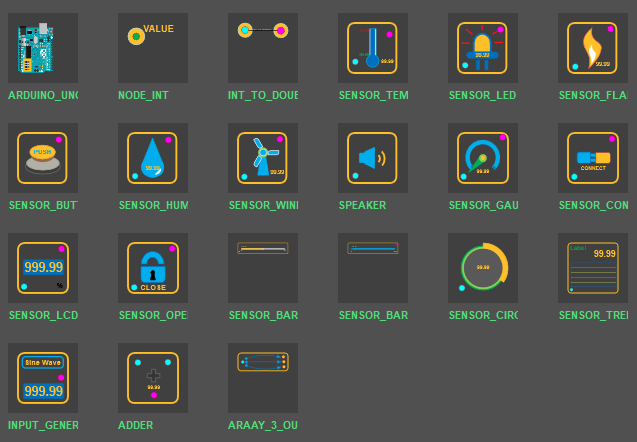
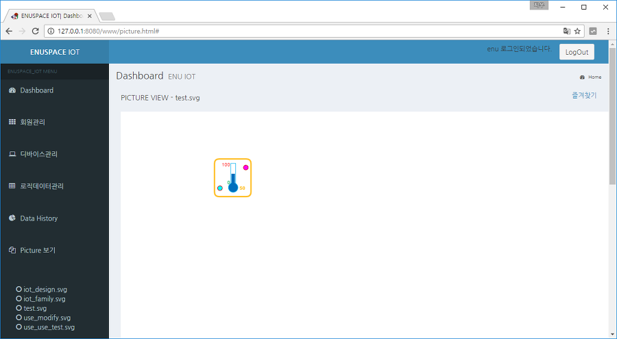
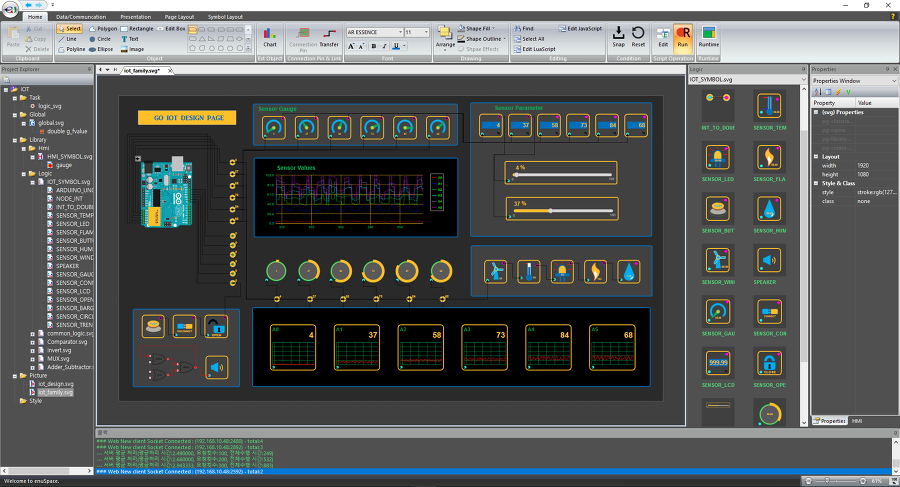

# SVG와 JavaScript를 이용한 다이나믹 로직 심볼 제작 

---

IoT library : [https://github.com/EXPNUNI/enuSpace-Article/tree/master/library%20package](https://github.com/EXPNUNI/enuSpace-Article/tree/master/library package)



## 라이브러리 생성

엔유스페이스를 실행하고 Project Explorer에서 Library하위에서 Logic선택후 Add New logic Library를 선택합니다. 라이브러리 파일이름을 입력후 Create를 수행하면, 새로운 로직파일이 생성됩니다.

생성된 파일을 선택후 팝업메뉴를 이용하여 Add Node를 통하여 새로운 심볼을 생성합니다. 생성된 심볼을 디자인합니다. 디자인 객체를 이용하여 아래 그림과 같이 디자인을 수행합니다.


각각의 객체의 속성에 id를 위 그림과 같이 설정합니다. 핀객체에 대해서는 name의 속성값을 설정합니다. 핀객체는 로직블럭과 로직블럭간의 연결선을 이용하여 연결이 가능합니다. 연결선을 이용하여 핀객체 연결시 데이터 전송 역할을 수행합니다.

심볼의 자체에 이벤트 함수를 등록합니다. \_ontask\(\)함수에 아래의 코드를 추가합니다. 입력핀의 객체 변수값을 출력핀의 객체 변수값으로 할당하는 코드입니다.

```lua
function _ontask()
 --TODO Add your lua script code here
 output = input
end
```

심볼에 입력데이터의 min, max를 정의하는 변수를 추가합니다.

float min = 0

float max = 100

## 동적 디스플레이

다음으로 ID\_GAGUE객체를 선택하고 이벤트함수 \_ontaskview\(\)함수를 추가합니다. 이때 추가할 스크립트는 JavaScript를 이용하여 추가합니다. JavaScript를 이용하는 경우에는 웹 현시에 있어 동일한 스크립트가 동작되어 수행됩니다.

```js
function _ontaskview()
{
 //TODO Add your javascript code here
 var datagap = max-min;


 var data = output;
 if (data < min)
 data = min;
 else if (data >max)
 data = max;


 var h = (43 * (data-min)) / (max - min);
 ID_GAUGE.height = h;


 ID_LABEL_VALUE.textContent = output.toString();
 ID_LABEL_MIN.textContent = min.toString();
 ID_LABEL_MAX.textContent = max.toString();
}
```

위 코드를 간단하게 보면, 출력 데이터의 값이 심볼변수를 설정한 min, max의 범위안에서 처리가 되도록 조건을 걸어줍니다. 다음으로 ID\_GAUGE의 초기 Height값 43을 기준으로 출력 데이터의 실제 게이지의 높이값을 계산하여, ID\_GAUGE객체의 높이값으로 치환합니다.

ID\_LABEL\_VALUE, ID\_LABEL\_MIN, ID\_LABEL\_MAX의 값 현시를 위한 코드를 추가합니다. 이와같은 방법으로 SVG 그래픽 과 JavaScript 코드를 이용하여 다양한 그래픽 심볼 라이브러리를 생성할 수 있습니다.

## 화면 적용

생성된 라이브러리를 이용하여 픽쳐페이지에 적용합니다. Project Explorer에서 Picture를 선택후 Add New Picture Item 메뉴를 선택하여 픽쳐페이지를 생성합니다.

생성된 픽쳐페이지에 생성한 라이브러리를 마우스를 이용하여 드래그 & 드랍으로 객체를 생성합니다. 선택객체를 더블클릭하여 Value Table의 입력값을 조정하여 정상적으로 라이브러리가 생성되었는지 확인합니다.


입력값을 50으로 설정시 게이지바의 위치가 50의 위치하였음을 확인할 수 있습니다.

## 웹 브라우져 연동

리본 메뉴의 Data/Communication에서 웹서버 기동 메뉴를 클릭하여, 웹서버를 기동한 후 웹브라우져를 통하여 제작한 픽쳐페이지가 정상적으로 현시되는지 확인합니다.



다양한 형태의 게이지를 생성하여, 아래 그림과 같이 적용 및 활용할 수 있습니다.



enuSpace for Mars\(2017\)은 HMI/SCADA/DCS/IoT분야에 강력한 기능을 활용하여 적용할 수 있습니다.

