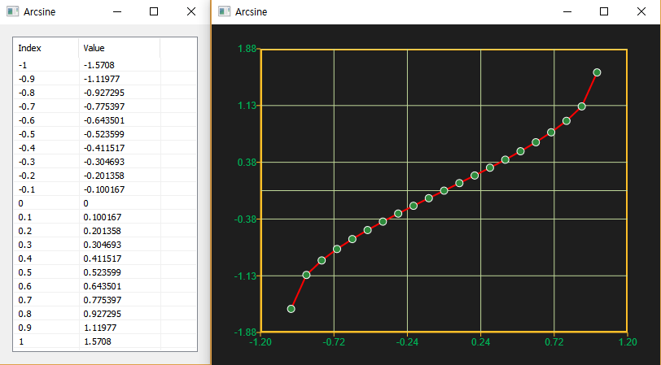

# Asin

Ensor.Asin\(Ensor\* pEnsor\)

#### Parameters

* Ensor\* pEnsor

Ensor.new\(\) 함수등에 의해 만들어진 포인터를 입력합니다.

#### Return Value

Ensor\* pRetEnsor : pEnsor의 엘리먼트에 대한 arc sine Ensor\*를 반환합니다.

#### Remarks

#### Examples

```lua
function MathEquation()
     local ensor_x = ensor.new("[21]","double","-1:1")
     local ensor_y = ensor.Asin(ensor_x)

     ensor.Plot(ensor_x, ensor_y)
     ensor.Table(ensor_y)
 end
```

#### Result



