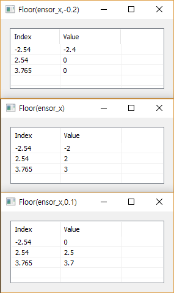

# Floor

Ensor.Fact\(Ensor\* pEnsor,double significance,\)

#### Parameters

* Ensor\* pEnsor

Ensor.new\(\) 함수등에 의해 만들어진 포인터를 입력합니다.

* double significance

The multiple to which you want to round.

#### Return Value

Ensor\* pRetEnsor : pEnsor의 엘리먼트에 대한 Floor Ensor\*를 반환합니다.

#### Remarks


#### Examples

```lua
function MathEquation()
 	local ensor_x = ensor.new("{-2.54, 2.54, 3.765}")
 	local ensor_y1 = ensor.Floor(ensor_x,0.1)
 	local ensor_y2 = ensor.Floor(ensor_x,-0.2)
 	local ensor_y3 = ensor.Floor(ensor_x)
	ensor.Name(ensor_y1,"Floor(ensor_x,0.1)")
	ensor.Name(ensor_y2,"Floor(ensor_x,-0.2)")
	ensor.Name(ensor_y3,"Floor(ensor_x)")

 	ensor.Table(ensor_y1)
	ensor.Table(ensor_y2)
	ensor.Table(ensor_y3)
 end
```

#### Result



