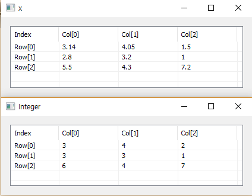

# Int

Ensor.Int\(Ensor\* pEnsor\)

#### Parameters

* Ensor\* pEnsor

Ensor.new\(\) 함수등에 의해 만들어진 포인터를 입력합니다.

#### Return Value

Ensor\* pRetEnsor : pEnsor의 엘리먼트에 대한 Integer Ensor\*를 반환합니다.

#### Remarks

#### Examples

```lua
function MathEquation()
	local x = ensor.new("/{/{3.14,4.05,1.5/},/{2.8,3.2,1.0/},/{5.5,4.3,7.2/}/}")
	local y = ensor.Int(x)

	ensor.Name(x,"x")
	ensor.Table(x)
	ensor.Table(y)
end
```

#### Result



