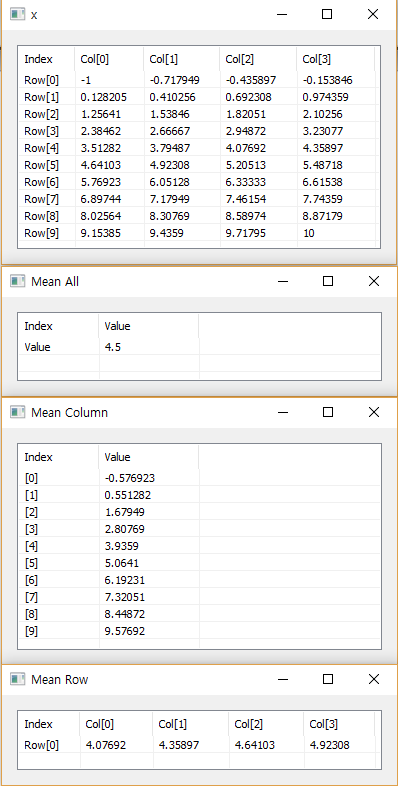

# Mean

Ensor.Mean\(Ensor\* pEnsor1\)

Ensor.Mean\(Ensor\* pEnsor1,string option\)

#### Parameters

* Ensor\* pEnsor1

Ensor.new\(\) 함수등에 의해 만들어진 포인터를 입력합니다.

* string option

option : "column" - column 방향으로 Mean값을 구합니다.

option : "row" - row 방향으로 Mean값을 구합니다.

#### Return Value

Ensor\* pRetEnsor : pEnsor의 엘리먼트에 대한 Mean 결과를 가진 Ensor\*를 반환합니다.

#### Remarks


#### Examples

```lua
function MathEquation()
	local x = ensor.new("[10][4]","double","-1:10")    
	local y1 = ensor.Mean(x)
	local y2 = ensor.Mean(x,"column")
	local y3 = ensor.Mean(x,"row")
	ensor.Name(x,"x")

	ensor.Table(x)
	ensor.Table(y1)
	ensor.Table(y2)
	ensor.Table(y3)
end
```

#### Result



