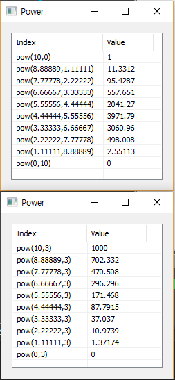

# Pow

Ensor.Pow\(Ensor\* pEnsor1,Ensor\* pEnsor2\)

Ensor.Pow\(Ensor\* pEnsor1,double dValue\)

#### Parameters

* Ensor\* pEnsor1

Ensor.new\(\) 함수등에 의해 만들어진 포인터를 입력합니다\(base\).

* Ensor\* pEnsor2

Ensor.new\(\) 함수등에 의해 만들어진 포인터를 입력합니다\(power\).

* double dValue

power 값을 입력합니다.

#### Return Value

Ensor\* pRetEnsor : pEnsor의 엘리먼트에 대한 power 결과를 가진 Ensor\*를 반환합니다.

#### Remarks

pEnsor1 과 pEnsor2는 같은 엘러먼트 수를 가져야 합니다.

#### Examples

```lua
function MathEquation()
	local x1 = ensor.new("[10]","double","10:0")
	local x2 = ensor.new("[10]","double","0:10")
	local y1 = ensor.Pow(x1,x2)
	local y2 = ensor.Pow(x1,3)

	ensor.Table(y1)
	ensor.Table(y2)
end
```

#### Result



