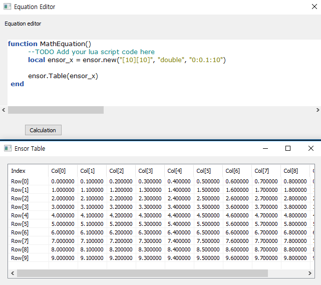

# Ensor object

---

본 문서는 enuSpace for jupiter version 기반으로 작성되었습니다.

## ensor.new\(\)

ensor 객체를 생성합니다. 생성하는 방법은 2가지로 구분됩니다.

* 데이터 기반의 ensor 객체 생성.

```lua
local ensor_x = ensor.new("{0.1, 0.2, 0.3, 0.4, 0.5, 0.6, 0.7, 0.8, 0.9, 1.0}")    -- [10] matrix

local ensor_x = ensor.new("/{/{1,2,3/},/{1,2,3/}/}"                                      -- [2][3] matrix
```

* 배열 Shape와 데이터 타입을 통한 ensor 객체 생성.

```lua
local ensor_x = ensor.new("[10][10]", "int")                -- [10][10] matrix (datatype = int, default value : 0) 

local ensor_x = ensor.new("[10][10]", "int", "1:100")       -- [10][10] matrix (datatype = int, default value : 1~100) 

local ensor_x = ensor.new("[10][10]", "double", "1:0.1:10") -- [10][10] matrix (datatype = double, default value : 1~10)
```




* enuSpace의 변수값을 이용하여 ensor객체 생성방법

```lua
local ensor_x = ensor.new("{#ID_PIN[0][0],#ID_PIN[0][1],3}")    -- first, second value get from enuspace pin variable.

local ensor_x = ensor.new("{#ID_PIN[1][1:784]}")                -- first index 1 get array value [784] matrix

local ensor_x = ensor.new("{#ID_PIN[:][50:100]}")               -- first index full get array value [full][784] matrix
```

## ensor.Name\(\)

ensor객체에 이름 라벨을 부여하는 함수입니다. 부여된 이름은 테이블, Plot Chart 타이틀에 보여집니다.

```lua
local ensor_x = ensor.new("{#ID_PIN[0][0],#ID_PIN[0][1],3}")
ensor.Name(ensor_x, "Pin Variable")                            -- set ensor name.
```

## ensor.GetEnsor\(\)

ensor객체에서 특정 일부분의 데이터를 취하는 함수입니다.

```lua
local ensor_x = ensor.new("[10][10]", "int", "1:100") 
local ensor_g = ensor.GetEnsor(ensor_x, "[3:5][3:5]")

ensor.Table(ensor_g)
```


특정 배열의 인덱스 전부를 취득하고자 하는 경우에는 아래 코드 처럼 \[:\]의 표기법을 사용한다.

```lua
local ensor_g = ensor.GetEnsor(ensor_x, "[:][3:5]")
```


## ensor.GetValue\(\)

ensor객체의 특정 배열의 값을 취하고자 하는 경우에 본 함수를 활용한다.

```lua
local ensor_x = ensor.new("[10][10]", "int", "1:100")
local value = ensor.GetValue(ensor_x, "[2][2]")

PrintMessage(string.format("%d", value))
ensor.Table(ensor_x)
```

GetValue\(\) 함수는 ensor객체를 반환하지 않고, 해당하는 데이터의 값을 반환한다. 만약 double형 ensor의 객체값을 요청하였을 경우, 데이터의 값은 double 형으로 반환함으로서, PrintMessage\(string.format\("%f, value\)\)로 출력값을 확인할수 있다.

## ensor.SetValue\(\)

ensor객체의 특정 배열의 값을 설정하는 경우에 본 함수를 확용한다.

```lua
local ensor_x = ensor.new("[10][10]", "int", "1:100")
ensor.SetValue(ensor_x, 10, "[2][2]")

PrintMessage(string.format("%d", ensor.GetValue(ensor_x, "[2][2]")))
ensor.Table(ensor_x)
```

특정 배열의 설정하고자 하는 값과 포지션정보를 제공하여 값을 설정후 실제 적용여부를 GetValue\(\)함수를 통하여 확인 할수 있다.

## ensor.GetElement\(\)

ensor객체의 배열의 총개수를 반환하는 함수이다.

```lua
local ensor_x = ensor.new("[10][10]", "int", "1:100")
local num = ensor.GetElement(ensor_x)                    -- return 100

PrintMessage(string.format("%d", num))
```

## ensor.GetShape\(\)

ensor객체의 Shape값을 문자열로 반환하는 함수이다.

```lua
local ensor_x = ensor.new("[10][10]", "int", "1:100")
local shape = ensor.GetShape(ensor_x)                    -- return "[10][10]"

PrintMessage(shape)
```

## ensor.GetDim\(\)

ensor객체의 Dimension의 정보를 반환하는 함수이다.

\[5\] -&gt; 1, \[2\]\[3\] -&gt; 2, \[4\]\[4\]\[4\] -&gt; 3을 반환한다.

```lua
local ensor_x = ensor.new("[10][10]", "int", "1:100")
local dim = ensor.GetDim(ensor_x)                    -- return 2

PrintMessage(string.format("%d", dim))
```

## ensor.GetDimElement\(\)

ensor객체의 특정 Dimension의 배열의 개수를 반환하는 함수이다.

\[5\]\[4\]

0 --&gt; 5

1 --&gt; 4

```lua
local ensor_x = ensor.new("[5][4]", "int", "1:20")
local dim = ensor.GetDim(ensor_x)                    -- return 2

local array1 = ensor.GetDimElement(ensor_x, 0)        -- return 5
local array2 = ensor.GetDimElement(ensor_x, 1)        -- return 4

PrintMessage(string.format("%d:%d", array1, array2))
```

## ensor.SetFlat\(\)

ensor 객체의 배열정보를 평면정보를 통하여 값을 설정하는 함수이다.

```lua
local ensor_x = ensor.new("[5][4]", "int")
local num = ensor.GetElement(ensor_x)

local i
local value = 10
for i=0,19 do
    ensor.SetFlat(ensor_x, i*value, i)
end
```

## ensor.GetFlat\(\)

ensor 객체의 배열정보를 평면정보를 통하여 값을 취득하는 함수이다.

```lua
local ensor_x = ensor.new("[5][4]", "int")
local num = ensor.GetElement(ensor_x)

local i
local value
for i=0,19 do
    value = ensor.GetFlat(ensor_x, i)
    PrintMessage(string.format("%d", value))
end
```

## ensor.Answer\(\)

ensor객체의 값을 문자열로 반환하는 함수이다.

```lua
local ensor_x = ensor.new("[3][3]", "int", "1:9")
local ans = ensor.Answer(ensor_x) 

PrintMessage(ans)                        -- return "1,2,3,4,5,6,7,8,9"
```

## ensor.DebugString\(\)

ensor객체의 Dimension정보와 출력값을 출력창에 디스플레이하는 함수이다.

```lua
local ensor_x = ensor.new("[3][3]", "int", "1:9")
ensor.DebugString(ensor_x)                        -- display message shape:[3][3], value:1,2,3,4,5,6,7,8,9
```

## ensor.Remove\(\)

생성된 ensor객체를 제거하는 함수이다. enuSpace 프로그램에서 자체적으로 제거를 수행하나, 사용자가 직접 제거함수를 호출하여 제거를 수행할 수도 있다.

```lua
local ensor_x = ensor.new("[3][3]", "int", "1:9")
ensor.Remove(ensor_x)                        -- delete ensor object.
```

## ensor.RemoveAll\(\)

생성된 ensor객체를 모두제거하는 함수이다. enuSpace 프로그램에서 자체적으로 제거를 수행하나, 사용자가 직접 제거함수를 호출하여 제거를 수행할 수도 있다.

```lua
local ensor_x = ensor.new("[3][3]", "int", "1:9")
ensor.RemoveAll()                        -- delete all ensor object.
```


