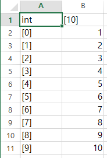
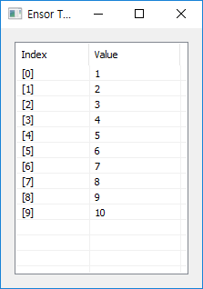
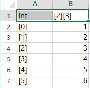

# Ensor IO

---

본 문서는 enuSpace for jupiter version 기반으로 작성되었습니다.

## ensor.SaveCSV\(\)

ensor 객체를 CSV 파일로 저장합니다.

```lua
function MathEquation()
    local ensor_obj = ensor.new("{1,2,3,4,5,6,7,8,9,10}")
     ensor.SaveCSV(ensor_obj, "D:\\data.csv")

     ensor.DebugString(ensor_obj)
 end
```

output -&gt; d:\data.csv



## ensor.ReadCSV\(\)

CSV 파일을 읽어와 ensor 객체를 반환합니다.

```lua
function MathEquation()
    local ensor_obj = ensor.new("{1,2,3,4,5,6,7,8,9,10}")
     local ensor_read = ensor.ReadCSV("D:\\data.csv")

     ensor.Table(ensor_read)
 end
```



```lua
function MathEquation()
    local ensor_obj = ensor.new("/{/{1,2,3/},/{4,5,6/}/}")
     ensor.SaveCSV(ensor_obj, "D:\\data.csv")
    local ensor_read = ensor.ReadCSV("D:\\data.csv")

     ensor.Table(ensor_read)
 end
```



