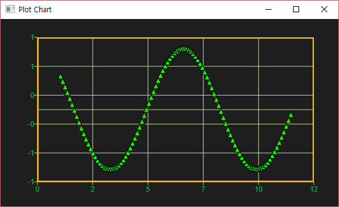
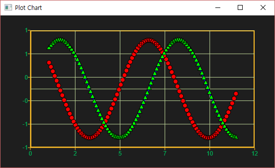
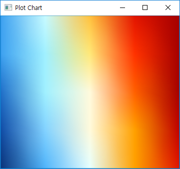
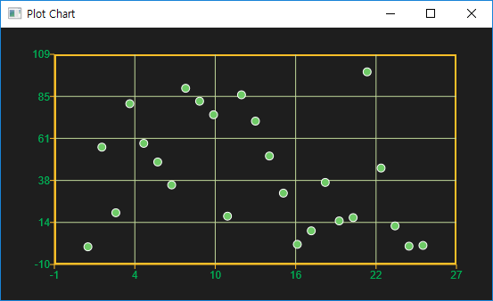
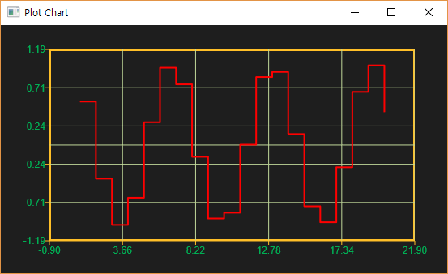
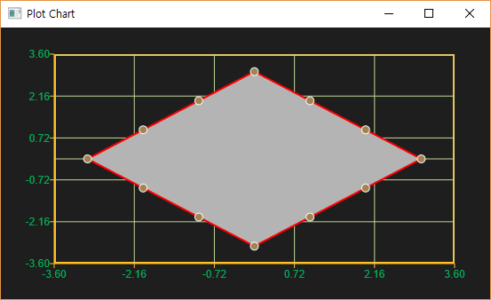
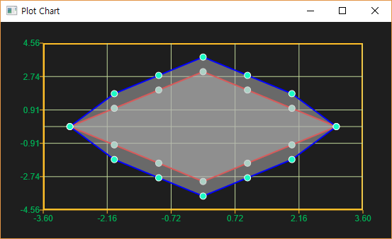

# Ensor Plot

---

본 문서는 enuSpace for jupiter version 기반으로 작성되었습니다.

## ensor.Plot\(\)

Plot 함수는 ensor객체의 값을 이용하여 Plot 차트를 제공합니다.

* Plot\(\)함수의 인자에 하나를 입력할 경우, x축의 값은 순차적인 값\(1, 2, 3 ...\)으로 할당되어 적용되어 y축값을 현시한다.

```lua
function MathEquation()
    --TODO Add your lua script code here
     local ensor_x = ensor.new("[100]", "double", "1:0.1:10") 
     local ensor_cos = ensor.Cos(ensor_x)

     ensor.Plot(ensor_cos)
 end
```


* Plot\(\)함수의 인자에 두개의 입력할 경우, x축의 인자에 대한 y축의 인자값을 이용하여 표시됩니다.

```lua
function MathEquation()
    --TODO Add your lua script code here
     local ensor_x = ensor.new("[100]", "double", "1:0.1:10") 
     local ensor_cos = ensor.Cos(ensor_x)

     ensor.Plot(ensor_x, ensor_cos)
 end
```


* Plot\(\)함수의 시리즈 속성 지정

stroke:\#ff0000                          // color

stroke-opacity:0.5                     // 0~1

stroke-width:3                            // number

stroke-dasharray:1,1                 // dash pattern

symbol-type:circle                     // circle, triangle, rect, none

symbol-fill:\#00ff00                   // color

symbol-fill-opacity:0.5              // 0~1

symbol-stroke:\#FFFFFF           // color

symbol-stroke-opacity:0.5       // 0~1

symbol-stroke-width:1              // number

symbol-size:9                            // number

```lua
function MathEquation()
    --TODO Add your lua script code here
     local ensor_x = ensor.new("[100]", "double", "1:0.1:10") 
     local ensor_cos = ensor.Cos(ensor_x)
    local ensor_sin = ensor.Sin(ensor_x)

     ensor.Plot(ensor_x, ensor_cos, "symbol-type:triangle;symbol-fill:#00FF00")
 end
```



* Plot\(\)함수에 여러개의 인자\(x1, y1, x2, y2 ...\)를 입력하였을 이용하여 멀티 시리즈 Plot 차트로 현시됩니다.

```lua
function MathEquation()
    --TODO Add your lua script code here
     local ensor_x = ensor.new("[100]", "double", "1:0.1:10") 
     local ensor_cos = ensor.Cos(ensor_x)
    local ensor_sin = ensor.Sin(ensor_x)

     ensor.Plot(ensor_x, ensor_cos, "symbol-type:circle;symbol-fill:#FF0000", ensor_x, ensor_sin, "symbol-type:triangle;symbol-fill:#00FF00")
 end
```



## ensor.Table\(\)

Table\(\)함수는 ensor데이터를 테이블 형태로 제공합니다.

```lua
function MathEquation()
    --TODO Add your lua script code here
     local ensor_x = ensor.new("[5][5]", "double", "1:25") 
     local ensor_cos = ensor.Cos(ensor_x)

     ensor.Table(ensor_x)
     ensor.Table(ensor_cos)
 end
```


## ensor.Contour\(\)

2차원 ensor 객체를 Contour 차트로 제공합니다.

```lua
function MathEquation()
    --TODO Add your lua script code here
     local ensor_x = ensor.new("[5][5]", "double", "1:25") 

     ensor.Contour(ensor_x)
 end
```



ensor.Contour\(\)함수의 두번째 인자는 사용자 정의한 속성값을 지정합니다.  \* 속성값을 지정하지 않을 경우, 기본 설정값으로 적용됩니다. contourType:contour;minEelvation:자동계산;maxElevation:자동계산;colorElevation:기본값

* contourType:contour or contour rect or contour circle
* minElevation:value
* maxElevation:value
* colorElevation:\#FFFFFF,\#FFFFFD,\#FFFFFC

```lua
function MathEquation()
    --TODO Add your lua script code here
     local ensor_x = ensor.new("[5][5]", "double", "1:25") 

     ensor.Contour(ensor_x, "draw-shape:rect;DrawType:solid;solidType:rect")
 end
```


```lua
function MathEquation()
    --TODO Add your lua script code here
    local ensor_x = ensor.new("[5][5]", "double", "1:25")

    ensor.Contour(ensor_x, "draw-shape:rect;DrawType:contour;minElevation:1;maxElevation:10")
 end
```


## ensor.Scatter\(\)

ensor객체를 Scatter 형태로 현시한다.

```lua
function MathEquation()
    --TODO Add your lua script code here
    local ensor_x = ensor.new("[25]", "double", "1:25")         -- 1~25 linear value generation
    local ensor_r1 = ensor.Rand("[25]", 100)                    -- 0~100 random value generation
    local ensor_r2 = ensor.Rand("[25]", 100)                    -- 0~100 random value generation

    ensor.Scatter(ensor_r1)
 end
```

```lua
function MathEquation()
    --TODO Add your lua script code here
    local ensor_x = ensor.new("[25]", "double", "1:25")         -- 1~25 linear value generation
    local ensor_r1 = ensor.Rand("[25]", 100)                    -- 0~100 random value generation
    local ensor_r2 = ensor.Rand("[25]", 100)                    -- 0~100 random value generation

    ensor.Scatter(ensor_x, ensor_r1)
 end
```



* Scatter\(\)함수의 시리즈 속성 지정

symbol-type:circle                     // circle, triangle, rect, none

symbol-fill:\#00ff00                   // color

symbol-fill-opacity:0.5              // 0~1

symbol-stroke:\#FFFFFF           // color

symbol-stroke-opacity:0.5       // 0~1

symbol-stroke-width:1              // number

symbol-size:9                            // number

```lua
function MathEquation()
    --TODO Add your lua script code here
    local ensor_x = ensor.new("[25]", "double", "1:25")         -- 1~25 linear value generation
    local ensor_r1 = ensor.Rand("[25]", 100)                    -- 0~100 random value generation
    local ensor_r2 = ensor.Rand("[25]", 100)                    -- 0~100 random value generation

    ensor.Scatter(ensor_x, ensor_r1, "symbol-type:triangle;symbol-fill:#ff0000;symbol-stroke:#ffffff")
 end
```


* 멀티 시리즈 Scatter\(\)함수

```lua
function MathEquation()
    --TODO Add your lua script code here
    local ensor_x = ensor.new("[25]", "double", "1:25")         -- 1~25 linear value generation
    local ensor_r1 = ensor.Rand("[25]", 100)                    -- 0~100 random value generation
    local ensor_r2 = ensor.Rand("[25]", 100)                    -- 0~100 random value generation

    ensor.Scatter(ensor_x, ensor_r1, "symbol-type:triangle;symbol-fill:#ff0000;symbol-stroke:#ffffff", ensor_x, ensor_r2, "symbol-type:circle;symbol-fill:#00ff00;symbol-stroke:#ffffff")
 end
```


## ensor.Stem\(\)

Stem\(\)함수는 입력된 ensor객체 줄기 형태로 디스플레이를 수행합니다.

```lua
function MathEquation()
    --TODO Add your lua script code here
    local ensor_x = ensor.new("[10]", "double", "1:10") 
    local ensor_cos = ensor.Cos(ensor_x)

    ensor.Stem(ensor_cos)
 end
```


```lua
function MathEquation()
    --TODO Add your lua script code here
     local ensor_x = ensor.new("[100]", "double", "1:0.1:10") 
     local ensor_cos = ensor.Cos(ensor_x)

     ensor.Stem(ensor_x ,ensor_cos)
 end
```


* Stem\(\)함수의 시리즈 속성 지정

stroke:\#ff0000                          // color

stroke-opacity:0.5                     // 0~1

stroke-width:3                            // number

symbol-type:circle                     // circle, triangle, rect, none

symbol-fill:\#00ff00                   // color

symbol-fill-opacity:0.5              // 0~1

symbol-stroke:\#FFFFFF           // color

symbol-stroke-opacity:0.5       // 0~1

symbol-stroke-width:1              // number

symbol-size:9                            // number

```lua
function MathEquation()
    --TODO Add your lua script code here
     local ensor_x = ensor.new("[100]", "double", "1:0.1:10") 
     local ensor_cos = ensor.Cos(ensor_x)

     ensor.Stem(ensor_x, ensor_cos, "stroke:#0000ff;symbol-type:circle;symbol-stroke-opacity:0;symbol-fill:#ffffff")
 end
```


* 멀티 시리즈 Stem\(\) 함수

```lua
function MathEquation()
    --TODO Add your lua script code here
     local ensor_x = ensor.new("[100]", "double", "1:0.1:10") 
     local ensor_cos = ensor.Cos(ensor_x)
     local ensor_sin = ensor.Sin(ensor_x)

     ensor.Stem(ensor_x, ensor_cos, "stroke:#ff0000;symbol-type:circle", ensor_x, ensor_sin, "stroke:#00ff00;symbol-type:circle")
 end
```


## ensor.Histogram\(\)

Histogram\(\)함수는 입력된 ensor객체 바 형태로 디스플레이를 수행합니다.

```lua
function MathEquation()
    --TODO Add your lua script code here
     local ensor_x = ensor.new("[100]", "double", "1:0.1:10") 
     local ensor_cos = ensor.Cos(ensor_x)

     ensor.Histogram(ensor_cos)
 end
```


```lua
function MathEquation()
    --TODO Add your lua script code here
     local ensor_x = ensor.new("[100]", "double", "1:0.1:10") 
     local ensor_cos = ensor.Cos(ensor_x)

     ensor.Histogram(ensor_x, ensor_cos)
 end
```


* Histogram\(\)함수의 시리즈 속성 지정

symbol-fill:\#00ff00                   // color

symbol-fill-opacity:0.5              // 0~1

symbol-stroke:\#FFFFFF           // color

symbol-stroke-opacity:0.5       // 0~1

symbol-stroke-width:1              // number

```lua
function MathEquation()
    --TODO Add your lua script code here
     local ensor_x = ensor.new("[100]", "double", "1:0.1:10") 
     local ensor_cos = ensor.Cos(ensor_x)

     ensor.Histogram(ensor_x, ensor_cos, "symbol-fill:#00ff00;symbol-stroke:#000000")
 end
```


* 멀티 시리즈 Histogram\(\) 함수

```lua
function MathEquation()
    --TODO Add your lua script code here
     local ensor_x = ensor.new("[100]", "double", "1:0.1:10") 
     local ensor_cos = ensor.Cos(ensor_x)
     local ensor_sin = ensor.Sin(ensor_x)

     ensor.Histogram(ensor_x, ensor_cos, "symbol-fill-opacity:0.5;symbol-fill:#ff0000;symbol-stroke:#000000", ensor_x, ensor_sin, "symbol-fill-opacity:0.5;symbol-fill:#00ff00;symbol-stroke:#000000")
 end
```


## ensor.Stair\(\)

Starit\(\)함수는 입력된 ensor객체를 계단 형태로 디스플레이를 수행합니다.

```lua
function MathEquation()
    --TODO Add your lua script code here
    local ensor_x = ensor.new("[20]", "double", "1:0.5:10") 
    local ensor_cos = ensor.Cos(ensor_x)

    ensor.Stair(ensor_cos)
 end
```


```lua
function MathEquation()
    --TODO Add your lua script code here
    local ensor_x = ensor.new("[20]", "double", "1:20") 
    local ensor_cos = ensor.Cos(ensor_x)

    ensor.Stair(ensor_x, ensor_cos)
 end
```



* Stair\(\)함수의 시리즈 속성 지정

stroke:\#ff0000                          // color

stroke-opacity:0.5                     // 0~1

stroke-width:3                            // number

stroke-dasharray:1,1                 // dash pattern

```lua
function MathEquation()
    --TODO Add your lua script code here
    local ensor_x = ensor.new("[20]", "double", "1:20") 
    local ensor_cos = ensor.Cos(ensor_x)

    ensor.Stair(ensor_x, ensor_cos, "stroke:#00ff00;stroke-width:3")
 end
```


* 멀티 시리즈 Stair\(\) 함수

```lua
function MathEquation()
    --TODO Add your lua script code here
    local ensor_x = ensor.new("[20]", "double", "1:20") 
    local ensor_cos = ensor.Cos(ensor_x)
    local ensor_sin = ensor.Sin(ensor_x)

    ensor.Stair(ensor_x, ensor_cos, "stroke-dasharray:1,1;stroke:#00ff00;stroke-width:3", ensor_x, ensor_sin, "stroke-dasharray:1,1;stroke:#ff0000;stroke-width:3")
 end
```


## ensor.Area\(\)

Area\(\)함수는 입력된 ensor객체를 영역형태로 디스플레이를 수행합니다.

```lua
function MathEquation()
    --TODO Add your lua script code here
    local ensor_x = ensor.new("{-3,-2,-1,0,1,2,3,2,1,0,-1,-2,-3}")
    local ensor_y1 = ensor.new("{0,-1,-2,-3,-2,-1,0,1,2,3,2,1,0}")

    ensor.Area(ensor_x, ensor_y1)
end
```



* Area\(\)함수의 시리즈 속성 지정

stroke:\#ff0000                          // color

stroke-opacity:0.5                     // 0~1

stroke-width:3                            // number

fill:\#00ff00                                 // color

fill-opacity:0.5                           // 0~1

symbol-type:circle                     // circle, triangle, rect, none

symbol-fill:\#00ff00                   // color

symbol-fill-opacity:0.5              // 0~1

symbol-stroke:\#FFFFFF           // color

symbol-stroke-opacity:0.5       // 0~1

symbol-stroke-width:1              // number

symbol-size:9                            // number

```lua
function MathEquation()
    --TODO Add your lua script code here
    local ensor_x = ensor.new("{-3,-2,-1,0,1,2,3,2,1,0,-1,-2,-3}")
    local ensor_y1 = ensor.new("{0,-1,-2,-3,-2,-1,0,1,2,3,2,1,0}")

    ensor.Area(ensor_x, ensor_y1,"fill-opacity:0.5")
 end
```


* 멀티 시리즈 Area\(\) 함수

```lua
function MathEquation()
    --TODO Add your lua script code here
     local ensor_x = ensor.new("{-3,-2,-1,0,1,2,3,2,1,0,-1,-2,-3}")
     local ensor_y1 = ensor.new("{0,-1,-2,-3,-2,-1,0,1,2,3,2,1,0}")
    local ensor_y2 = ensor.new("{0,-1.8,-2.8,-3.8,-2.8,-1.8,0,1.8,2.8,3.8,2.8,1.8,0}")

     ensor.Area(ensor_x, ensor_y1, "fill-opacity:0.5", ensor_x, ensor_y2, "fill-opacity:0.5")
 end
```



