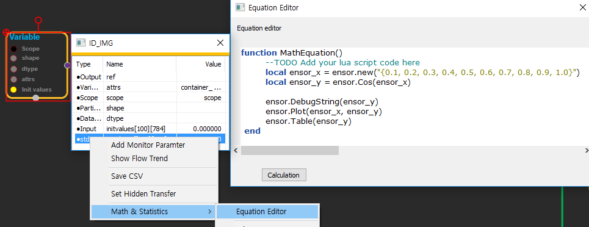
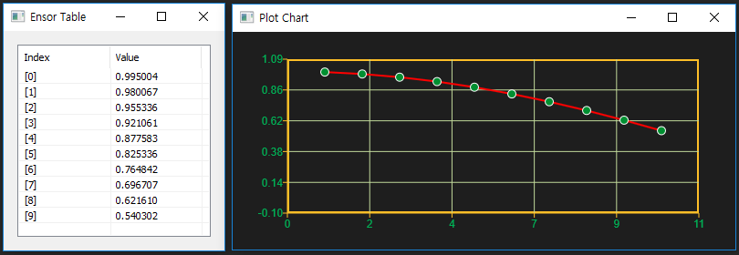

## enuSpace

## Math & Statistics functions - Using method

---

본 문서는 enuSpace for jupiter version 기반으로 작성되었습니다.

enuSpace 환경\(데이터 조작, 계산 및 그래픽 표시를 위한 소프트웨어 기능의 통합\)하에 동작됩니다.

### Using method

기본 수학적 연산 객체 "ensor"를 이용하여 연산결과를 저장합니다.

enuSpace를 실행합니다. 상단의 리본메뉴의 Equation Editor 버튼을 클릭하여 Equation Editor창을 실행하거나, 로직 객체의 심볼 테이블의 팝업 메뉴를 이용하여 Equation Editor창을 실행합니다.




```lua
function MathEquation()
    --TODO Add your lua script code here
     local ensor_x = ensor.new("{0.1, 0.2, 0.3, 0.4, 0.5, 0.6, 0.7, 0.8, 0.9, 1.0}")
     local ensor_y = ensor.Cos(ensor_x)

     ensor.DebugString(ensor_y)
     ensor.Plot(ensor_x, ensor_y)
     ensor.Table(ensor_y)
 end
```

ensor.new\(\) 라이브러리 함수를 통하여 객체를 생성합니다.

**생성 예시**

```lua
ensor.new("{0.1, 0.2, 0.3, 0.4, 0.5, 0.6, 0.7, 0.8, 0.9, 1.0}")  -- 일반 배열 생성
ensor.new("/{/{1,2,3/},/{4,5,6/},/{7,8,9/}/}")        -- RANK 표현을 통한 배열 생성
ensor.new("{#ID_IMG.PIN[1:3][1:3]}"}        -- 로직 객체의 핀 정보를 이용하여 ensor객체를 생성
```

ensor 수학 및 통계함수 연산을 수행합니다. Math & Statistics API 참조.

```lua
local ensor_y = ensor.Cos(ensor_x)
```

출력값 data display는 다음과 같은 함수를 이용하여 표현합니다.

**디스플레이 예시**

```lua
ensor.Plot(ensor_x)        -- Plot 차트를 이용한 데이터 가시화.
ensor.Contour(ensor_x)     -- contour 색상을 이용한 데이터 가시화.
ensor.Table(ensor_x)       -- Table을 이용한 데이터 디스플레이.
```

### 

```lua
function MathEquation()
    local ensor_obj = ensor.new("{#ID_IMG.result_ref[0][0:783]}")    -- 784개의 배열 정보를 가져옴 
     local ensor_cal = ensor.Reshape(ensor_obj, "[28][28]")          -- 784의 배열을 28by28 2차원 배열로 변경

     ensor.Contour(ensor_cal)                                        -- Contour를 이용한 데이터 가시화
     ensor.Table(ensor_cal)                                          -- 2차원 배열 정보 테이블로 현시
 end
```

### 

### Math & Statistics API Category

* #### [Math](/statistics/math-api.html)
* #### [Statistics](/statistics/statistics-api.html)


