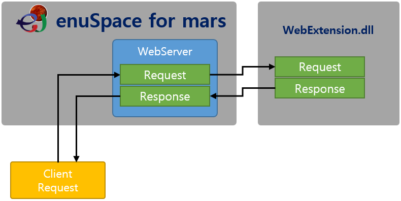

# enuSpace for mars\(2017\)에서 확장용 web 모듈 사용하기

---


enuSpace for mars\(2017\)버젼부터 확장용 web 모듈을 추가하여 개발할 수 있는 기능을 제공합니다. 본 내용은 개발자에게 web 모듈 확장 프로젝트 사용 방법에 대하여 설명합니다.



##### **확장 웹모듈 인터페이스 구조도** 

동작 방법 : enuSpace가 설치된 동일한 디렉토리에 제공되는 샘플용 프로젝트\(WebExtension.sln\)를 컴파일하여 WebExtension.dll 생성, enuSpace의 실행 프로그램 위치에 복사하여 붙여넣기를 수행합니다. 

enuSpace 프로그램을 실행하고 기존의 프로젝트를 로드하거나 신규 프로젝트를 생성후 웹 서버 시작 버튼을 클릭하면 enuSpace프로그램에서 확장 WebExtension.dll 파일을 로드합니다.  

사용 방법 : 기본 제공되는 RASTful API 이외의 함수에 대해서는 WebExtension.dll의 Requst함수에 의하여 처리되므로, 개발자가 클라이언트에서 전달된 데이터의 데이터를 전달받아 요청된 명령에 따른 처리를 수행하면 됩니다. 

아래 기본 샘플은 사용자가 웹서버를 통하여 전달받은 데이터를 확장 모듈에서 ECHO 데이터를 반환하는 샘플이다. 

```cpp
void GetParamValue(CString strInput, CString *strAttr, CString *strParam)
{
	int ipos = strInput.Find('=');
	if (ipos > 0)
	{
		CString strElement;
		*strAttr = strInput.Left(ipos);
		*strParam = strInput.Right(strInput.GetLength() - ipos - 1);
	}
}

char* WCToMB(CString str)
{
	char * temp = new char[_tcslen(str) * 2 + 1];
	WideCharToMultiByte(CP_ACP, 0, str, (int)_tcslen(str) + 1, temp, (int)_tcslen(str) * 2 + 1, 0, 0);
	return temp;
}

extern "C" __declspec(dllexport) void Request(WebSocketObject* pSocketObject, wchar_t* funtionname, wchar_t* contents)
{
	// SAMPLE CODE
	CString strParam = contents;
	CString Seperator = _T("&");
	int charpos = 0;
	CString token;
	token = strParam.Tokenize(Seperator, charpos);

	// 개별 입력 속성및 값을 취득하는 SAMPLE
	while (token != L"")
	{
		token.Trim();
		CString attribute;				// attribute값 취득
		CString value;					// value값 취득
		GetParamValue(token, &attribute, &value);
		token = strParam.Tokenize(Seperator, charpos);
	}

	// 반환값 코드.
	CString strResult;
	strResult.Format(L"RESULT:%s, %s" ,funtionname, contents);
	char* pstr = WCToMB(strResult.GetBuffer(0));

	pSocketObject->response.sendlen = strlen(pstr);
	pSocketObject->response.pSendBuffer = pstr;
	pSocketObject->response.connent_type = L"application/json; charset=UTF-8";
	return;
} 

```


클라이언트 웹 브라우져에서 주소줄에 다음과 같이 입력하였을 경우, http://127.0.0.1:8080/myfunction?dfdf=444&dfefe=999

아래 그림과 같은 결과를 획득할 수 있다. 


주\) 반환값을 전달할 때 char\*의 메모리 값을 동적으로 생성하였으며, 별도의 메모리 해제를 수행하지 말아야 한다. enuSpace 웹 서버모듈에서 처리가 완료되면, 메모리를 자동으로 해제를 수행하기 때문이다. 

  


