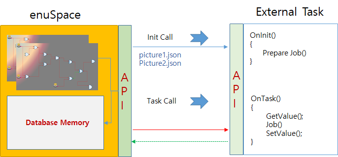

# External Task

---

본 문서는 enuSpace for jupiter version 기반으로 작성되었습니다.

reference sample : [https://github.com/EXPNUNI/enuSpace-Article/tree/master/sample\_task](https://github.com/EXPNUNI/enuSpace-Article/tree/master/sample_task)

### External Task 디렉토리 구조

External Task의 디렉토리 및 파일 구조는 아래 그림과 같이 프로젝트 디렉토리 하위에 Task 디렉토리에 위치한다.

해당 External Task는 {TaskName} 디렉토리와 {TaskName}.dll 테스크  파일로 구성된다.

TaskName은 해당 Task의 이름과 dll파일 이름이 동일하여야 한다.

##### 

---

### External Task의 종류 및 특징

#### External Task 종류

External Task는 4가지의 종류로 구성된다.

#### **일반 산술 연산을 위한 타입 **\[TASK\_TYPE\_PROCESS\]

컴포넌트 로직 객체에 대한 플로우 다이어그램에 대한 그래프용

* #### **전체 픽쳐 페이지 연결용 그래프 연산용 타입 **\[TASK\_TYPE\_FLOW\_COMPONENT\_TOTAL\]
* #### **단일 픽처 페이지 연결용 그래프 연산용 타입 **\[TASK\_TYPE\_FLOW\_COMPONENT\_PAGE\]

#### **컴포넌트 로직 객체의 함수 호출용 타입 **\[TASK\_TYPE\_FUNCTION\_COMPONENT\]

### External Task 특징

##### **일반 산술 연산 모델을 위한 타입 **\[TASK\_TYPE\_PROCESS\]

* 연산 처리용으로 외부의 알고리즘 모델을 enuSpace의 메모리 연동하여 제어를 수행한다.  enuSpace에서 설정된 Cycle 주기에 맞추어 해당 모듈의 OnTask\(\)함수를 주기적으로 호출한다. 


##### **단일 픽처 페이지 연결용 그래프 연산용 타입 **\[TASK\_TYPE\_FLOW\_COMPONENT\_PAGE\]

* 로직 컴포넌트간 연결 정보에 대하여 개별 페이지단위로  json 파일을 생성, 해당 Task에서 json파일들을 이용하여 개발을 수행한다.
* 본 타입은 enuSpace에서 설정된 Cycle 주기에 맞추어 해당 모듈의 OnTask\(\)함수를 호출한다. 

예\) enuSpace Tensorflow plugin project : [https://github.com/EXPNUNI/enuSpace-Tensorflow](https://github.com/EXPNUNI/enuSpace-Tensorflow)



##### **전체 픽쳐 페이지 연결용 그래프 연산용 타입 **\[TASK\_TYPE\_FLOW\_COMPONENT\_TOTAL\]

* 로직 컴포넌트간 연결 정보에 대하여 해당 Task의 연결선 정보를 json 파일 생성, 해당 Task에서 json파일을 이용하여 개발을 수행한다. 하나의 json 파일에 여러픽쳐 페이지간 연결선 정보를 포함하고 있다.

* 본 타입은 enuSpace에서 설정된 Cycle 주기에 맞추어 해당 모듈의 OnTask\(\)함수를 호출한다.


##### **컴포넌트 로직 객체의 함수 호출용 타입 **\[TASK\_TYPE\_FUNCTION\_COMPONENT\]

* 정의된 컴포넌트를 픽처상에 추가하여 테스크를 기동하였을 경우, 해당 컴포넌트는 주어진 사이클 정보에 따라 외부 테스크 함수를 호출한다. 연산에 필요한 입력 핀의 변수 값을 참조하여 연산을 수행한후 출력 핀의 변수에 업데이트를 수행한다. 
* 본 타입은 enuSpace에서 설정된 Cycle 주기에 맞추어 해당 컴포넌트의 함수를 호출한다. 

예\) enuSpace Eigen plugin project : [https://github.com/EXPNUNI/enuSpace-Eigen](https://github.com/EXPNUNI/enuSpace-Eigen)


### External Task 설정

각 타입에 맞는 External Task를 지정하기 위해서는 External Task 모듈의 GetTaskType\(\)함수에 타입의 정보를 지정하고 반환하여 준다.

```cpp
#define TASK_TYPE_PROCESS            1    // 연산처리용 타입
#define TASK_TYPE_FLOW_COMPONENT_TOTAL        2    // FLOW 컴포넌트 전체 단위 타입
#define TASK_TYPE_FLOW_COMPONENT_PAGE        3    // FLOW컴포넌트 페이지 단위 타입
#define TASK_TYPE_FUNCTION_COMPONENT        4    // 함수형 컴포넌트 타입

extern "C" __declspec(dllexport) int GetTaskType()
{
    return TASK_TYPE_FLOW_COMPONENT_PAGE;
}
```

---

## enuSpace와 External Task 인터페이스 정의

enuSpace와 External Task는 다음과 같이 정의된다.

### CallBack Functios

#### extern "C" \_\_declspec\(dllexport\) void SetCallBack\_SetValue\(void fcbSetValue\(wchar\_t\*, double\)\)

enuSpace의 변수값을 설정하기 위한 콜백함수를 전달한다.

#### extern "C" \_\_declspec\(dllexport\) void SetCallBack\_GetValue\(VariableStruct fcbGetValue\(wchar\_t\*\)\)

enuSpace의 변수값을 가져오기 위한 콜백함수를 전달한다.

#### extern "C" \_\_declspec\(dllexport\) void SetCallBack\_SetArrayValue\(void fcbSetArrayValue\(wchar\_t\*, void\*, int, int\)\);

enuSpace의 배열 변수값을 설정하기 위한 콜백함수를 전달한다.

#### extern "C" \_\_declspec\(dllexport\) void SetCallBack\_GetArrayValue\(VariableStruct fcbGetArrayValue\(wchar\_t\*\)\);

enuSpace의 배열 변수값을 가져오기 위한 콜백함수를 전달한다.

#### extern "C" \_\_declspec\(dllexport\) void SetCallBack\_SetReShapeArrayValue\(void fcbSetReShapeArrayValue\(wchar\_t\*, void\*, int, int\)\);

enuSpace의 로직 컴포넌트의 PIN 변수값과 Shape값을 설정하기 위한 콜백함수를 전달한다.

#### extern "C" \_\_declspec\(dllexport\) void SetCallBack\_PrintMessage\(void fcbPrintMessage\(wchar\_t\*\)\);

enuSpace의 출력창에 표시하기 위한 콜백함수를 전달한다.

---

enuSpace for jupiter version\(3.0.4.0\) 이후 버전 제공

**extern "C" \_\_declspec\(dllexport\) void SetCallBack\_SetPinInterfaceVariable\(void fcbSetPinInterfaceVariable\(wchar\_t\*, void\*, int, int\)\)**

enuSpace에 추가된 로직객체에 대하여 핀의 정보를 외부 태스크의 메모리로 변경할 경우 사용합니다.

```cpp
// 함수 포인터 사용방법.

// 외부 태스크의 전역변수 선언.
double data[100];
// enuSpace에 추가된 로직객체의 핀(double형 배열 100)의 지시 위치 주소 설정.
// enuSpace는 타입과 배열의 크기를 비교하여 설정 수행.
fcbSetPinInterfaceVariable(L"ID_LOGIC.PIN_DATA", &data, DEF_DOUBLE, 100);

// 외부 태스크의 데이터 설정시 enuSpace의 로직 객체 심볼 테이블을 통하여 데이터 확인 및 디버깅.
```

### Task Option Functions

#### extern "C" \_\_declspec\(dllexport\) int GetTaskType\(\);

enuSpace에 Task의 타입정보를 전달한다.

#### extern "C" \_\_declspec\(dllexport\) bool IsEnableTransfer\(wchar\_t\* pFromType, wchar\_t\* pToType\);

로직 컴포넌트의 타입의 경우 각 컴포넌트의 PIN변수의 타입정보가 연결가능한 타입인지를 반환한다.

#### extern "C" \_\_declspec\(dllexport\) bool IsTaskStopWhenModify\(\);

로직 컴포넌트를 이용하여 픽처를 편집할 경우, TASK 기동시 TASK를 정지하여 편집을 진행할 것인지를 반환한다.

### Operation Functions

#### extern "C" \_\_declspec\(dllexport\) bool OnLoad\(\);

enuSpace는 Task가 처음로드 수행시 OnLoad\(\)함수를 호출한다.

#### extern "C" \_\_declspec\(dllexport\) bool OnInit\(\);

enuSpace는 로드 상테에서 Task Run 명령 수행시 초기에 한번 OnInit\(\)함수를 호출한다.

#### extern "C" \_\_declspec\(dllexport\) bool OnTask\(\);   &lt;--- 3.0.5.1 이전버젼

#### extern "C" \_\_declspec\(dllexport\) bool OnTask\(\_\_int64 time\);   &lt;--- 3.0.6.0 이후버젼

```cpp
extern "C" __declspec(dllexport) bool OnTask(__int64 time)
{
    __int64 itime = time / 10000000;   // sec 단위
    CString strMessage;
    strMessage.Format(L"%lld", itime);
    PrintMessage(strMessage);

    FILETIME toTime;
    toTime.dwLowDateTime = time;
    toTime.dwHighDateTime = time>> 32;

    SYSTEMTIME SystemTime;
    FileTimeToSystemTime(&toTime, &SystemTime);
    CString strLabel;
    strLabel.Format(L"System Time : %04d-%02d-%02d %02d:%02d:%02d.%03d", SystemTime.wYear, SystemTime.wMonth, SystemTime.wDay, SystemTime.wHour, SystemTime.wMinute, SystemTime.wSecond, SystemTime.wMilliseconds);
}
```

enuSpace는 주어진 Task Cycle의  주기에 맞추어 OnTask\(\)함수를 호출한다.

#### extern "C" \_\_declspec\(dllexport\) bool OnUnload\(\);

enuSpace는 프로젝트 닫기를 수행하거나 종료시 OnUnload\(\) 함수를 호출한다.

#### extern "C" \_\_declspec\(dllexport\) bool OnModeChange\(int iMode\);

enuSpace의 Task의 상태를 제어할 경우, 상태정보를 각 Task에 전달을 수행한다. 이러한 상태 정보 \(DEF\_MODE\_EDIT, DEF\_MODE\_FREEZE, DEF\_MODE\_STEP, DEF\_MODE\_RUN\)를 이용하여 해당 Task 모델을 구성한다.

```cpp
#define DEF_MODE_EDIT          0
#define DEF_MODE_FREEZE        1
#define DEF_MODE_STEP          2
#define DEF_MODE_RUN           3

extern "C" __declspec(dllexport) void OnModeChange(int iMode)
{
    switch (iMode)
    {
        case DEF_MODE_EDIT:
        {
            PrintMessage(L"편집 모드");
            break;
        }
        case DEF_MODE_FREEZE:
        {
            PrintMessage(L"정지 모드");
            break;
        }
        case DEF_MODE_STEP:
        {
            PrintMessage(L"스탭 모드");
            break;
        }
        case DEF_MODE_RUN:
        {
            PrintMessage(L"실행 모드");
            break;
        }
    }
}
```

### Util Functions

#### extern "C" \_\_declspec\(dllexport\) void ExecuteFunction\(wchar\_t\* pStrFunction\);

enuSpace에서 스크립트에서 호출한다.

예\)

구현예시

```cpp
extern "C" __declspec(dllexport) void ExecuteFunction(wchar_t* pStrFunction)
{
    CString strFunction = pStrFunction;
    if (strFunction.Find(L"ShowDebugMessage") == 0)
    {
        CString Value = strFunction.Right(strFunction.GetLength() - 16);
        Value.Trim();
        Value.Trim(L"(");
        Value.Trim(L")");
        Value.Trim();
        Value.MakeLower();
        if (Value == L"true" || Value == L"1")
            m_bShowDebugMessage = true;
        else
            m_bShowDebugMessage = false;
    }
}
```

lua script를 이용한 호출 예시

```lua
 function _onload()
    if (INFINITE_LOOP == true) then
        m_bInfiniteLoop = true
        ExecuteTaskFunction("taskname", "ShowDebugMessage(true)")
    else
        m_bInfiniteLoop = false
        ExecuteTaskFunction("taskname", "ShowDebugMessage(false)")
    end    
end
```

#### extern "C" \_\_declspec\(dllexport\) bool OnShowHelp\(wchar\_t\* pStrSymbolName\);

enuSpace에서 로직 컴포넌트 선택후 F1 key를 입력하였을 경우 호출한다. 해당 컴포넌트의 이름에 맞는 도움말을 제공합니다.

## Task의 Delta Time 가져오기 방법

enuSpace에서 설정한 Task의 Cycle 정보를 취득하는 방법은 변수 요청함수 포이터를 이용하여 가져올수 있다. 일반적으로 변수값을 요청하는 방식과 동일하게 변수명을 dt.{TaskName} 을 입력하여 취득한다.

```cpp
VariableStruct Data = g_fcbGetValue(L"dt.coretask");
if (Data.pValue)
{
    if (Data.Type == DEF_DOUBLE)
    {
        double fReturn = *(double*)pData->pValue;
    }
}
```

---

### enuSpace와 External Task 인터페이스 예시

참고 : [시뮬레이션 및 data visualization tutorial](/tutorial/simulation-visulation.html)

```c
//////////////////////////////////////////////////////////////////////////////////////////////
// enuSpace 값 쓰기 API
void(*g_fcbSetValue)(wchar_t*, double) = NULL;
VariableStruct (*g_fcbGetValue)(wchar_t*) = NULL;
void(*g_fcbSetArrayValue)(wchar_t*, void*, int, int) = NULL;
void(*g_fcbSetReShapeArrayValue)(wchar_t*, void*, int, int) = NULL;
VariableStruct (*g_fcbGetArrayValue)(wchar_t*) = NULL;
void(*g_fcbPrintMessage)(wchar_t*) = NULL;
void(*g_fcbSetPinInterfaceVariable)(wchar_t*, void*, int, int) = NULL;
//////////////////////////////////////////////////////////////////////////////////////////////
// enuSpace interface functions.
extern "C" __declspec(dllexport) void SetCallBack_SetValue(void fcbSetValue(wchar_t*, double));
extern "C" __declspec(dllexport) void SetCallBack_GetValue(VariableStruct fcbGetValue(wchar_t*));
extern "C" __declspec(dllexport) void SetCallBack_SetArrayValue(void fcbSetArrayValue(wchar_t*, void*, int, int));
extern "C" __declspec(dllexport) void SetCallBack_GetArrayValue(VariableStruct fcbGetArrayValue(wchar_t*));
extern "C" __declspec(dllexport) void SetCallBack_SetReShapeArrayValue(void fcbSetReShapeArrayValue(wchar_t*, void*, int, int));
extern "C" __declspec(dllexport) void SetCallBack_PrintMessage(void fcbPrintMessage(wchar_t*));
extern "C" __declspec(dllexport) void SetCallBack_SetPinInterfaceVariable(void fcbSetPinInterfaceVariable(wchar_t*, void*, int, int))


extern "C" __declspec(dllexport) int GetTaskType();
extern "C" __declspec(dllexport) bool IsEnableTransfer(wchar_t* pFromType, wchar_t* pToType);
extern "C" __declspec(dllexport) bool IsTaskStopWhenModify();

extern "C" __declspec(dllexport) bool OnInit();
extern "C" __declspec(dllexport) bool OnLoad();
extern "C" __declspec(dllexport) bool OnUnload();
extern "C" __declspec(dllexport) bool OnTask();
extern "C" __declspec(dllexport) bool OnModeChange(int iMode);
extern "C" __declspec(dllexport) void ExecuteFunction(wchar_t* pStrFunction);
extern "C" __declspec(dllexport) bool OnShowHelp(wchar_t* pStrSymbolName);
//////////////////////////////////////////////////////////////////////////////////////////////

//////////////////////////////////////////////////////////////////////////////////////////////
extern "C" __declspec(dllexport) void SetCallBack_SetValue(void fcbSetValue(wchar_t*, double))
{
    g_fcbSetValue = fcbSetValue;
}

extern "C" __declspec(dllexport) void SetCallBack_GetValue(VariableStruct fcbGetValue(wchar_t*))
{
    g_fcbGetValue = fcbGetValue;
}

extern "C" __declspec(dllexport) void SetCallBack_SetArrayValue(void fcbSetArrayValue(wchar_t*, void*, int, int))
{
    g_fcbSetArrayValue = fcbSetArrayValue;
}

extern "C" __declspec(dllexport) void SetCallBack_GetArrayValue(VariableStruct fcbGetArrayValue(wchar_t*))
{
    g_fcbGetArrayValue = fcbGetArrayValue;
}

extern "C" __declspec(dllexport) void SetCallBack_SetReShapeArrayValue(void fcbSetReShapeArrayValue(wchar_t*, void*, int, int))
{
    g_fcbSetReShapeArrayValue = fcbSetReShapeArrayValue;
}
extern "C" __declspec(dllexport) void SetCallBack_PrintMessage(void fcbPrintMessage(wchar_t*))
{
    g_fcbPrintMessage = fcbPrintMessage;
}

// enuSpace for jupiter (3.0.4.0) later
extern "C" __declspec(dllexport) void SetCallBack_SetPinInterfaceVariable(void fcbSetPinInterfaceVariable(wchar_t*, void*, int, int))
{
    g_fcbSetPinInterfaceVariable = fcbSetPinInterfaceVariable;
}

extern "C" __declspec(dllexport) int GetTaskType()
{
    return TASK_TYPE_FLOW_COMPONENT_PAGE;
}

extern "C" __declspec(dllexport) bool IsEnableTransfer(wchar_t* pFromType, wchar_t* pToType)
{
    CString strFromType = pFromType;
    CString strToType = pToType;
    if (strFromType == L"Output" && strToType == L"Input")
        return true;
    else
        return false;
}

extern "C" __declspec(dllexport) bool IsTaskStopWhenModify()
{
    return true;
}

extern "C" __declspec(dllexport) bool OnLoad()
{
    return true;
}

extern "C" __declspec(dllexport) bool OnInit()
{    
    return true;
}

extern "C" __declspec(dllexport) bool OnTask()
{
    return true;
}

extern "C" __declspec(dllexport) bool OnUnload()
{
    return true;
}

extern "C" __declspec(dllexport) bool OnModeChange(int iMode)
{
    if (iMode == DEF_MODE_EDIT)
        // user event
    else if (iMode == DEF_MODE_FREEZE)
        // user event
    else if (iMode == DEF_MODE_STEP)
        // user event
    else if (iMode == DEF_MODE_RUN)
        // user event    
    else
        // error
}

extern "C" __declspec(dllexport) void ExecuteFunction(wchar_t* pStrFunction)
{
    CString strFunction = pStrFunction;
    if (strFunction.Find(L"ShowDebugMessage") == 0)
    {
        CString Value = strFunction.Right(strFunction.GetLength() - 16);
        Value.Trim();
        Value.Trim(L"(");
        Value.Trim(L")");
        Value.Trim();
        Value.MakeLower();
        if (Value == L"true" || Value == L"1")
            m_bShowDebugMessage = true;
        else
            m_bShowDebugMessage = false;
    }
}

// HELP Interface
extern "C" __declspec(dllexport) bool OnShowHelp(wchar_t* pStrSymbolName)
{
    // tlaqh
    strAddress.Format(L"https://expnuni.gitbooks.io/taskmodel/content/%s.html", pStrSymbolName);
    ShellExecute(NULL, L"open", L"chrome.exe", strAddress, NULL, SW_SHOW);
    return true;
}
```

각 API 함수에 대한 구현부는 아래 tensorflow의 인터페이스 구현 소스를 참고하세요.

참조 : [https://github.com/EXPNUNI/enuSpace-Tensorflow/blob/master/enuSpaceTensorflow/tensorflow.cpp](https://github.com/EXPNUNI/enuSpace-Tensorflow/blob/master/enuSpaceTensorflow/tensorflow.cpp)

---

### External Task 모듈에서 enuSpace API 사용하기

External Task 모듈에서 Application API를 이용하고자 하는 경우에는 아래와 같이 enuSpaceLib.dll의 export함수의 주소를 취득하여 호출하여 사용할 수 있다.

dll의 InitInstance\(\)함수에서 라이브러리의 인스턴스와 함수 포이터를 취득.

```cpp
typedef void(*FuncPtr_enuExecuteString)(wchar_t* pStrPageName, wchar_t* pStrEvent);
FuncPtr_enuExecuteString FnExecuteStringPtr = NULL;

BOOL CCoreTaskApp::InitInstance()
{
    CWinApp::InitInstance();

    HINSTANCE hInstance = AfxGetInstanceHandle();

    HINSTANCE hSpaceLib = GetModuleHandle(L"enuSpaceLib.dll");
    FnExecuteStringPtr = (FuncPtr_enuExecuteString)::GetProcAddress(hSpaceLib, "enuExecuteString");

    return TRUE;
}
```

취득한 함수포인터를 이용하여 호출.

```cpp
extern "C" __declspec(dllexport) bool OnTask()
{
    MAIN();

    if (FnExecuteStringPtr)
    {
        (*FnExecuteStringPtr)(L"picture\\test.svg", L"ID_TEST.width=10");
        (*FnExecuteStringPtr)(L"picture\\test.svg", L"ID_LOGIC.STATUS=10");
    }

    return true;
}
```

