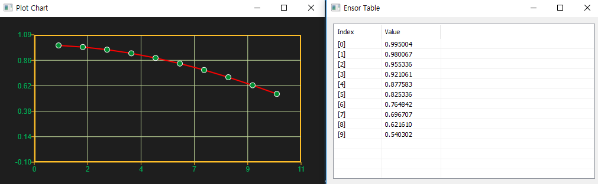

## enuSpace

## Math & Statistics functions

---

본 문서는 enuSpace for jupiter version 기반으로 작성되었습니다.

enuSpace for jupiter 버젼에서는 수학 및 통계 함수를 제공합니다.

```lua
function MathEquation()
     local ensor_x = ensor.new("{0.1,0.2,0.3,0.4,0.5,0.6,0.7,0.8,0.9,1.0}")
     local ensor_cal = ensor.Cos(ensor_x )

     ensor.Plot(ensor_cal)  -- Data visualization by Plot chart.
     ensor.Table(ensor_cal)  -- Data visualization by Table.
 end
```

다양한 데이터 가시화 기능을 이용하여 데이터 분석을 수행할수 있습니다.

### Math & Statistics API Category

* #### [Math](/statistics/math-api.html)
* #### [Statistics](/statistics/statistics-api.html)


