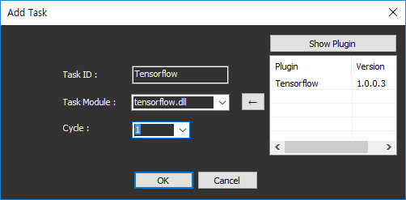
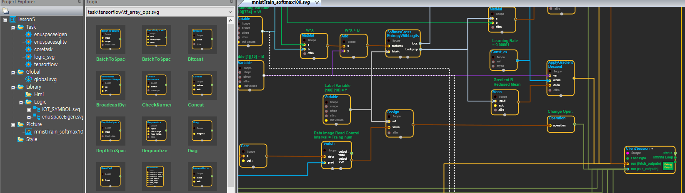

# **enuSpace plugin**

---

#### enuSpace plugin 관리자

Plugin Manager 리본 메뉴를 클릭하여, Plugin Manager를 호출합니다.

내려받고자 하는 Plugin을 선택후 INSTALL 버튼을 클릭하여 설치를 수행합니다.

#### Project add plugin

신규 프로젝트에 Plugin 모듈을 추가하여 사용하기 위해서 Project Explorer에서 Task의 팝업메뉴를 통한 Add Task를 수행합니다.

Add Task 다이얼로그를 통하여 설치된 plugin을 추가합니다.

Show Plugin 버튼을 클릭하여, 현재 설치된 플러그인 리스트를 확인후 추가하고자 하는 플러그인을 클릭하여 신규 프로젝트에 추가합니다. Cycle 정보는 1초에 Plugin의 Task의 메인 함수 호출 주기입니다. 만약 2를 입력하였다면, 1초에 2회 호출을 수행합니다.

OK 버튼을 클릭시 해당 플러그인 Task가 추가됩니다.

Plugin Task의 타입에 따라 그래픽 로직 블럭을 제공하기도 하며, 수치 연산로직용으로 적용되기도 합니다.

Plugin Task의 제작방법은 External Task항목을 참고하세요.

그래픽 로직 블럭을 제공시에는 신규 Picture를 추가하여, 로직을 구성하여 모델을 생성합니다.

## Plugin List

---

#### enuSpaceSQLite

enuSpace에서 SQLite를 로직 블럭을 이용하여 프로그래밍을 수행할 수 있습니다.

gitbook : [https://expnuni.gitbooks.io/enuspacesqlite/](https://expnuni.gitbooks.io/enuspacesqlite/)

github : [https://github.com/EXPNUNI/enuSpaceSQLite](https://github.com/EXPNUNI/enuSpaceSQLite)

---

#### enuSpaceTensorflow

enuSpace에서 Tensorflow를 로직 블럭을 이용하여 프로그래밍을 수행할 수 있습니다.

gitbook : [https://expnuni.gitbooks.io/enuspacetensorflow/](https://expnuni.gitbooks.io/enuspacetensorflow/)

github : [https://github.com/EXPNUNI/enuSpaceTensorflow](https://github.com/EXPNUNI/enuSpaceTensorflow)

#### 

