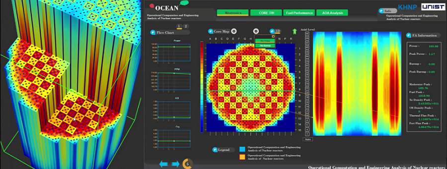
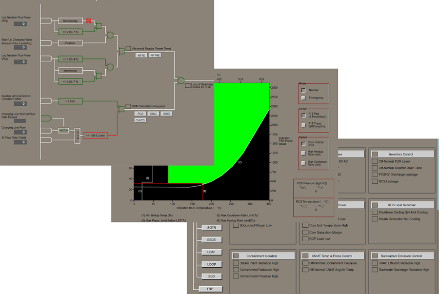

# Reference \(Applied Project\)

---

#### 

#### enuSpace-Tensorflow

enuSpace for saturn \(ver 4.0\)

#### 3D Display and Core analyzer

enuSpace for jupiter \(ver 3.0\)

#### Air Map Editor Software

enuSpace for mars \(ver 2.0\)

#### Air Traffic Analsys Software

enuSpace for mars \(ver 2.0\)

#### Plant HMI Software

enuSpace for moon \(ver 1.0\)

