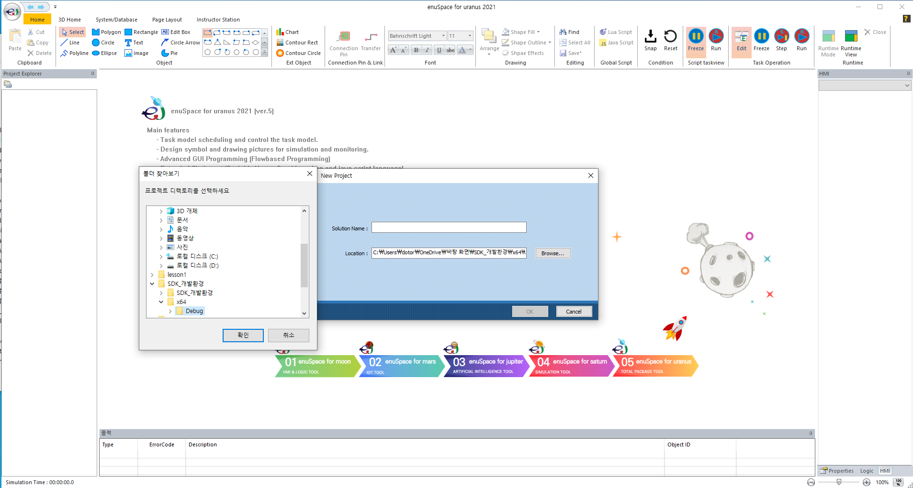
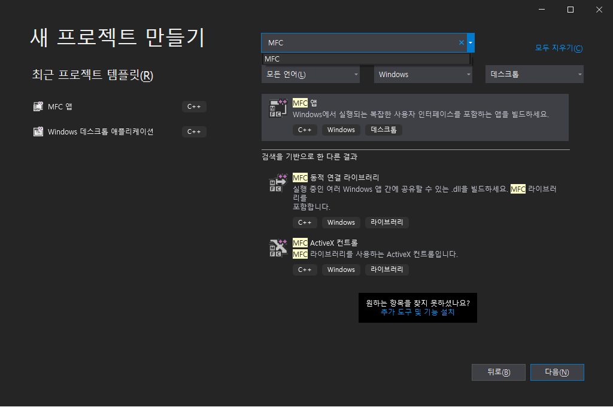
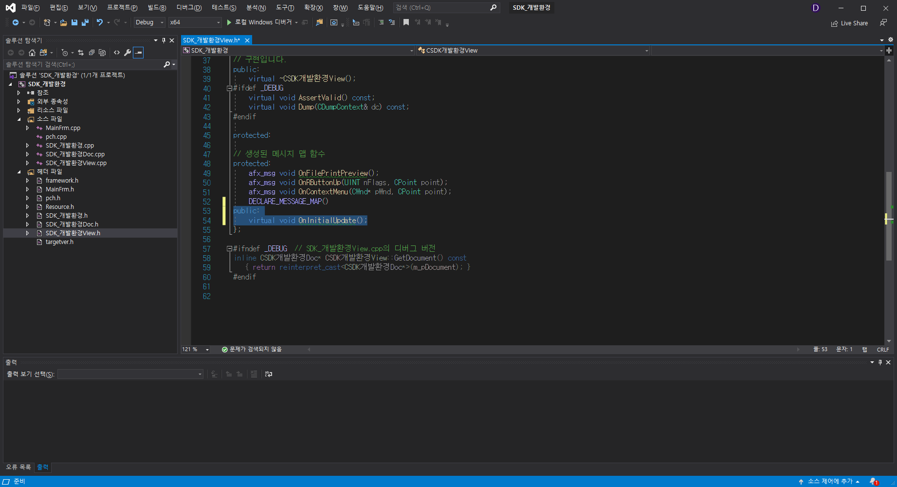
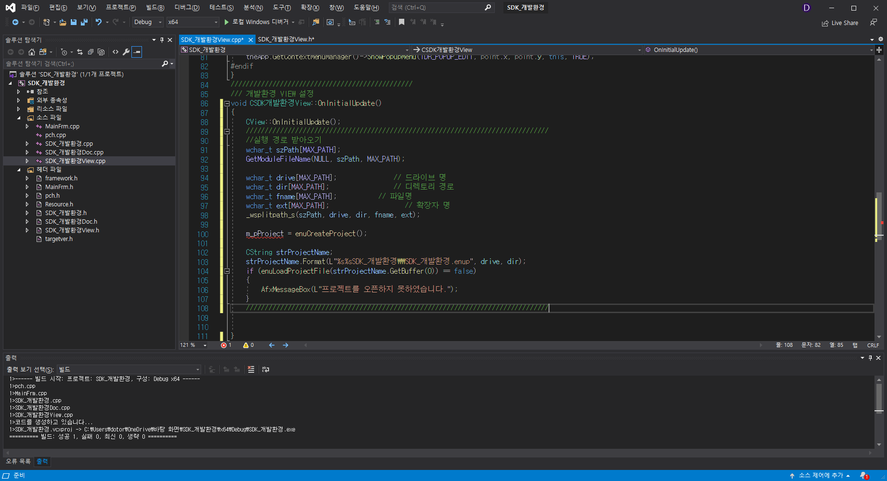

# **SDK 개발환경 설정**

---

## **준비물 : enuSpace SDK, Visual studio2019**
---


## enuSpace SDK 파일 및 디렉토리 구조
---

* header
--header/enuLibrary.h
--header/svgdefine.h
* lib
--lib/enuSpaceLib.lib
* bin
--bin/Certify.dll
--bin/dbplugin
--bin/dllLEA.dll
--bin/DXFHandler.dll
--bin/enuspace.config
--bin/enuSpaceLib.dll
--bin/glew32.dll
--bin/hdf5.dll
--bin/hdf5_cpp.dll
--bin/InstructorStation.dll
--bin/libmariadb.dll
--bin/natives_blob.bin
--bin/plugin
--bin/PluginManager.dll
--bin/ReservedWords.js
--bin/ReservedWords.lua
--bin/SciLexer.dll
--bin/snapshot_blob.bin
--bin/sqlite3.dll
--bin/v8.dll
--bin/v8_libbase.dll
--bin/v8_libplatform.dll
--bin/WebExtension.dll

## enuSpace Studio를 이용한 프로젝트 생성
---
enuSpace Studio를 이용하여 MFC 응용프로그램에서 사용하기 위한 프로젝트를 생성한다. 
enuSpace Studio를 실행해서 새 프로젝트를 만들고 픽쳐를 생성 간단한 그림을 작도한다.




## MFC(Microsoft Foundation Class) 기반의 프로젝트 생성
---


MFC 기반 Single Doc/View 프로젝트를 생성한다.


프로젝트 루트 디렉토리에 제공된 enuSpace SDK 폴더 복사 및 붙여넣기를 수행한다.


생성된 프로젝트 해더에 enuSpace SDK관련 해더 및 라이브러리정보를 추가한다. 
추가방법은 아래와 같습니다.
주) enuSpace SDK를 사용하려면 #define USE_SDK를 설정한다.

```cpp
#define USE_SDK

#include "enuSpace SDK/header/SvgDefine.h"
#include "enuSpace SDK/header/enuLibrary.h"

#pragma comment(lib, "enuSpace SDK/lib/enuSpaceLib.lib")
```
---

MFC 프로젝트를 빌드 후 실행힌다. 


실행시 프로젝트 실행 디렉토리에 enuSpace SDK/bin 디렉토리에 포함된 파일을 복사하여 붙여넣기를 수행한다.
주) enuSpaceLib.dll은 참조되는 파일들이 모두 동일한 디렉토리에 위치한다.


enuSpace SDK에서 제공하는 프로젝트 생성, 로드, 뷰 설정을 수행하기 위한 함수를 추가한다. 




## MFC(Microsoft Foundation Class) 기반 응용프로그램에서 enuSpace 프로젝트 로드
---
MFC 기반 응용프로그램에서 enuLoadProject()함수를 통하여 enuSpace 프로젝트 파일의 풀패스 정보를 입력하여 프로젝트를 로드한다.

실행 프로그램의 디렉토리 위치를 취득하여 enuSpace 프로젝트를 로드한 예이다. 



```cpp

// .....h
public:
	HPROJECT m_pProject;
	HVIEW m_pENUView;

////////////////////////////////////////////////
/// 개발환경 VIEW 설정
void CSDKView::OnInitialUpdate()
{
	CView::OnInitialUpdate();
	//////////////////////////////////////////////
	//실행 경로 받아오기
	wchar_t szPath[MAX_PATH];
	GetModuleFileName(NULL, szPath, MAX_PATH);

	wchar_t drive[MAX_PATH];           
	wchar_t dir[MAX_PATH];              
	wchar_t fname[MAX_PATH];           
	wchar_t ext[MAX_PATH];                    
	_wsplitpath_s(szPath, drive, dir, fname, ext);

	m_pProject = enuCreateProject();

	CString strProjectName;
	strProjectName.Format(L"%s%sSDK_개발환경\\SDK_개발환경.enup", drive, dir);
	if (enuLoadProjectFile(strProjectName.GetBuffer(0)) == false)
	{
		AfxMessageBox(L"프로젝트를 오픈하지 못하였습니다.");
	}
	//////////////////////////////////////////////
	m_pENUView = enuCreateView(m_hWnd);
	enuSetWindowColor(m_pENUView, 255, 255, 255);

	RECT rect;
	GetClientRect(&rect);

	enuSetWindowPos(m_pENUView, rect.left, rect.top, rect.right - rect.left, rect.bottom - rect.top);
	enuSetCanvasSize(m_pENUView, 1920, 1080);

	enuSetSvgPageView(m_pENUView, L"picture\\Main.svg");
	HSVG hSvg = enuGetSvgHandler(m_pENUView);

	enuSetEditOperationMode(m_pENUView, false);
	//////////////////////////////////////////////
}

```
---

enuSpace SDK에서 제공하는 View의 사이즈를 MFC 응용프로그램 Resize 이벤트를 처리하기 위하여 아래와 같이 OnSize() 함수와 프로그램 종료시 메모리 해제를 하기위하여 OnDestory()함수를 추가하여 아래와 같이 enuSpace API 함수를 호출한다. 

```cpp

void CSDKView::OnSize(UINT nType, int cx, int cy)
{
	CView::OnSize(nType, cx, cy);

	if (m_pENUView)
	{
		RECT rect;
		GetWindowRect(&rect);
		enuSetWindowPos(m_pENUView, 0, 0, rect.right - rect.left, rect.bottom - rect.top);
		enuSetAutoScale(m_pENUView, 0, 0, rect.right - rect.left, rect.bottom - rect.top);
	}
}


void CSDKView::OnDestroy()
{
	CView::OnDestroy();

	// TODO: 여기에 메시지 처리기 코드를 추가합니다.
	enuDestoryView(m_pENUView);
	enuCloseProjectFile();
	enuDestoryProject(m_pProject);
}

```
