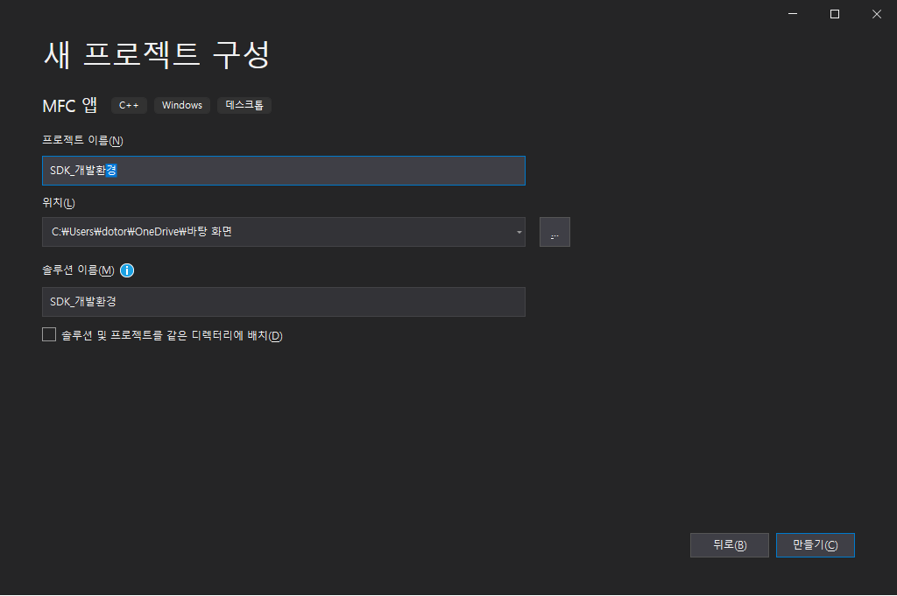
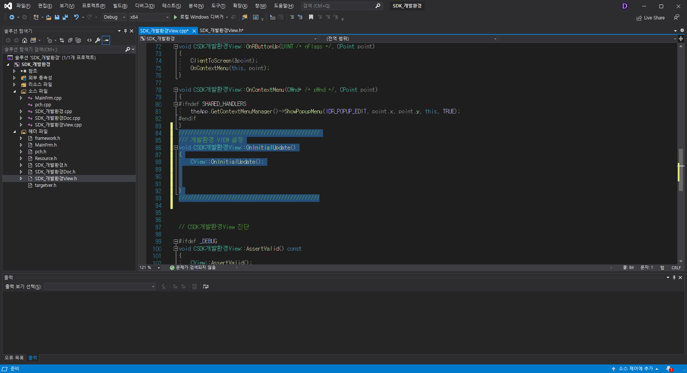
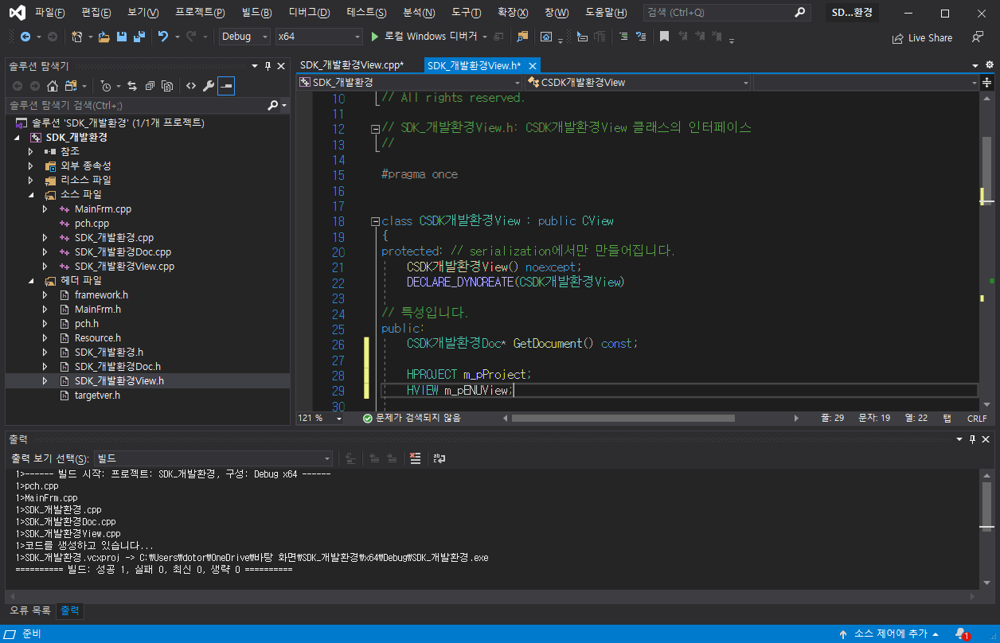
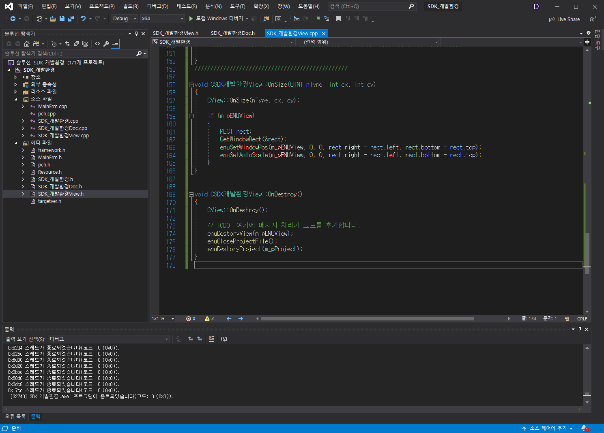

# **SDK 개발환경 설정**

---

## **New Project**

---

MFC(Microsoft Foundation Class) 기반의 프로젝트를 만듭니다.

제목은 짓습니다.

사용 목적에 맞게 설정을 합니다.

enuSpace SDK 폴더를 프로젝트 폴더에 넣습니다.

헤더파일 \(pch.h\)에 enuSpace SDK 파일을 추가합니다.

64비트로 빌드를 합니다.

빌드후 생긴 폴더에 enuSpace SDK/bin에 있는 파일들을 복사해서 붙여넣기 합니다.

SDK_개발환경View.h(현재 사용중인 Project의 이름이 SDK_개발환경으로 지정했기 때문이다.)에 실행을 위한 가상함수 OnInitialUpdate()를 public으로 지정합니다.

SDK_개발환경View.cpp에 OnInitialUpdate()를 상속받는 CSDK개발환경View 함수를 만듭니다.

enuSpace.exe를 실행해서 새 프로젝트를 만들고, 그 프로젝트의 저장위치는 SDK_개발환경 실행 폴더로 합니다.

enuSpace로 VisualStudio MFC앱으로 실행하고자 하는 파일을 생성합니다.(필자는 Picture 폴더에 Main.svg파일을 생성했습니다.)

SDK_개발환경View.cpp에서 CSDK개발환경View 함수에 실행결로를 받아옵니다.

m_pProject 변수의 타입을 SDK_개발환경View.h의 CSDK개발환경View클래스에 HPROJECT로 m_pENUView의 변수 타입을 HVIEW로 지정합니다.

SDK_개발환경View.cpp에 View의 크기, 위치, view에 보여주려는 파일 등을 지정합니다.

SDK_개발환경View.h에 추가하려는 기능의 함수를 지정합니다.

SDK_개발환경View.cpp에 OnSize 기능과, OnDestroy기능을 추가합니다.