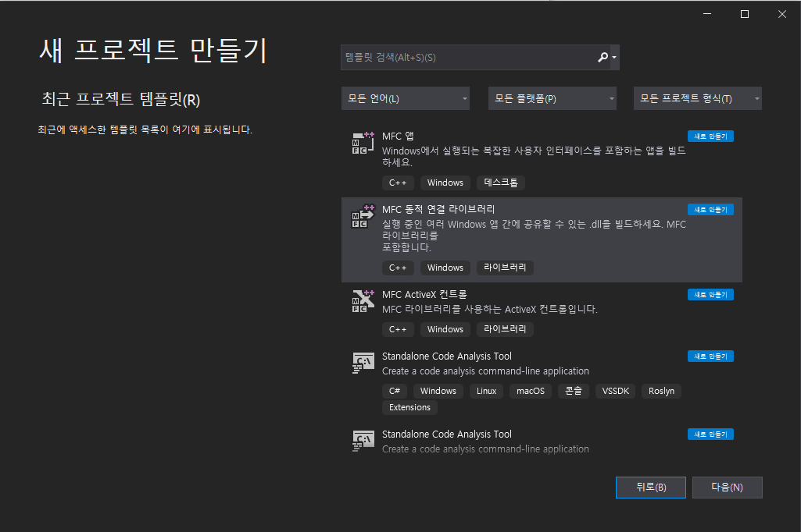
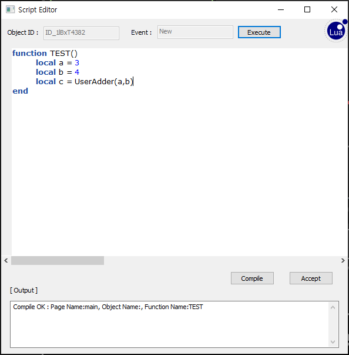

# ExternalFunction.dll 

## 프로젝트 생성 방법
---


MFC 동적 연결 라이브러리로 새 프로젝트를 만든다. 

다만 프로젝트 명은 ExternalFunction으로 하고, 저장된 폴더 명을 사용자의 상황에 맞게 설정한다.

## EnuSpace에 등록 방법
---


EnuSpace 프로젝트 폴더 안에 db 폴더가 있다.


이 중 enusapce.db를 통해 ExternalFunction.dll 등록을 수행한다. 

아래의 그림은 SQLite Expert Personal.exe를 통해 테이블을 수정하는 것을 보여준다.


* EXTERNALFUNCTION : 등록할 ExternalFunction.dll이 들어있는 폴더 명을 기록하는 컬럼. (사용자의 상황에 따라 다양한 폴더 명이 만들어진다.)

* EXTERNALFUNCTION_MODULE : 등록할 ExternalFunction.dll의 상대 Path 정보를 기록하는 컬럼.


등록에 성공할 시 위의 그림처럼 사용자가 등록한 ExternalFunction이 Project tree에 표현된다.

## Script에서 사용할 함수 등록 방법
---


```cpp
#define USE_SDK
#include "enuspace_sdk/x64/header/enuLibrary.h" // EnuSpace SDK Include는 필수!!!

int Adder(lua_State* L)
{
	/// /////////////////////////////////////////////////////////
	// 외부함수 사용시 디폴트 파라미터 영역입니다. 아래영역은 수정하지 마세요.
	const char* str;
	str = luaL_checkstring(L, 1);
	CString strPageName(str);

	str = luaL_checkstring(L, 2);
	CString strScriptName(str);
	/// /////////////////////////////////////////////////////////

	int first = lua_tonumber(L, 3);
	int second = lua_tonumber(L, 4);
	int cc = first + second;

	lua_pushnumber(L, cc);  //출력하는 값
	return 1;
}


extern "C" __declspec(dllexport) bool OnLoad()
{
	enuRegisterFunction(L"UserAdder", Adder);   
	return true;
}
```
참조 : [enuRegisterFunction](enusappapi_enuregisterfunction)

* Script로부터 입력받는 Parameter 설정
```cpp
lua_tonumber(L, 3); // 함수의 첫 번쨰 Parameter
lua_tonumber(L, 4); // 함수의 두 번쨰 Parameter

// 입력받는 인자가 number일 때는 lua_tonumber 사용
// 입력받는 인자가 string일 때는 luaL_checkstring 사용
```

* 출력 값 설정
```cpp

lua_pushnumber(L, cc);  // 출력하는 값이 number
lua_pushstring(L, str); // 출력하는 값이 string

// 출력하는 값이 number일 때는 lua_pushnumber 사용
// 출력하는 값이 string일 때는 lua_pushstring 사용

return 1; // 출력하는 값의 개수를 return 한다.

// 만약 출력하는 값이 없을 때는 return 0;
```

## 함수 등록 성공 메세지 및 Script에서 함수 사용 예시
---


Debug 창에 위와 같은 메세지가 표현된다.



Script에서 위와 같이 함수를 사용한다.

## 사용시 주의할 점
---


* Thread 사용이 필요한 경우.

enuGetObjectById, enuGetTrendSeriesNode... 같은 함수들은 사용자가 입력한 값에 해당하는 객체를 검색하고 그 결과에 대해 return한다.

각 함수들의 작업은 Task Scheduler에 쌓이고, RTM에서 실시간으로 처리된다.

다만, 작업의 효율성을 위해 각 함수에는 결과를 받기까지 허용한 시간이 있다. 

그 시간내에 올바른 결과를 받을 수 없을 경우, 작업이 실패한 것으로 간주한다.

위의 작업들을 ExternalFunction.dll에서 바로 사용할 경우, 

요청한 작업이 RTM이 처리하기 전에 Task Scheduler에 머물다 허용한 시간 지나갈 가능성이 높다.

따라서 별도의 Thread를 구성해서 사용하는 것을 추천한다.
