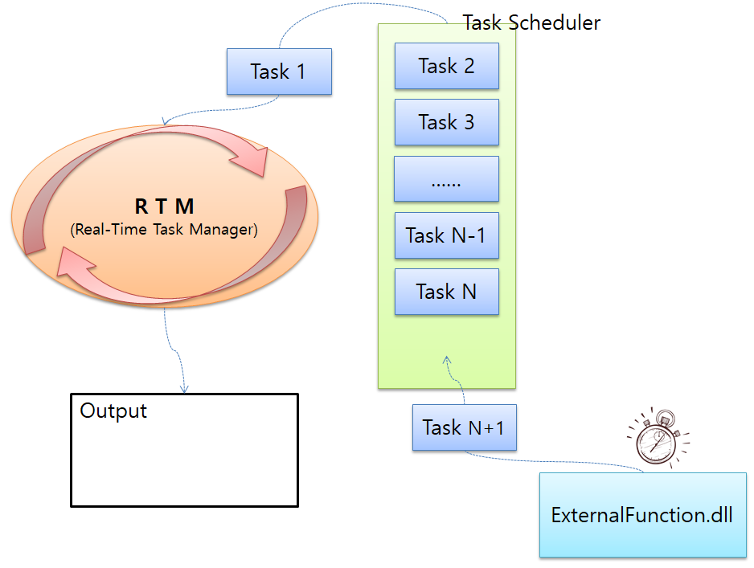

# **주의할 점**

## ExternalFunction 사용시 주의할 점
---

* 허용 시간 내에 return을 못할 경우.

enuGetObjectById, enuGetTrendSeriesNode... 같은 함수들은 사용자가 입력한 값에 해당하는 객체를 검색하고 그 결과에 대해 return한다.

각 함수들의 작업은 Task Scheduler에 쌓이고, RTM에서 실시간으로 처리된다.

다만, 작업의 효율성을 위해 각 함수에는 결과를 받기까지 허용한 시간이 있다. 

그 시간내에 올바른 결과를 받을 수 없을 경우, 작업이 실패한 것으로 간주한다.

위의 작업들을 ExternalFunction.dll에서 바로 사용할 경우, 

요청한 작업이 RTM이 처리하기 전에 Task Scheduler에 머물다 허용한 시간 지나갈 가능성이 높다.

따라서 별도의 Thread를 구성해서 사용하는 것을 추천한다.

---
