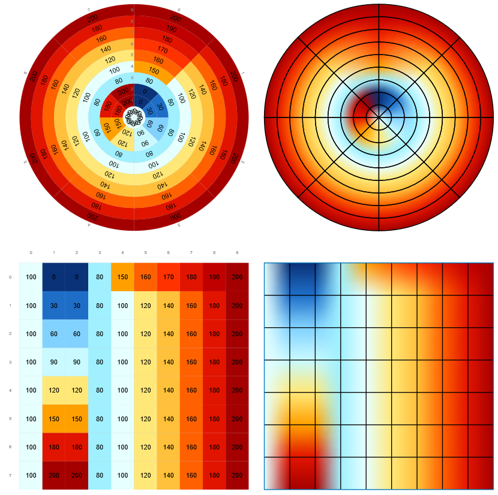
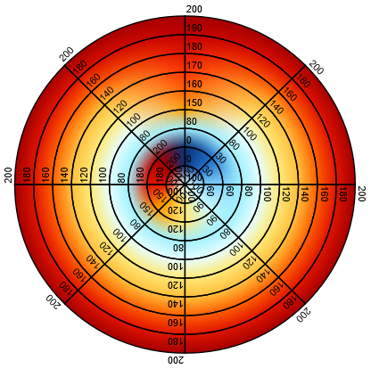

Revision 2019.12.09 - enuSpace for saturn \(v4.0\)

# contour

---

contour객체에 대하여 설명합니다.



---

## Properties

아래 테이블의 속성정보는 스크립트상에서 연계되는 속성 이름과 데이터 타입정보 입니다.

| Property | Type | Description | Value |
| :--- | :--- | :--- | :--- |
| visibility | bool | 객체의 visibility 속성 | true, false |
| lock | bool | 객체의 잠금 속성 | true, false |
| stroke | string | 객체의 라인 색상 속성 | "rgb\(0,0,0\)", "\#000000" |
| stroke\_opacity | float | 객체의 라인 투명도 속성 | 0~1 |
| stroke\_width | float | 객체의 라인 굵기 | value |
| stroke\_linecap | string | 객체의[linecap](#)의 속성 | "butt", "round", "square" |
| stroke\_linejoin | string | 객체의 linejoin의 속성 | "miter", "round", "bevel" |
| stroke\_dasharray | string | 객체의[dasharray](#)의 속성 | "1 1 1" |
| x | float | 객체의 x위치 속성 | value |
| y | float | 객체의 y위치 속성 | value |
| width | float | 객체의 넓이 속성 | value |
| height | float | 객체의 높이 속성 | value 라운드 |
| translate\_x | float | 객체의 x축 이동 | value |
| translate\_y | float | 객체의 y축 이동 | value |
| rotate | float | 객체의 회전 각도 | value |
| scale\_x | float | 객체의 x 스케일 | value |
| scale\_y | float | 객체의 y 스케일 | value |
| center\_x | float | 객체의 x 센터 설정 | value |
| center\_y | float | 객체의 y 센터 설정 | value |
| fill | string | 채우기 색상 설정 | "rgb\(0,0,0\)", "\#000000" |
| fill\_opacity | float | 채우기 투명도 설정 | 0~1 |
| grid\_stroke | string | 그리드 라인 색상 설정 | "rgb\(0,0,0\)", "\#000000" |
| grid\_stroke\_width | float | 그리드 라인 굵기 설정 | value |
| grid\_stroke\_opacity | float | 그리드 라인 투명도 설정 | 0~1 |
| subdivision\_x | int | 컨투어 분할\(x\) | value |
| subdivision\_y | int | 컨투어 분할\(y\) | value |
| label\_num | int | 라벨의 개수 | value |
| xaxis\_font\_color | string | x 축 폰트 색상 | "rgb\(0,0,0\)", "\#000000" |
| xaxis\_font\_family | string | x 축 폰트 이름 | "arial"... |
| xaxis\_font\_size | float | x 축 폰트 사이즈 | value |
| yaxis\_font\_color | string | y 축 폰트 색상 | "rgb\(0,0,0\)", "\#000000" |
| yaxis\_font\_family | string | y 축 폰트 이름 | "arial"... |
| yaxis\_font\_size | float | y 축 폰트 사이즈 | value |
| value\_font\_color | string | 값 폰트 색상 | "rgb\(0,0,0\)", "\#000000" |
| value\_font\_family | string | 값 폰트 이름 | "arial"... |
| value\_font\_size | float | 값 폰트 사이즈 | value |
| value\_format | string | 값 디스플레이 포맷 | "number", "engineering unit" |
| value\_decimal\_point | int | 소수점 자리 디스플레이 | value |
| legend\_pos | string | 범례 위치 | left, right, top, bottom |
| legend\_gap | float | contour와 범례사이의 간격 | value |
| legend\_width | float | 범례 너비 | value |
| legend\_font\_family | string | 범례 폰트 이름 | "arial"... |
| legend\_font\_size | float | 범례 폰트 크기 | value |
| grid\_visible | bool | 그리드 Visible 속성 | true, false |
| outline\_visible | bool | 아웃라인 Visible 속성 | true, false |
| legend\_visible | bool | 범례 Visible 속성 | true, false |
| xaxis\_visible | bool | x 축 Visible 속성 | true, false |
| yaxis\_visible | bool | y 축 Visible 속성 | true, false |
| value\_visible | bool | 값 Visible 속성 | true, false |
| draw\_shape | string | Contour 모양 | "rect", "circle" |
| draw\_type | string | Contour 그리기 타입 | "solid", "contour" |
| draw\_direction | string | Contour 그리는 방향 | rect: "top bottom", "bottom top" ;  circle: "clockwise", "counterclockwise" |
| minElevation | float | 컨투어 최소값 | value |
| maxElevation | float | 컨투어 최대값 | value |
| colorElevation | string | 컨투어 색상 리스트 | rgb\(10,50,120\);rgb\(15,75,165\);rgb\(165,0,0\) |

* colorElevation값 설정 방법

rgb\(0,100,20\),rgba\(20,30,40,30\) ..... : 색상값을 rgb, rgba의 포맷에 따라서 나열하는 방법

hsl\(0,100,20\),hsla\(20,30,40,20\) ...... : 색상값을 hsl, hsla의 포맷에 따라서 나열하는 방법

hsl\_elevation\_l\(0:360, 0:100, 0:100\) : hsl 색상표를 이용한 색상 테이블 설정 방법\(left 방향\)

hsl\_elevation\_r\(0:360, 0:100, 0:100\) : hsl 색상표를 이용한 색상 테이블 설정 방법\(right 방향\)

hsla\_elevation\_l\(0:360, 0:100, 0:100, 0:1\) : hsla 색상표를 이용한 색상 테이블 설정 방법\(left 방향\)

hsla\_elevation\_r\(0:360, 0:100, 0:100, 0:1\) : hsla 색상표를 이용한 색상 테이블 설정 방법\(right 방향\)

rgb\_elevation\(0:255, 0:255, 0:255\) : rgb 색상표를 이용한 색상 테이블 설정 방법

rgb\_elevationa\(0:255, 0:255, 0:255, 0:1\) : rgba 색상표를 이용한 색상 테이블 설정 방법


## Script Example

스크립트는 lua스크립트와 javascript를 이용하여 적용할 수 있습니다.

객체의 속성을 설정하는 방법에는 직접 객체의 변수에 접근하여 적용하는 방법과[SetAttribute](./enusscriptapi_setattribute.md.md)함수를 통하여 적용할 수 있습니다. 직접 변수에 접근하고자 할 경우에는 위 테이블의 속성이름을 통하여 접근을 수행합니다.

SetAttribute함수는 전역기반의 함수로 객체의 이름과 속성을 조합하여 값을 설정합니다. 스크립트를 SVG노드에서 추가하였을 경우에는 해당객체의 ID와 속성을 통하여 스크립트를 작성합니다.

* 컨투어의 색상을 표현하기 위한 변수는 subdivision_x, \_subdivision\_y_의 설정값에 따라서 변경된다. 예를 들어 subdivision\_x=5, \_subdivision\_y=5로 설정하였을 경우, double형 data\[5\]\[5\]의 메모리가 생성된다. 생성된 data 배열 변수를 이용하여 스크립트를 작성한다.

## lua Script

lua Script \(객체내부의 ontaskview 함수에서의 구현한 예시\)

```lua
function _ontaskview()

    --TODO Add your lua script code here
    local i
    local j
    for i=0,3 do 
        for j=0,3 do
            data[i][j] = data[i][j] + 1
            if (data[i][j] >100) then
                data[i][j] = 0

                -- label display. if label-num = 1
                label[i][j][0] = string.format('%d,%d',i,j)
            end
        end
    end

end
```

lua Script \(SVG의 ontaskview 함수에서의 구현한 예시\)

```lua
function _ontaskview()

    --TODO Add your lua script code here
    local i
    local j
    for i=0,3 do 
        for j=0,3 do
            ID_CONTOUR.data[i][j] = ID_CONTOUR.data[i][j] + 1
            if (ID_CONTOUR.data[i][j] >100) then
                ID_CONTOUR.data[i][j] = 0

                -- label display. if label-num = 1
                ID_CONTOUR.label[i][j][0] = string.format('%d,%d',i,j)

                -- if label-num = 2
                ID_CONTOUR.label[i][j][1] = string.format('%d,%d',i,j)                  
            end
        end
    end

end
```

## javascript

javascript를 이용하여 적용하였을 경우, 웹 랜더러를 이용하여 동적 웹 가시화가 가능합니다.

javascript \(객체내부의 ontaskview 함수에서의 구현한 예시\)

```js
function _ontaskview()
{    
    //TODO Add your javascript code here
    var i
    var j
    for (i=0 ; i<5 ; i++)
    {
        for (j=0 ; j<5 ; j++ )
        {
            data[i][j] = data[i][j] + 1;
            if (data[i][j] > 100)
            {
                data[i][j] = 0;
            }
        }
    }
}
```

## enuSpace의 속성 윈도우 {#enuspace의-속성-윈도우}

enuSpace 스튜디오를 통하여 객체의 편집 및 속성정보를 확인할 수 있습니다.

       

### contour data 편집 대화창


## SVG Tag 예시 {#svg-tag-예시}

```xml
<?xml version="1.0" encoding="UTF-16"?>
<svg id="ID_1h1QZt1" stroke="rgb(0,119,189)" stroke-opacity="1" stroke-width="1" transform="translate(0,0) rotate(0) scale(1, 1)" pg-xcenter="0" pg-ycenter="0" style="stroke:rgb(127,127,127);stroke-opacity:1.00;stroke-width:2.00;stroke-dasharray:1,1,1;"
    enuspace-version="4.0.2.0"
    xmlns="http://www.w3.org/2000/svg"
    xmlns:xlink="http://www.w3.org/1999/xlink"
    width="1920"
    height="1080"
>
    <pg-trend-contour id="ID_1gvvB40" stroke="rgb(0,0,0)" stroke-opacity="1" stroke-width="1" transform="translate(300,300) rotate(0) scale(1, 1)" pg-xcenter="0" pg-ycenter="0" stroke-linecap="square" stroke-linejoin="miter" draw-shape="circle" draw-type="solid" draw-direction="clockwise" x="0.00" y="0.00" width="500.00" height="500.00" fill="rgb(200,200,200)" fill-opacity="1.00" grid-stroke="rgb(0,0,0)" grid-stroke-width="0.50" grid-stroke-opacity="1.00" xaxis-font-family="arial" xaxis-font-color="rgb(0,0,0)" xaxis-font-size="20.00" yaxis-font-family="arial" yaxis-font-color="rgb(0,0,0)" yaxis-font-size="20.00" value-font-family="arial" value-font-color="rgb(0,0,0)" value-font-size="15.00" value-format="number" value-decimal-point="0" subdivision="7,9" label-num="0" minElevation="0.000000" maxElevation="90.000000" colorElevation="rgb(10,50,120);rgb(15,75,165);rgb(30,110,200);rgb(60,160,240);rgb(80,180,250);rgb(130,210,255);rgb(160,240,255);rgb(200,250,255);rgb(230,255,255);rgb(255,250,220);rgb(255,232,120);rgb(255,192,60);rgb(255,160,0);rgb(255,96,0);rgb(255,50,0);rgb(225,20,0);rgb(192,0,0);rgb(165,0,0)" grid-visible="visible" outline-visible="visible" xaxis-visible="visible" yaxis-visible="visible" value-visible="visible" data="10.000000,20.000000,30.000000,40.000000,50.000000,60.000000,70.000000,80.000000,90.000000,10.000000,20.000000,30.000000,40.000000,50.000000,60.000000,70.000000,80.000000,90.000000,10.000000,20.000000,30.000000,40.000000,50.000000,60.000000,70.000000,80.000000,90.000000,10.000000,20.000000,30.000000,40.000000,50.000000,60.000000,70.000000,80.000000,90.000000,10.000000,20.000000,30.000000,40.000000,50.000000,60.000000,70.000000,80.000000,90.000000,10.000000,20.000000,30.000000,40.000000,50.000000,60.000000,70.000000,80.000000,90.000000,10.000000,20.000000,30.000000,40.000000,50.000000,60.000000,70.000000,80.000000,90.000000"></pg-trend-contour>
</svg>
```

# enuSpace for saturn \(ver 4.0\) 추가 기능

### 속성 확장 : circle-position

color-position 속성 정보는 draw-shape 속성값이 circle인 경우에만 제공되는 정보입니다. circle-position 속성은 원형 컬럼의 위치 정보를 설정하는 기능입니다.


원형 컬럼의 위치 정보를 0~100사이의 가중치값을 이용하여 컬럼을 정의합니다.

### 속성 확장 : min-transparent

min-transparent 속성 정보가 true 설정시 표현하고자 하는 데이터의 값이 minElevation값과 같은 경우에 투명 처리를 수행하는 옵션이다.


