# Trend

---

Trend\(이하 차트\)객체의 속성 및 사용방법에 대하여 설명합니다.

**Lesson6 project sample: **[lesson6.zip](http://enuspace.tistory.com/attachment/cfile1.uf@2131E739593102D3334615.zip)

차트의 사용법은 크게 3가지가 있습니다.

1. 정적 데이터를 이용한 차트 객체 표현

2. 동적 데이터를 이용한 차트 객체 표현

3. 차트 객체를 Logic객체로 만들어서 사용하기

차트는 기본적으로 실시간 차트입니다. 이를 라인 차트로 변경하려면 몇가지 설정을 해줘야 합니다.

## New Project

---

우선 차트를 그리기 위한 프로젝트를 하나 생성합니다.

프로젝트 생성은[프로젝트 만들기 튜토리얼](http://enuspace.tistory.com/entry/enuSpace-for-mars-tutorial2)을 참조하시길 바랍니다.

프로젝트 생성이 완료 되었다면 Project Explorer에서 Picture폴더에 trend라는 svg파일을 하나 생성합니다.

그리고 리본메뉴에서 차트\(Home-&gt;Chart\)를 선택하고 에디트화면에 생성합니다.

위 화면이 차트를 처음 생성했을 때 나타나는 화면입니다.

여기까지 하셨으면 차트를 사용하기 위한 기본작업이 완료되었습니다.

차트와 차트의 컴포넌트 속성은 다음과 같습니다.

## 차트 속성 보기

---

| 분류 | 속성 이름 | 속성 설명 |
| :--- | :--- | :--- |
| 기본 속성 | id | 차트의 id |
|  | visibility | 차트 visible속성 |
|  | lock | 편집화면에서 객체가 선택되지 않도록하는 속성 |
| Layout | x | 차트의 x좌표 |
|  | y | 차트의 y좌표 |
|  | width | 차트 배경의 너비 |
|  | height | 차트 배경의 높이 |
| Style&Class | style | 커스텀 스타일 프리셋을 만드는 속성 |
| Trend Properties | trend-flow | real time차트 활성화 비활성화 옵션 |
|  | trend-cycle | real time차트일 때 series에 데이터가 쌓이는 속도\(속성 값이 1이면 1초에 한번\) |
|  | title-visible | 차트 제목 표시/비표시 속성 |
|  | legend-visible | 차트 범례 표시/비표시 속성 |
|  | xaxis-visible | 차트 x축 표시/비표시 속성 |
|  | yaxis-visible | 차트 y축 표시/비표시 속성 |
|  | graph-visible | 차트 그래프 표시/비표시 속성 |
| Trend Background | fill | 차트 배경 색상 |
|  | fill-opacity | 차트 배경 투명도 |
|  | stroke | 차트 배경 외곽선 |
|  | stroke-opacity | 차트 배경 투명도 |
|  | stroke-width | 차트 배경 외곽선 굵기 |
|  | stroke-linejoin | 차트 배경 외곽선 꼭지점의 모양 |
|  | stroke-dasharray | 차트 배경 외곽선 스타일 |
| Trend Band Properties | band-visible | 그래프에 영역 설정을 하는 옵션 입니다. 최대값, 최소값을 설정할 수 있습니다. |
|  | band-hightlimit | 최대값을 설정하고 최대값보다 크고 y축 최대값보다 작은 영역을 표시합니다. |
|  | band-high-fill | 최대값 영역의 색상 |
|  | band-high-opacity | 최대값 영역의 투명도 |
|  | band-lowlimit | 최소값을 설정하고 최소값보다 작고 y축 최소값보다 큰 영역을 표시합니다. |
|  | band-low-fill | 최소값 영역의 색상 |
|  | band-low-opacity | 최소값 영역의 투명도 |
| Trend Axis Properties | duration | real time차트일 때 x축의 표시 범위 \(단위 : 초\) |
|  | xview-min | static차트일 때 x축 최대 값 |
|  | xview-max | static차트일 때 x축 최소 값 |
|  | yview-min | y축 최대 값 |
|  | yview-max | y축 최소 값 |
|  | auto-scale | series의 y데이터 값이 y축 최대값보다 클 경우 자동으로 y축 최대값을 보정하는 옵션 |

## 차트 제목 속성 보기

---

| 분류 | 속성 이름 | 속성 설명 |
| :--- | :--- | :--- |
| 기본 속성 | id | 차트 제목의 id |
| Style&Class | style | 커스텀 프리셋 스타일 설정 옵션 |
| Trend Title Properties | x | 차트 제목 x좌표 |
|  | y | 차트 제목 y좌표 |
|  | position | 차트 제목의 위치 프리셋 |
|  | fill | 차트 제목의 배경색 |
|  | fill-opacity | 차트 제목의 배경 투명도 |
|  | stroke | 차트 제목의 배경 외곽선색 |
|  | stroke-opacity | 차트 제목의 배경 외곽선 투명도 |
|  | stroke-width | 차트 제목의 배경 외곽선 굵기 |
|  | stroke-linejoin | 차트 제목의 배경 외곽선 꼭지점 모양 |
|  | stroke-dasharray | 차트 제목의 배경 외곽선 스타일 |
|  | title | 차트 제목의 내용 |
|  | font-color | 글씨 색상 |
|  | font-family | 글씨 모양 |
|  | font-size | 글씨 크기 |
|  | font-style | 글씨 스타일 |
|  | font-weight | 글씨 굵기 |
|  | gap-left | 차트 제목 왼쪽 여백 |
|  | gap-right | 차트 제목 오른쪽 여백 |
|  | gap-top | 차트 제목 위쪽 여백 |
|  | gap-bottom | 차트 제목 아래쪽 여백 |

## 차트 범례 속성 보기

---

| 분류 | 속성 이름 | 속성 설명 |
| :--- | :--- | :--- |
| 기본 속성 | id | 차트 범례의 id |
| Style&Class | style | 차트 범례의 스타일 프리셋 설정 속성 |
| Trend Legend Properties | position | 차트 범례의 위치 |
|  | current-value-display | series별로 현재값을 표시해주는 옵션\(real time\) |
|  | current-value-type | 현재값의 표시형식 설정 |
|  | current-value-decimal-point | 현재값의 소수점 표시 자리수 설정 |
|  | gap-left | 차트 범례의 왼쪽 여백 |
|  | gap-right | 차트 범례의 오른쪽 여백 |
|  | gap-top | 차트 범례의 위쪽 여백 |
|  | gap-bottom | 차트 범례의 아래쪽 여백 |
|  | gap-row | 차트 범례의 줄간격 |
|  | gap-symbol-text | 차트 범례의 심볼과 series id 간의 간격 |
|  | gap-series | series\(symbol+series id+ current value\)와 series 간의 간격 |
|  | gap-text-currentvalue | series id와 current value 간의 간격 |
|  | fill | 범례 배경색 |
|  | fill-opacity | 범례 배경 투명도 |
|  | stroke | 범례 배경 외곽선색 |
|  | stroke-opacity | 범례 배경 외곽선 투명도 |
|  | stroke-width | 범례 배경 외곽선 굵기 |
|  | stroke-dasharray | 범례 배경 외곽선 스타일 |
|  | symbol-size | 심볼의 크기 |
|  | font-color | 글씨 색상 |
|  | font-family | 글씨 모양 |
|  | font-size | 글씨 크기 |
|  | font-style | 글씨 스타일 |
|  | font-weight | 글씨 굵기 |

## 차트 축 속성 보기

---

| 분류 | 속성 이름 | 속성 설명 |
| :--- | :--- | :--- |
| 기본 속성 | id | 차트 축의 id |
| Style&Class | style | 스타일 프리셋 설정 속성 |
| Trend Axis Properties | position | 차트 축의 위치 |
|  | mainscale | 주눈금 표시/비표시 설정 |
|  | scale-length | 주눈금의 길이 |
|  | tick | 눈금과 그래프와의 간격 설정 |
|  | stroke | 선 색상 |
|  | stroke-opacity | 선 투명도 |
|  | stroke-width | 선 굵기 |
|  | stroke-dasharray | 선 스타일 |
|  | font-color | 글씨 색상 |
|  | label-format | 축 라벨의 표시형식 지정 |
|  | decimal-point | 라벨의 소수점 표시 갯수를 지정\(label-format에서 number 속성을 선택 했을시 나타난다.\) |
|  | font-family | 글씨 모양 |
|  | font-size | 글씨 크기 |
|  | font-style | 글씨 스타일 |
|  | font-weight | 글씨 굵기 |

## 차트 그래프 속성

---

| 분류 | 속성 이름 | 속성 설명 |
| :--- | :--- | :--- |
| 기본 속성 | id | 차트 그래프의 id |
| Style&Class | style | 스타일 프리셋 설정 속성 |
| Trend Graph Properties | x | 그래프의 x좌표 |
|  | y | 그래프의 y좌표 |
|  | width | 그래프의 너비 |
|  | height | 그래프의 높이 |
|  | xaxis-count | x축 주눈금 갯수 |
|  | yaxis-count | y축 주눈금 갯수 |
|  | fill | 그래프 배경 색상 |
|  | fill-opacity | 그래프 배경색 투명도 |
|  | stroke | 그래프 외곽선의 색상 |
|  | stroke-opacity | 그래프 외곽선의 투명도 |
|  | stroke-dasharray | 그래프 외곽선의 스타일 |
|  | stroke-width | 그래프 외곽선의 굵기 |
|  | grid-stroke | 그래프 그리드선의 색상 |
|  | grid-stroke-opacity | 그래프 그리드선의 투명도 |
|  | grid-stroke-dasharray | 그래프 그리드선의 스타일 |
|  | grid-stroke-width | 그래프 그리드선의 굵기 |

## **1. 정적으로 차트 사용하기**

---

정적 차트\(라인 차트\)로 사용하기 위해서 몇가지 속성을 변경해야 합니다. 우선 위에서 생성한 차트를 선택하고 오른쪽에 속성창을 살펴봅니다.

클릭하시면 원본크기로 볼 수 있습니다.

위의 속성창에서 아래 세가지 속성을 변경해줍니다.

`trend-flow = off`

`xview-max = 300`

`auto-scale = off`

속성을 변경 했다면 아래와 같은 그림이 나옵니다.

이제 마우스로 차트를 선택 합니다. 선택하면 상단에 리본메뉴가 아래와 같이 바뀌어 있는것을 볼 수 있습니다.

리본메뉴에 대해 잠깐 설명 하자면 Add Chart Element는 차트안에 있는 컴포넌트들\(범례, 제목, 그래프, x축, y축\)의 visible 속성을 뜻합니다.  
Drawing 카테고리에 있는 메뉴들은 모두 차트 배경에 관한 속성입니다.  
Add Data항목은 차트의 series를 설정 하는 곳으로 series를 추가, 삭제, 속성 변경 등을 할 수 있습니다.

우리는 series를 추가해야 하니  Add Data를 선택 합니다.

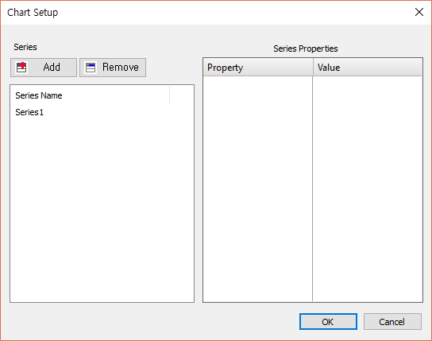

Add Data항목을 선택 했을 때 나오는 창입니다.

위 창에서 Add 버튼을 클릭하여 series를 하나 추가합니다. 그리고 추가된 series를 선택하여 오른쪽에 series에 대한 속성을 띄웁니다.

series에 관한 속성은 다음과 같습니다.

## series 속성 보기

---

| 분류 | 속성 이름 | 속성 설명 |
| :--- | :--- | :--- |
| 기본 속성 | id | series의 id 값 |
| TrendSeries Variable | variable | 실시간 차트에서 사용하는 속성, 실시간으로 값이 변하는 변수의 이름을 넣으면 해당 변수의 데이터를 가져오는 인터페이스 속성 |
| TrendSeries Properties | series-type | 정적 차트에서 사용하는 속성, 차트의 종류를 바꾼다. |
|  | stroke | series의 선의 색상 |
|  | stroke-opacity | series 선의 투명도 |
|  | stroke-width | series 선의 굵기 |
|  | stroke-linecap | series 선의 시작점과 끝점의 모양 |
|  | symbol-type | series의 각 데이터포인트의 모양\(원, 삼각형, 사각형\) |
|  | symbol-fill | series 심볼의 배경색 |
|  | symbol-fill-opacity | series 심볼의 배경 투명도 |
|  | symbol-stroke | series 심볼의 외곽선 색 |
|  | symbol-stroke-opacity | series 심볼의 외곽선 투명도 |
|  | symbol-stroke-width | series 심볼의 외곽선 굵기 |
|  | symbol-stroke-dasharray | series 심볼의 외곽선  스타일 |
|  | symbol-size | series 심볼의 크기 |
|  | series-max-size | series에 저장되는 데이터의 총 갯수 |
|  | data | series의 정적 데이터를 집어넣는 속성 |

정적 데이터의 데이터 포맷은 x,y x,y 입니다. 예\) 50,300 100,250 150,400 200,150 250,500

위의 예를 series2의 data속성에 넣으면 다음과 같은 화면이 나옵니다.

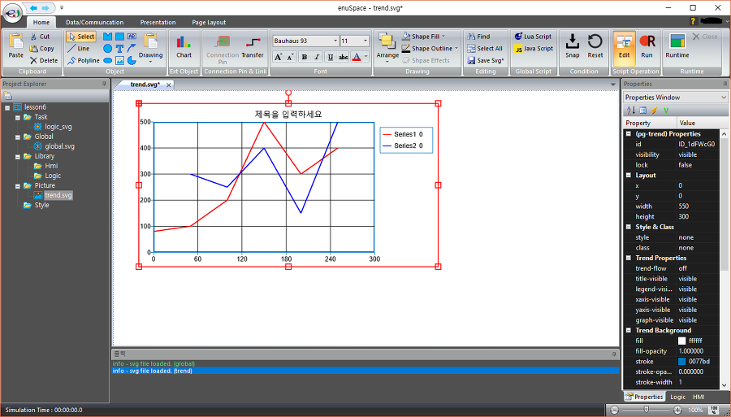

현재 정적 차트에서 사용할 수 있는 타입은 line\(선\)과 scatter\(점\) 차트입니다. 그리고 두가지 타입은 하나의 차트에 나타낼 수 있습니다.

## **2. 동적 차트 사용하기**

---

동적 차트를 사용하기 위해서 우선 값이 변하는 지역변수를 만들어 보겠습니다.

Project Explorer에서 picture폴더에 파일을 하나 더 생성합니다.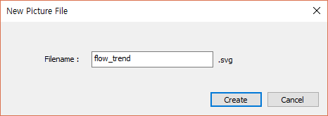

생성된 picture파일 화면에서 배경을 클릭하시고 오른쪽 속성창을 확인합니다. 속성창의 윗 부분에 4개의 아이콘이 있는 것을 확인할 수 있습니다. 이 중에서 V모양의 아이콘을 클릭합니다.

그러면 아래와 같은 창이 나옵니다.

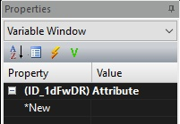

여기서 picture파일의 지역변수를 생성할 수 있습니다. 생성 방법은 다음과 같습니다.

1\) New라고 표시된 속성에서 드롭다운 메뉴의 &lt;Add Variable&gt;항목을 선택한다.

2\) 변수 생성창에서 변수의 타입\(필수\), 이름\(필수\), 시작 값\(필수\), 설명\(선택\)을 입력하고 Accept버튼을 클릭합니다.

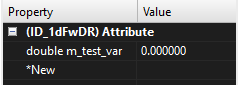  
생성 완료된 화면

변수가 생성 되었다면 변수 값을 속성창의 4개 아이콘중 번개 모양의 아이콘을 선택하여 아래와 같은 창을 띄웁니다.

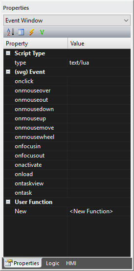

위의 창에서 Script Type의 type속성을 text/javascript로 변경하고, ontaskview항목을 추가해줍니다.

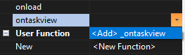

스크립트 편집 창이 뜨면 다음과 같이 입력합니다.

\(생성했던 변수이름\) = Math.floor\(Math.random\(\) \* 500\);

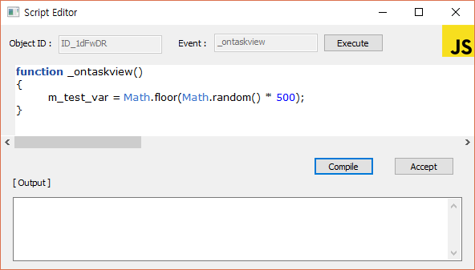

입력을 완료하고 Compile 버튼이나 Accept버튼을 클릭하여 스크립트를 등록 하여 줍니다.

여기까지 완료하셨으면 값이 변화 하는지 확인해봅니다.

실시간 변수 값 변경 확인 방법

이제 picture화면에 차트를 새로 생성합니다. 차트가 생성되면 상단 리본메뉴의 Add Data항목을 열어 줍니다.

series1의 속성에서 variable 속성에 위에서 생성한 변수의 이름을 넣어 줍니다. \(※주의 : 변수의 이름이 틀리면 값이 들어오지 않거나 원하는 변수의 값이 들어오지 않을 수 있습니다.\)

여기까지 완료하면 상단 리본메뉴에서 Home-&gt;Run을 클릭하여 스크립트를 실행하여 줍니다. 차트의 그래프가 그려지는지 확인합니다.

그래프가 너무 촘촘히 나온다면 차트의 duration값을 60 또는 120으로 설정하시면 됩니다.

## **3. 차트 객체를 Logic객체로 만들어서 사용하기**

---

Logic 파일 생성과 Logic객체 이용방법은[LOGIC 프로그래밍, HMI라이브러리 인터페이스 방법](http://enuspace.tistory.com/entry/enuSpace-for-mars-tutorial6)에서 확인 하시기 바랍니다.

우선 Project Explorer에서 Logic라이브러리 파일을 생성하고, Logic Node를 생성합니다.

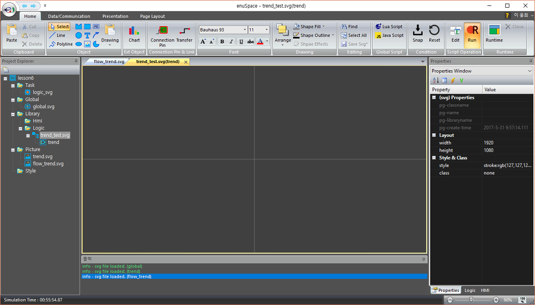

시작과정을 모두 완료한 상태

먼저 리본메뉴의 Home-&gt;Connection Pin을 생성합니다. Pin의 속성을 다음과 같이 설정합니다.

`name = input          
var-type = double`

설정이 완료되면 차트를 생성하여 속성을 변경해 줍니다.

`title-visible = hidden          
legend-visible = hidden          
xaxis-visible = hidden          
yaxis-visible = hidden          
fill-opacity = 0          
duration = 30          
auto-scale = off`

위와 같이 모두 변경 하였다면 차트의 크기를 줄여 줍니다\(줄이지 않으셔도 무방합니다.\). 대략 밑의 그림 정도로 줄여 주시면 됩니다.

이제 차트를 선택클릭하고 리본메뉴의 Add Data항목을 클릭하여 series속성변경 창을 열고 속성을 다음과같이 변경합니다.

variable = pin의 이름\(name속성\)

위 과정을 모두 완료 한뒤 라이브러리를 저장해 줍니다.

2번에서 만들었던 picture를 열어줍니다.

여기에 방금 만든 Logic차트를 생성하여 줍니다.

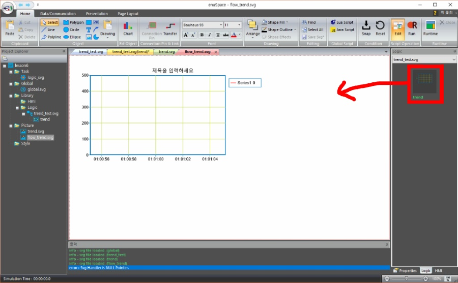

생성이 완료되면 Logic차트에 ID값을 입력하여 줍니다. 입력이 완료 되면 배경을 클릭하고 스크립트를 편집합니다.

위 과정이 모두 완료 되면 리본 메뉴의 Run을 눌러 동작하는지 확인합니다.

# 팝업 차트 사용하기

---

팝업 차트를 사용하기 위해서는 두가지 방법이 있습니다.

**1. DB에 등록된 변수를 이용하여 팝업 차트로 보기**

**2. 현재 생성되어 있는 Logic객체의 데이터를 이용하여 팝업차트 이용하기**

**3. Logic객체의 데이터를 모아서 팝업차트 만들기**

주의 할 점은 2번 방법의 경우 Logic객체에 Pin객체나 지역변수가 생성되어 있어야 합니다.

3번 방법은 여러개의 데이터를 한데 묶어서 볼 수 있다는 장점이 있습니다.

## **1. DB에 등록된 변수를 이용하기**

우선 DB에 변수를 등록 해야합니다. 위에서 우리가 만들어놓은 지역변수를 등록하여 팝업차트를 만들어 봅시다.

먼저 리본메뉴의 Data/Communcation탭으로 이동합니다. 그리고 DB Show라는 버튼을 클릭합니다.

DB TABLE 다이얼로그가 나타나면 상단의 DB그림에 G가 써져있는 버튼을 클릭합니다. 그 뒤 나타나는 창의 내용은  
**"해당 버튼을 누르고 계속 진행하면 기존에 생성되어 있던 데이터들이 모두 지워집니다. 그리고 글로벌 변수와 로직 객체의 변수들을 데이터 베이스에 재생성합니다. 계속하시겠습니까?"**라는 내용입니다.

여러분은 처음 생성하는 것일테니 아마도 전부 비어있을 겁니다. 그러므로 걱정하지 마시고 예를 눌러주시면 됩니다.

지금까지 제대로 따라오셨다면 아래와 같은 화면이 나타납니다. DB TABLE창을 닫지 않고, 리본메뉴에서 Run버튼을 눌러 변수의 값을 변화 시켜 줍니다.

DB TABLE창에서 팝업차트에서 보고 싶은 변수를 오른쪽 클릭하거나 'Ctrl+클릭' 또는 'Shift+클릭' 또는 '드래그'로 다중선택 하여 오른쪽위의 버튼을 클릭합니다.

생성된 팝업 차트를 확인합니다.

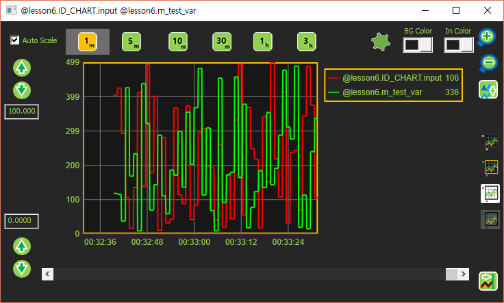

## **2. 현재 생성되어 있는 Logic객체의 데이터를 이용하여 팝업차트 이용하기**

다시 picture 화면으로 돌아가서 Logic차트를 더블 클릭합니다.

아래와 같은 창이 나타나면

팝업 차트로 보고싶은 변수를 마우스 오른클릭하여 팝업 차트를 실행합니다.

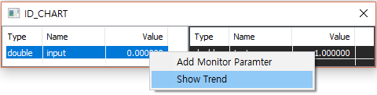

**3. Logic객체의 데이터를 모아서 팝업차트 만들기**

데이터를 한데 모아 사용하기 위해서 테이블 기능을 이용합니다. 리본메뉴의 Presentation-&gt;New Table버튼을 클릭합니다.

위와 같은 창이 나오면 Logic차트를 더블 클릭하여 아래와 같은 창을 다시 엽니다.

Table 창과 Logic변수 창이 모두 띄워져 있으면 Logic변수 창의 변수를 마우스 오른쪽 클릭하여 Add Monitor Paramiter를 선택합니다.

그리고 Table 창에 해당 변수가 추가되었는지 확인합니다.  
※변수는 하나의 객체에서 여러 개를 추가할 수 있고, 다른 Logic객체에서도 추가할 수 있습니다.

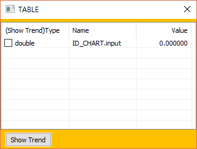

여기서 팝업 차트를 띄우기 위해서 변수의 왼쪽에 체크박스를 체크 해줍니다.  
※선택해야할 변수가 여러개라면 모두 체크해줍니다.

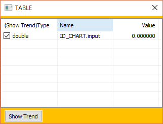

이후 Show Trend 버튼을 클릭합니다. \(그리고 Run상태가 아닐경우 Run버튼을 클릭해줍니다.\)

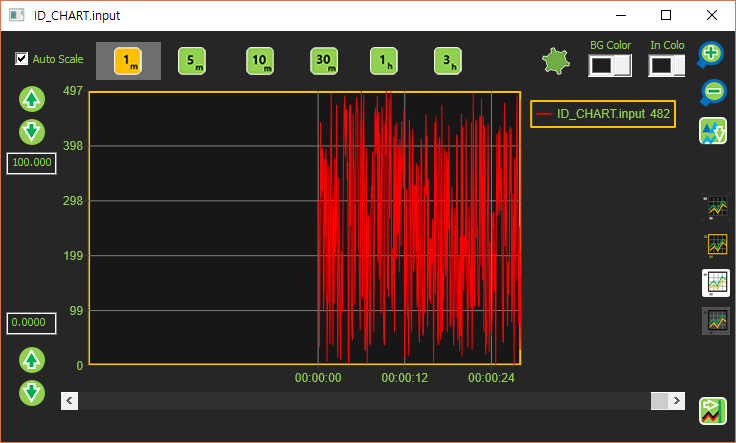

팝업 차트가 정상적으로 돌아가는지 확인합니다.

