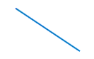

# line



---

라인 객체에 대하여 설명합니다. enuSpace는 SVG의 포맷을 이용하며, 확장된 속성 정보를 포함하고 있습니다.

[https://www.w3schools.com/graphics/svg\_line.asp](https://www.w3schools.com/graphics/svg_line.asp)

## Properties

아래의 테이블의 속성정보는 스크립트상에서 연계되는 속성 이름과 데이터 타입정보 입니다.

| Property | Type | Description | Value |
| :--- | :--- | :--- | :--- |
| visibility | bool | 객체의 visibility 속성 | true, false |
| lock | bool | 객체의 잠금 속성 | true, false |
| stroke | string | 객체의 라인 색상 속성 | "rgb\(0,0,0\)", "\#000000" |
| stroke\_opacity | float | 객체의 라인 투명도 속성 | 0~1 |
| stroke\_linecap | string | 객체의 [linecap](https://www.w3schools.com/graphics/svg_stroking.asp)의 속성 | "butt", "round", "square" |
| stroke\_linejoin | string | 객체의 linejoin의 속성 | "miter", "round", "bevel" |
| stroke\_dasharray | string | 객체의 [dasharray](https://www.w3schools.com/graphics/svg_stroking.asp)의 속성 | "1 1 1" |
| pg\_begin\_arrow\_type | string | 확장 : 시작화살표 모양 속성 | "none", "arrow", "line arrow", "stealth arrow", "diamond", "circle" |
| pg\_begin\_arrow\_size | float | 확장 : 시작 화살표의 사이즈 속성 | value |
| pg\_begin\_arraow\_span | string | 확장 : 시작 화살표의 크기 속성 | "small1", "small2", "small3", "medium1", "medium2", "medium3", "large1", "large2", large3" |
| pg\_end\_arrow\_type | string | 확장 : 끝화살표 모양 속성 | "none", "arrow", "line arrow", "stealth arrow", "diamond", "circle" |
| pg\_end\_arrow\_size | float | 확장 : 끝화살표의 사이즈 속성 | value |
| pg\_begin\_arrow\_span | string | 확장 : 끝화살표의 크기 속성 | "small1", "small2", "small3", "medium1", "medium2", "medium3", "large1", "large2", large3" |
| x1 | float | 라인 시작 x좌표 | value |
| y1 | float | 라인 시작 y좌표 | value |
| x2 | float | 라인 끝 x좌표 | value |
| y2 | float | 라인 끝 y좌표 | value |
| translate\_x | float | 객체의 x축 이동 | value |
| translate\_y | float | 객체의 y축 이동 | value |
| scale\_x | float | 객체의 x 스케일 | value |
| scale\_y | float | 객체의 y 스케일 | value |
| center\_x | float | 객체의 x 센터 설정 | value |
| center\_y | float | 객체의 y 센터 설정 | value |

## Script Example

스크립트는 lua스크립트와 javascript를 이용하여 적용할 수 있습니다.

객체의 속성을 설정하는 방법에는 직접 객체의 변수에 접근하여 적용하는 방법과 [SetAttribute](./enusscriptapi_setattribute.md.md)함수를 통하여 적용할 수 있습니다. 직접 변수에 접근하고자 할 경우에는 위 테이블의 속성이름을 통하여 접근을 수행합니다.

SetAttribute함수는 전역기반의 함수로 객체의 이름과 속성을 조합하여 값을 설정합니다. 스크립트를 SVG노드에서 추가하였을 경우에는 해당객체의 ID와 속성을 통하여 스크립트를 작성합니다.

### lua Script

lua Script \(객체내부의 onmousedown 함수에서의 구현한 예시\)

```lua
function _onmousedown()

    --TODO Add your lua script code here
    y1 = y1 + 1
    x1 = 100
    SetAttribute("ID_LINE.x1", "100")        

    visibility = false                                -- 변수에 직접 접근하여 값을 할당
    SetAttribute("ID_LINE.visibility", "hidden")      -- SetAttribute 함수를 이용할 경우, 원본 SVG 속성값을 이용

    -- SetAttribute 함수 수행시 원본 속성이름을 지정
    SetAttribute("ID_LINE.pg-begin-arrow-type", "arrow")  
end
```

lua Script \(SVG의 onmousedown 함수에서의 구현한 예시\)

```lua
function _onmousedown()

    --TODO Add your lua script code here
    ID_LINE.y1 = ID_LINE.y1 + 1
    ID_LINE.x1 = 100
    SetAttribute("ID_LINE.x1", "100")

    ID_LINE.visibility = false
    SetAttribute("ID_LINE.visibility", "hidden") -- SetAttribute 함수를 이용할 경우, 원본 SVG 속성값을 이용
end
```

### javascript

javascript를 이용하여 적용하였을 경우, 웹 랜더러를 이용하여 동적 웹 가시화가 가능합니다.

javascript \(객체내부의 onmousedown 함수에서의 구현한 예시\)

```js
function _onmousedown()
{    
    //TODO Add your javascript code here
    y1 = y1 + 1;
    x1 = 100;
    SetAttribute("ID_LINE.x1", "100");

    visibility = false;
    SetAttribute("ID_LINE.visibility", "hidden");
}
```

## enuSpace의 속성 윈도우

enuSpace 스튜디오를 통하여 객체의 편집 및 속성정보를 확인할 수 있습니다.


## SVG Tag 예시

객체의 내부에 추가된 스크립트와 SVG루트에 추가된 스크립트는 아래 스크립트 예시와 같이 적용됩니다.

```xml
<?xml version="1.0" encoding="UTF-16"?>
<svg
    id="ID_1evI63"
    stroke="rgb(0,119,189)"
    stroke-opacity="1.00"
    stroke-width="1.00"
    transform="translate(0.00,0.00) rotate(0.00) scale(1.0000, 1.0000)"
    pg-xcenter="0.00"
    pg-ycenter="0.00"
    onmousedown="_onmousedown()"
    style="stroke:rgb(127,127,127);stroke-opacity:1.00;stroke-width:2.00;stroke-dasharray:1,1,1;"
    enuspace-version="3.0.3.0"
    xmlns="http://www.w3.org/2000/svg"
    xmlns:xlink="http://www.w3.org/1999/xlink"
    pg-create-time="2018-3-12 7:42:15.486"
    width="1920"
    height="1080"
>
    <script
        id="ID_1evIva"
        type="text/lua"
    >
            <![CDATA[
function _onmousedown()
    ID_LINE.y1 = ID_LINE.y1 + 1
    ID_LINE.x1 = 100
    SetAttribute("ID_LINE.x1", "100")
    ID_LINE.visibility = false
    SetAttribute("ID_LINE.visibility", "hidden")    
end]]>
    </script>
    <line
        id="ID_LINE"
        visibility="hidden"
        stroke="rgb(0,119,189)"
        stroke-opacity="1.00"
        stroke-width="2.00"
        transform="translate(308.00,223.00) rotate(0.00) scale(1.0000, 1.0000)"
        pg-xcenter="0.00"
        pg-ycenter="0.00"
        stroke-linecap="butt"
         stroke-linejoin="miter"
         onmousedown="_onmousedown()"
        x1="100.00"
        x2="211.00"
        y1="20.00"
        y2="-2.00"
        pg-begin-arrow-type="none"
        pg-begin-arrow-size="5.00"
        pg-begin-arrow-angle="60.00"
        pg-begin-arrow-span="medium2"
        pg-end-arrow-type="none"
        pg-end-arrow-size="5.00"
        pg-end-arrow-angle="60.00"
        pg-end-arrow-span="medium2"
    >
        <script
            id="ID_1evICC"
            type="text/lua"
        >
                <![CDATA[
function _onmousedown()
    y1 = y1 + 1
    x1 = 100
    SetAttribute("ID_LINE.x1", "100")
    visibility = false
    SetAttribute("ID_LINE.visibility", "hidden")
end]]>
        </script>
    </line>
</svg>
```

## 


