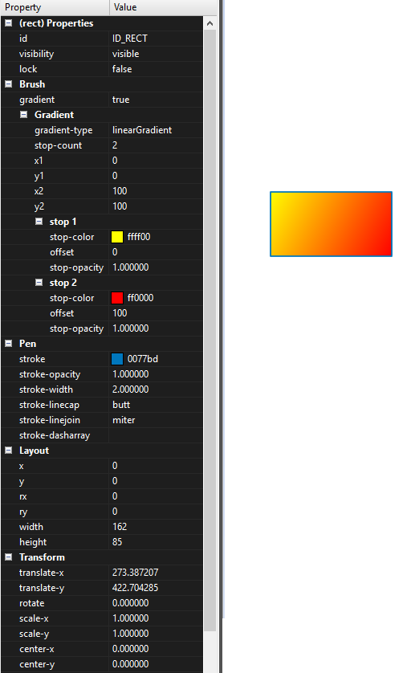

# rect


---

사각형 객체에 대하여 설명합니다. enuSpace는 SVG의 포맷을 이용하며, 확장된 속성 정보를 포함하고 있습니다.

[https://www.w3schools.com/graphics/svg\_rect.asp](https://www.w3schools.com/graphics/svg_rect.asp)

## Properties

아래의 테이블의 속성정보는 스크립트상에서 연계되는 속성 이름과 데이터 타입정보 입니다.

| Property | Type | Description | Value |
| :--- | :--- | :--- | :--- |
| visibility | bool | 객체의 visibility 속성 | true, false |
| lock | bool | 객체의 잠금 속성 | true, false |
| gradient | bool | 그라디언트 설정 속성 | true, false |
| fill | string | 객체의 브러쉬 색상 속성 | "rgb\(0,0,0\)", "\#000000" |
| fill\_opacity | float | 객체의 브러쉬 투명도 속성 | 0~1 |
| stroke | string | 객체의 라인 색상 속성 | "rgb\(0,0,0\)", "\#000000" |
| stroke\_opacity | float | 객체의 라인 투명도 속성 | 0~1 |
| stroke\_linecap | string | 객체의 [linecap](https://www.w3schools.com/graphics/svg_stroking.asp)의 속성 | "butt", "round", "square" |
| stroke\_linejoin | string | 객체의 linejoin의 속성 | "miter", "round", "bevel" |
| stroke\_dasharray | string | 객체의 [dasharray](https://www.w3schools.com/graphics/svg_stroking.asp)의 속성 | "1 1 1" |
| x | float | 객체의 x위치 속성 | value |
| y | float | 객체의 y위치 속성 | value |
| rx | float | 객체의 x축 라운드 속성 | value |
| ry | float | 객체의 y축 라운드 속성 | value |
| width | float | 객체의 넓이 속성 | value |
| height | float | 객체의 높이 속성 | value 라운드 |
| translate\_x | float | 객체의 x축 이동 | value |
| translate\_y | float | 객체의 y축 이동 | value |
| scale\_x | float | 객체의 x 스케일 | value |
| scale\_y | float | 객체의 y 스케일 | value |
| center\_x | float | 객체의 x 센터 설정 | value |
| center\_y | float | 객체의 y 센터 설정 | value |

#### gradient - true \(optional\)

[https://www.w3schools.com/graphics/svg\_grad\_linear.asp](https://www.w3schools.com/graphics/svg_grad_linear.asp)

| Property | Type | Description | Value |
| :--- | :--- | :--- | :--- |
| gradient\_type | string | 그라디언트 타입 속성 | "linearGradient", "radialGradient" |
| stop\_count | int | 그라디언트 색상 개수 | value |
| x1 | float | 그라디언트 x1값 | value |
| y1 | float | 그라디언트 y1값 | value |
| x2 | float | 그라디언트 x2값 | value |
| y2 | float | 그라디언트 y2값 | value |
| stop1 |  |  |  |
| stop\_color | string | 그라디언트 색상 | "rgb\(0,0,0", "\#000000" |
| offset | float | 그라디언트 위치 값 | value |
| stop\_opacity | float | 그라디언트 투명도 | 0~1 |
| stop2   .... |  |  |  |

## Script Example

스크립트는 lua스크립트와 javascript를 이용하여 적용할 수 있습니다.

객체의 속성을 설정하는 방법에는 직접 객체의 변수에 접근하여 적용하는 방법과 [SetAttribute](./enusscriptapi_setattribute.md.md)함수를 통하여 적용할 수 있습니다. 직접 변수에 접근하고자 할 경우에는 위 테이블의 속성이름을 통하여 접근을 수행합니다.

SetAttribute함수는 전역기반의 함수로 객체의 이름과 속성을 조합하여 값을 설정합니다. 스크립트를 SVG노드에서 추가하였을 경우에는 해당객체의 ID와 속성을 통하여 스크립트를 작성합니다.

### lua Script

lua Script \(객체내부의 onmousedown 함수에서의 구현한 예시\)

```lua
function _onmousedown()

    --TODO Add your lua script code here
    width = width + 1
    -- or SetAttribute("ID_RECT.width ", "10")        

end
```

lua Script \(SVG의 onmousedown 함수에서의 구현한 예시\)

```lua
function _onmousedown()

    --TODO Add your lua script code here
    ID_RECT.width = ID_RECT.width + 1
    -- or SetAttribute("ID_RECT.rx", "10") 
end
```

### javascript

javascript를 이용하여 적용하였을 경우, 웹 랜더러를 이용하여 동적 웹 가시화가 가능합니다.

javascript \(객체내부의 onmousedown 함수에서의 구현한 예시\)

```js
function _onmousedown()
{    
    //TODO Add your javascript code here
    width = width + 1;

    // gradient 속성 변경.
    gradient.stop1.offset = gradient.stop1.offset + 1;
    if (gradient.stop1.offset>100)
    {
        gradient.stop1.offset = 0;
    }
}
```

## enuSpace의 속성 윈도우

enuSpace 스튜디오를 통하여 객체의 편집 및 속성정보를 확인할 수 있습니다.



## SVG Tag 예시

객체의 내부에 추가된 스크립트 예시

```xml
<?xml version="1.0" encoding="UTF-16"?>
<svg
    id="ID_1evI63"
    stroke="rgb(0,119,189)"
    stroke-opacity="1.00"
    stroke-width="1.00"
    transform="translate(0.00,0.00) rotate(0.00) scale(1.0000, 1.0000)"
    pg-xcenter="0.00"
    pg-ycenter="0.00"
    style="stroke:rgb(127,127,127);stroke-opacity:1.00;stroke-width:2.00;stroke-dasharray:1,1,1;"
    enuspace-version="3.0.3.0"
    xmlns="http://www.w3.org/2000/svg"
    xmlns:xlink="http://www.w3.org/1999/xlink"
    width="1920"
    height="1080"
>
    <linearGradient id="ID_RECT_GRAD" x1="0.00" y1="0.00" x2="100.00" y2="100.00">
        <stop offset="16.00" style="stop-color:rgb(255,255,0);stop-opacity:1.00"/>
        <stop offset="100.00" style="stop-color:rgb(255,0,0);stop-opacity:1.00"/>
    </linearGradient>
    <rect
        id="ID_RECT"
        stroke="rgb(0,119,189)"
        stroke-opacity="1.00"
        stroke-width="2.00"
        transform="translate(273.39,422.70) rotate(0.00) scale(1.0000, 1.0000)"
        pg-xcenter="0.00"
        pg-ycenter="0.00"
        stroke-linecap="butt"
         stroke-linejoin="miter"
         x="0.00"
        y="0.00"
        width="165.01"
        height="85.83"
        rx="13.00"
        ry="0.00"
        fill="url(#ID_RECT_GRAD)"
        fill-opacity="1.00"
    >
        <script
            id="ID_1evdS8"
            type="text/javascript"
        >
                <![CDATA[function _ontaskview()
{
    width = width + 1;

    // gradient 속성 변경.
    gradient.stop1.offset = gradient.stop1.offset + 1;
    if (gradient.stop1.offset>100)
    {
        gradient.stop1.offset = 0;
    }
}]]>
        </script>
    </rect>
</svg>
```

## 


