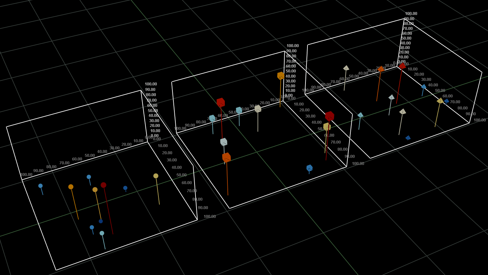
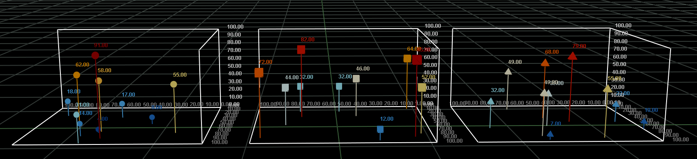

# 3d scatter chart


---

3d scatter chart 객체에 대하여 설명합니다. enuSpace는 OpenGl엔진을 이용합니다.

## 3d scatter chart Properties

아래의 테이블의 속성정보는 스크립트상에서 연계되는 속성 이름과 데이터 타입정보 입니다.

| Property | Type | Description | Value |
| :--- | :--- | :--- | :--- |
| diffuseColor | string | 객체의 color 속성 | "rgb\(0,0,0\)", "\#000000" |
| emissiveColor | string | 객체의 발광 color 속성 | "rgb\(0,0,0\)", "\#000000" |
| specularColor | string | 객체의 highlight color 속성 | "rgb\(0,0,0\)", "\#000000" |
| ambientlntensity | float | 객체의 라인 투명도 속성 | 0~1 |
| shininess | float | 객체표면의 광택의 강도 | 0~1 |
| transparency | float | 객체의 투명도 속성 | value |
| translation\_x | double | 객체의 X축 위치 | value |
| translation\_y | double | 객체의 Y축 위치 | value |
| translation\_z | double | 객체의 Z축 위치 | value |
| rotation\_x | float | 객체의 X축 회전값 | value |
| rotation\_y | float | 객체의 Y축 회전값 | value |
| rotation\_z | float | 객체의 Z축 회전값 | value |
| scale\_x | float | 객체의 X 확대율 | value |
| scale\_y | float | 객체의 Y 확대율 | value |
| scale\_z | float | 객체의 Z 확대울 | value |
| center\_x | float | 객체의 X축 중앙점 | value |
| center\_y | float | 객체의 Y축 중앙점 | value |
| center\_z | float | 객체의 Z축 중앙점 | value |
| solid | bool | 면 채우기 | true, false |
| size\_x | float | 객체의 x축 크기 | value |
| size\_y | float | 객체의 y축 크기 | value |
| height | float | 객체의 z축 크기 | value |
| grid\_visible | bool | grid 표시를 결정한다 | visible, hidden |
| outline\_visible | bool | 외곽선표시를 결정한다 | visible, hidden |
| xyaxis\_visible | bool | x,y축 라벨 표시를 결정한다 | visible, hidden |
| zaxis\_visible | bool | z축 라벨 표시를 결정한다 | visible, hidden |
| axis\_x\_min | float | x축의 최소 값 | value |
| axis\_x\_max | float | x축의 최대 값 | value |
| axis\_y\_min | float | y축의 최소 값 | value |
| axis\_y\_max | float | y축의 최대 값 | value |
| axis\_z\_min | float | z축의 최소 값 | value |
| axis\_z\_max | float | z축의 최대 값 | value |

## 3d series Properties

| Property | Type | Description | Value |
| :--- | :--- | :--- | :--- |
| id | string | 시리즈 id | value |
| type | string | 시리즈의 종류 | point, stem, bar |
| symbol | string | 심볼의 종류 | none, point, rect, triangle |
| symbol\_color | string | 심볼의 색상 | rgb\(0,0,0\) or \#ffffff |
| symbol\_opacity | float | 심볼의 투명도 | 0~1 |
| symbol\_size | float | 심볼의 사이즈 | value |
| label\_visible | bool | 라베값 디스플레이 여부 | true, false |
| data\_format | string | 시리즈 데이터 포맷정보 | xyz, xyzw, xyzl |
| elevationType | string | 데이터 가시화 방법 | none, color, volume, color+volume |
| minElevation | float | 데이터 가시화 최소값 | value |
| maxElevation | float | 데이터 가시화 최대값 | value |
| colorElevation | string | 데이터 가시화 색상표 | rgb\(10,50,120\);rgb\(15,75,165\) |
| volumeElevation | string | 데이터 가시화 볼륨 사이즈 | 2,5 |

ScatterChart엘리먼트 하위에는 Series엘리먼트를 포함한다. Series엘리먼트는 데이터를 가시화하기 위한 데이터 값 및 속성을 값을 갖는다. 

Series의 type은 point, stem, bar를 설정한다. 

point : 데이터의 정보를 점 형태로 표현

stem : 데이터의 정보를 z축방향의 라인을 이용하여 표현

bar : 데이터의 정보를 사각형 바를 이용하여 표현


symbol의 속성은 none, point, rect, triangle에 대하여 설정할 수 있다.

심볼의 색상, 사이즈, 투명도를 설정할 수 있다.



labelvisible의 속성은 데이터를 심볼상단에 표시한다. label\_visible 속성은 data\_format의 정보와 상관관계를 갖는다.

data\_format의 속성값 xyz로 지정하였을 경우 \(fx, fy, fz\)의 데이터를 구조를 갖는다.

 \[주\] fx, fy, fz의 값은 좌표값이 아닌 데이터 x, y, z의 값이다.

data\_format의 속성값 xyzw로 지정하였을 경우 \(fx, fy, fz, fw\)의 데이터를 구조를 갖는다.

data\_format의 속성값 xyzl로 지정하였을 경우 \(fx, fy, fz, label\)의 데이터를 구조를 갖는다.

label\_visible의 true로 설정하였을 경우, data\_format이 xyzw로 설정시 fw의 값을 디스플레이한다. 만약 xyzl의 데이터 포맷인 경우에는 입력데이터의 라벨정보를 디스플레이한다.



elevationType의 속성값에 따라 색상표현 및 심볼의 볼륨 사이즈를 지정한다. 총 4가지의 타입을 지정할 수 있다.

none : 시리즈의 기본 속성을 따라 데이터를 가시화한다.

color : 사이즈 정보는 기본 속성이 적용되며, 색상값은 minElevation, maxElevation, colorElevation의 지정값에 따라 가시화한다.

volume : 색상값은 기본 속성이 적용되며, 볼륨의 사이즈 정보 minElevation, maxElevation, volumeElevation의 정보에 따라서 가시화한다.

color+volume : 색상값은 minElevation, maxElevation, colorElevation의 지정값에 따라 가시화되며, 볼륨의 사이즈 정보 minElevation, maxElevation, volumeElevation의 정보에 따라서 가시화한다.

## Script Example

스크립트는 lua스크립트와 javascript를 이용하여 적용할 수 있습니다.

객체의 속성을 설정하는 방법에는 직접 객체의 변수에 접근하여 적용하는 방법이 있습니다. 직접 변수에 접근하고자 할 경우에는 위 테이블의 속성이름을 통하여 접근을 수행합니다.

스크립트를 X3D노드에서 추가하였을 경우에는 해당객체의 ID와 속성을 통하여 스크립트를 작성합니다.

### lua Script

```lua
function _onmousedown()

    --TODO Add your lua script code here
    Series1.data = "(37,9,67,67);(5,0,91,91);(27,27,58,58);(69,83,72,72);(48,20,74,74);(46,45,94,94);(74,10,59,59);(38,73,60,60);(57,36,15,15);(22,42,80,80)"
    Series1.type = "stem"
end
```

```lua
function _onmousedown()

    --TODO Add your lua script code here
    ID_CHART.Series1.data = "(37,9,67,67);(5,0,91,91);(27,27,58,58);(69,83,72,72);(48,20,74,74);(46,45,94,94);(74,10,59,59);(38,73,60,60);(57,36,15,15);(22,42,80,80)"
    ID_CHART.Series1.type = "bar"
end
```

### javascript

```js
function _onmousedown()
{    
    //TODO Add your javascript code here
    var data = "(37,9,67,67);(5,0,91,91);(27,27,58,58);(69,83,72,72);(48,20,74,74);(46,45,94,94);(74,10,59,59);(38,73,60,60);(57,36,15,15);(22,42,80,80)";
    ID_CHART.Series1.data = data;
    ID_CHART.Series1.type = "stem";    
}
```

## enuSpace의 속성 윈도우

enuSpace 스튜디오를 통하여 객체의 편집 및 속성정보를 확인할 수 있습니다.

## X3D Tag 예시

객체의 내부에 추가된 스크립트와 x3d루트에 추가된 스크립트는 아래 스크립트 예시와 같이 적용됩니다.

```xml
<?xml version="1.0" encoding="UTF-16" ?>
<x3d
>
    <script
        type="text/lua"
    >
            <![CDATA[function _onmousedown()

    --TODO Add your lua script code here
    ID_CHART.Series1.data = "(37,9,67,67);(5,0,91,91);(27,27,58,58);(69,83,72,72);(48,20,74,74);(46,45,94,94);(74,10,59,59);(38,73,60,60);(57,36,15,15);(22,42,80,80)"
    ID_CHART.Series1.type = "bar"
end]]>
    </script>
    <Scene
    >
        <Transform
            rotation="0.000000,0.000000,0.000000"
            scaleOrientation="0.000000,0.000000,1.000000,0.000000"
            translation="-50.000000,-50.000000,2.000000"
        >
            <Shape
                id="ID_CHART"
            >
                <script
                    type="text/lua"
                >
                        <![CDATA[function _onmousedown()

    --TODO Add your lua script code here
    Series1.data = "(37,9,67,67);(5,0,91,91);(27,27,58,58);(69,83,72,72);(48,20,74,74);(46,45,94,94);(74,10,59,59);(38,73,60,60);(57,36,15,15);(22,42,80,80)"
    Series1.type = "stem"
end]]>
                </script>
                <Appearance
                >
                    <Material
                        ambientIntensity="0.200000"
                        shininess="0.200000"
                        transparency="1.000000"
                        diffuseColor="0.800000,0.800000,0.800000"
                        emissiveColor="0.000000,0.000000,0.000000"
                        specularColor="0.000000,0.000000,0.000000"
                    >
                    </Material>
                </Appearance>
                <ScatterChart
                    size="100.000000,100.000000"
                    height="100.000000"
                    grid_visible="hidden"
                    outline_visible="visible"
                    xyaxis_visible="visible"
                    zaxis_visible="visible"
                    axis_x_min="0.000000"
                    axis_x_max="100.000000"
                    axis_y_min="0.000000"
                    axis_y_max="100.000000"
                    axis_z_min="0.000000"
                    axis_z_max="100.000000"
                >
                    <Series
                        id="Series1"
                        type="bar"
                        symbol="point"
                        symbol-color="rgb(255,0,0)"
                        symbol-opacity="0.800000"
                        symbol-size="5"
                        label-visible="visible"
                        format="xyzw"
                        elevationType="color+volume"
                        minElevation="0.000000"
                        maxElevation="100.000000"
                        colorElevation="rgb(10,50,120);rgb(15,75,165);rgb(30,110,200);rgb(60,160,240);rgb(80,180,250);rgb(130,210,255);rgb(160,240,255);rgb(200,250,255);rgb(230,255,255);rgb(255,250,220);rgb(255,232,120);rgb(255,192,60);rgb(255,160,0);rgb(255,96,0);rgb(255,50,0);rgb(225,20,0);rgb(192,0,0);rgb(165,0,0)"
                        volumeElevation="5,10"
                        data="(37,9,67,67);(5,0,91,91);(27,27,58,58);(69,83,72,72);(48,20,74,74);(46,45,94,94);(74,10,59,59);(38,73,60,60);(57,36,15,15);(22,42,80,80)"
                    >
                    </Series>
                    <Series
                        id="Series2"
                        type="point"
                        symbol="point"
                        symbol-color="rgb(0,255,0)"
                        symbol-opacity="0.800000"
                        symbol-size="7"
                        label-visible="hidden"
                        format="xyzw"
                        elevationType="none"
                        minElevation="0.000000"
                        maxElevation="100.000000"
                        colorElevation="rgb(10,50,120);rgb(15,75,165);rgb(30,110,200);rgb(60,160,240);rgb(80,180,250);rgb(130,210,255);rgb(160,240,255);rgb(200,250,255);rgb(230,255,255);rgb(255,250,220);rgb(255,232,120);rgb(255,192,60);rgb(255,160,0);rgb(255,96,0);rgb(255,50,0);rgb(225,20,0);rgb(192,0,0);rgb(165,0,0)"
                        volumeElevation="5,10"
                        data="(51,98,75,75);(34,16,65,65);(49,6,69,69);(50,14,94,94);(14,90,69,69);(30,42,7,7);(96,68,15,15);(87,82,58,58);(19,17,81,81);(47,15,50,50)"
                    >
                    </Series>
                </ScatterChart>
            </Shape>
        </Transform>
    </Scene>
</x3d>
```


