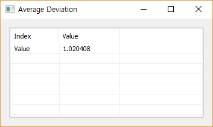

# AveDev

Ensor.AveDev\(Ensor\* pEnsor\)

#### Parameters

* Ensor\* pEnsor

Ensor.new\(\) 함수등에 의해 만들어진 포인터를 입력합니다.

#### Return Value

Ensor\* pRetEnsor : 엘리먼트의 갯수가 1인 Ensor\*를 반환합니다.

#### Remarks

데이터포인트에서 데이터포인트들의 평균을 뺀 값을 절대값을 취하여 더하고 데이터 포인트의 수로 나눈값을 반환합니다.


#### Examples

```lua
function MathEquation()
     local ensor_x = ensor.new("{4,5,6,7,5,4,3}")
     local ensor_y = ensor.AveDev(ensor_x)
     ensor.Table(ensor_y)
 end
```

#### Result



