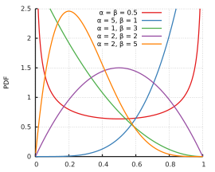
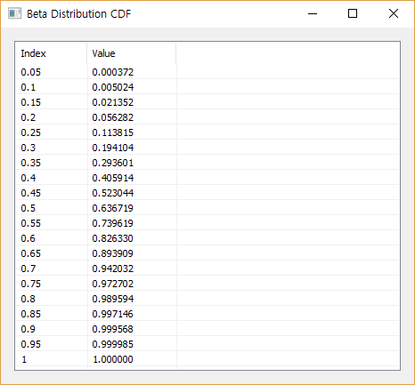
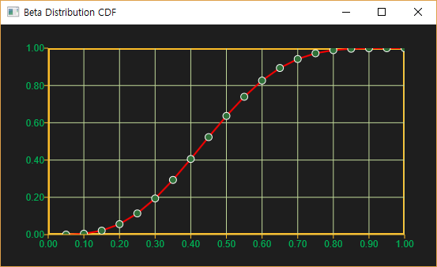
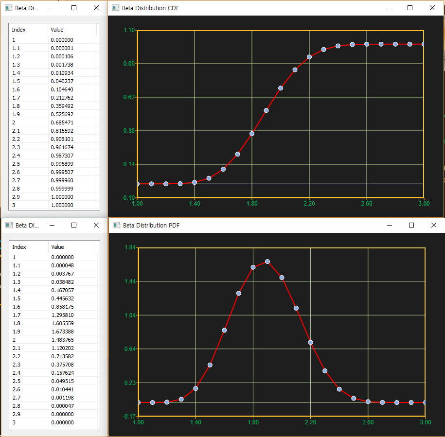

# BetaDist

Ensor.BetaDist\(Ensor\* pEnsor, double alpha,double beta,bool cumulative \)

Ensor.BetaDist\(Ensor\* pEnsor, double alpha,double beta,bool cumulative,double A,double B \)

#### Parameters

* Ensor\* pEnsor

Ensor.new\(\) 함수등에 의해 만들어진 포인터를 입력합니다.

* double alpha

베타 분포의 alpha 값을 입력합니다.

* double beta

베타 분포의 beta 값을 입력합니다.

* bool cumulative 

cumulative  : true 이면 누적분포값을 반환합니다.

cumulative  : false이면 ,확률 밀도값을 반환합니다.

* double A

A : Low Limit 값을 입력합니다. 없으면 0으로 설정됩니다.

* double B

B : High Limit 값을 입력합니다. 없으면 1로 설정됩니다.

#### Return Value

Ensor\* pRetEnsor : pEnsor의 엘리먼트에 맞는 갯수만큼 계산된 Ensor\*를 반환합니다.

#### Remarks

* **PDF**




* **CDF**


#### Examples1

```lua
function MathEquation()
     local ensor_x = ensor.new("{0.05,0.1,0.15,0.2,0.25,0.3,0.35,0.4,0.45,0.5,0.55,0.6,0.65,0.7,0.75,0.8,0.85,0.9,0.95,1.0}")
     local ensor_y = ensor.BetaDist(ensor_x,4,5,false)
     local ensor_y2 = ensor.BetaDist(ensor_x,4,5,true)

     ensor.Plot(ensor_x, ensor_y)
     ensor.Plot(ensor_x, ensor_y2)
     ensor.Table(ensor_y)
      ensor.Table(ensor_y2)
end
```

#### Result






#### Examples2

```lua
function MathEquation()
     local ensor_x = ensor.new("{1.0,1.1,1.2,1.3,1.4,1.5,1.6,1.7,1.8,1.9,2.0,2.1,2.2,2.3,2.4,2.5,2.6,2.7,2.8,2.9,3.0}")
     local ensor_y = ensor.BetaDist(ensor_x,8,10,false,1,3)
     local ensor_y2 = ensor.BetaDist(ensor_x,8,10,true,1,3)

     ensor.Plot(ensor_x, ensor_y)
     ensor.Plot(ensor_x, ensor_y2)
     ensor.Table(ensor_y)
      ensor.Table(ensor_y2)
end
```

#### Result



