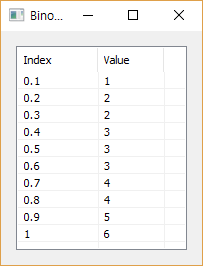

# BinomInv

Ensor.BinomInv\(Ensor\* pEnsor1, int nTrial, double succesP \)

#### Parameters

* Ensor\* pEnsor1

Ensor.new\(\) 함수등에 의해 만들어진 포인터를 입력합니다\(기준확률 : 0 &lt;= p &lt;= 1\).

* int nTrial

nTrial 값을 입력합니다\(시도회수\)

* double succesP

모집단의 성공확률 succesP 값을 입력합니다.

#### Return Value

Ensor\* pRetEnsor : pEnsor의 엘리먼트에 맞는 갯수만큼 계산된 Ensor\*를 반환합니다.

#### Remarks

각 시도에서 성공확률이 succesP인 모집단에서 nTrial회수만큼 시도를 했을 때 pEnsor1 의 성공 누적에 달하는 성공회수를 구합니다.

* **CDF**


#### Examples1

```lua
function MathEquation()
     local ensor_x = ensor.new("{0.1,0.2,0.3,0.4,0.5,0.6,0.7,0.8,0.9,1.0}")
     local ensor_y = ensor.BinomInv(ensor_x,6,0.5)

     ensor.Plot(ensor_x, ensor_y)
     ensor.Table(ensor_y)
end
```

#### Result



