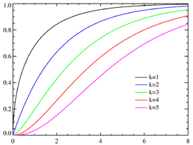

# ChisqDist

Ensor.ChisqDist\(Ensor\* pEnsor, int df,bool cumulative \)

#### Parameters

* Ensor\* pEnsor

Ensor.new\(\) 함수등에 의해 만들어진 포인터를 입력합니다.

* int df

자유도\(Degree of Freedom\)값을 입력합니다.

* bool cumulative 

cumulative  : true 이면 누적분포값을 반환합니다.

cumulative  : false이면 ,확률 밀도값을 반환합니다.

#### Return Value

Ensor\* pRetEnsor : pEnsor의 엘리먼트에 맞는 갯수만큼 계산된 Ensor\*를 반환합니다.

#### Remarks

* **PDF**


* **CDF**




#### Examples1

```lua
function MathEquation()
    local ensor_x = ensor.new("{0.5,1,1.5,2,2.5,3,3.5,4,4.5,5}")
    local ensor_y = ensor.ChisqDist(ensor_x,3,false)
    local ensor_y1 = ensor.ChisqDist(ensor_x,3,true)

    ensor.Table(ensor_y)
    ensor.Table(ensor_y1)
end
```

#### Result


