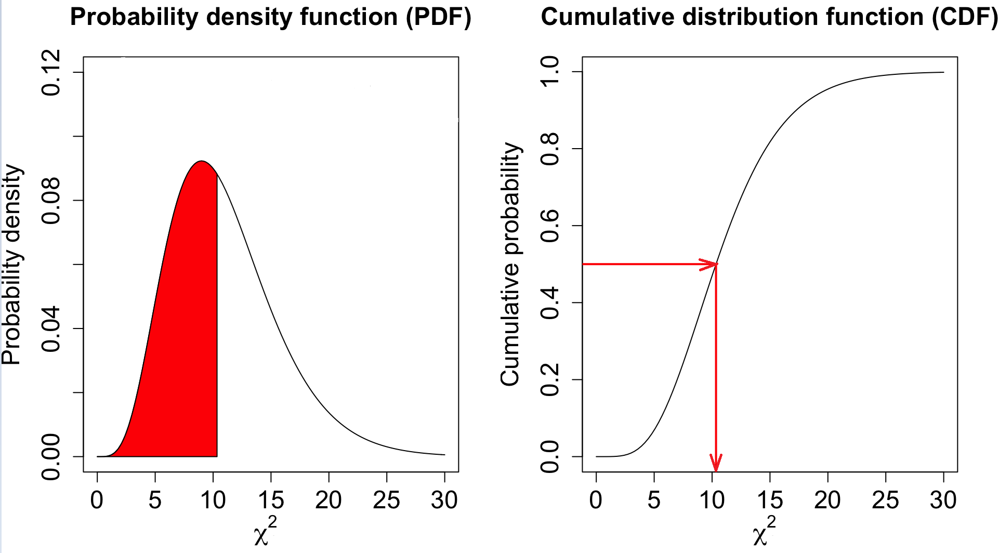

# ChisqInv

Ensor.ChisqInv\(Ensor\* pEnsor, int df\)

#### Parameters

* Ensor\* pEnsor

Ensor.new\(\) 함수등에 의해 만들어진 포인터를 입력합니다\(ChisqDist probability : 0 &lt;= p &lt;= 1\).

* int df

자유도\(Degree of Freedom\)값을 입력합니다.

#### Return Value

Ensor\* pRetEnsor : pEnsor의 엘리먼트에 맞는 갯수만큼 계산된 Ensor\*를 반환합니다.

#### Remarks

* **CDF INVERSE**



#### Examples1

```lua
function MathEquation()
     local ensor_x = ensor.new("{0.05,0.1,0.15,0.2,0.25,0.3,0.35,0.4,0.45,0.5,0.55,0.6,0.65,0.7,0.75,0.8,0.85,0.9,0.95}")
     local ensor_y = ensor.ChisqInv(ensor_x,3)

     ensor.Plot(ensor_x, ensor_y)
     ensor.Table(ensor_y)
end
```

#### Result


