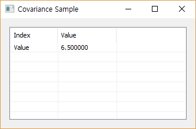

# Devsq

Ensor.Devsq\(Ensor\* pEnsor\)

#### Parameters

* Ensor\* pEnsor1

Ensor.new\(\) 함수등에 의해 만들어진 포인터를 입력합니다\(data\).

#### Return Value

Ensor\* pRetEnsor : 편차의 제곱의 합를 가진 Ensor\*를 반환합니다.

#### Remarks

* Returns the sum of squares of deviations.

* The equation for the sum of squared deviations is:

  

#### Examples1

```lua
function MathEquation()
 	local ensor_x = ensor.new("{4,5,8,7,11,4,3}")
	local ensor_y = ensor.Devsq(ensor_x)

 	ensor.Table(ensor_y)
end
```

#### Result



