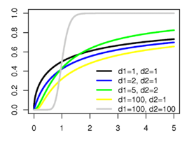

# FDist

Ensor.FDist\(Ensor\* pEnsor, int df1,int df2,bool cumulative \)

#### Parameters

* Ensor\* pEnsor

Ensor.new\(\) 함수등에 의해 만들어진 포인터를 입력합니다.

* int df1

자유도1\(Degrees of Freedom 1\)값을 입력합니다\( numerator\).

* int df2

자유도2\(Degrees of Freedom 2\)값을 입력합니다\(denominator\).

* bool cumulative 

cumulative  : true 이면 누적분포값을 반환합니다.

cumulative  : false이면 ,확률 밀도값을 반환합니다.

#### Return Value

Ensor\* pRetEnsor : pEnsor의 엘리먼트에 맞는 갯수만큼 계산된 Ensor\*를 반환합니다.

#### Remarks

* **PDF**


* **CDF**




#### Examples1

```lua
function MathEquation()
 	local ensor_x = ensor.new("{5,10,15,20,25,30,35,40,45,50}")
	local ensor_y = ensor.FDist(ensor_x,6,4,false)
	local ensor_y2 = ensor.FDist(ensor_x,6,4,true)

	ensor.Plot(ensor_x, ensor_y)
	ensor.Plot(ensor_x, ensor_y2)
 	ensor.Table(ensor_y)
	ensor.Table(ensor_y2)
end	
```

#### Result


