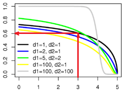
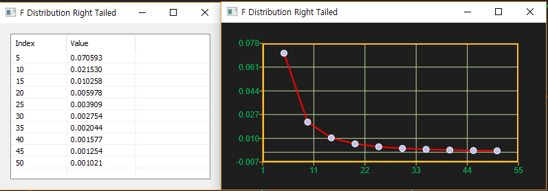

# FDistRt

Ensor.FDistRt\(Ensor\* pEnsor, int df1,int df2 \)

#### Parameters

* Ensor\* pEnsor

Ensor.new\(\) 함수등에 의해 만들어진 포인터를 입력합니다.

* int df1

자유도1\(Degrees of Freedom 1\)값을 입력합니다\( numerator\).

* int df2

자유도2\(Degrees of Freedom 2\)값을 입력합니다\(denominator\).

#### Return Value

Ensor\* pRetEnsor : pEnsor의 엘리먼트에 맞는 갯수만큼 계산된 Ensor\*를 반환합니다.

#### Remarks

* **CDF**

**FDistRt**\(_x, df1, df2_\) = 1 – FDist\(_x, df1, df2,_ true\)



#### Examples1

```lua
function MathEquation()
 	local ensor_x = ensor.new("{5,10,15,20,25,30,35,40,45,50}")
	local ensor_y = ensor.FDistRt(ensor_x,6,4)

	ensor.Plot(ensor_x, ensor_y)
 	ensor.Table(ensor_y)
end	
```

#### Result



