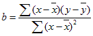

# Forecast

Ensor.Forecast\(Ensor\* pEnsor1, Ensor\* pEnsor2, Ensor\* pEnsor3\)

#### Parameters

* Ensor\* pEnsor1

Ensor.new\(\) 함수등에 의해 만들어진 포인터를 입력합니다\(new x data\).

* Ensor\* pEnsor2

Ensor.new\(\) 함수등에 의해 만들어진 포인터를 입력합니다\(x data\).

* Ensor\* pEnsor3

Ensor.new\(\) 함수등에 의해 만들어진 포인터를 입력합니다\(y data\).

#### Return Value

Ensor\* pRetEnsor : pEnsor2와 pEnsor3에 의해 계산된 선형 트렌드 식에 의해 새로은 x 데이터 pEnsor1엘러먼트를 가지고 계산된 y data가진 Ensor\*를 반환합니다.

#### Remarks

* Returns a value along a linear trend.

* The equation for FORECAST is **a+bx**, where:




and where x and y are the sample means AVERAGE\(x data\) and AVERAGE\(y data\).

#### Examples1

```lua
function MathEquation()
     local ensor_newx = ensor.new("{20,22,24,26,28,30,32,34,36,38,40}")
    local ensor_y = ensor.new("{6,7,9,15,21}")
    local ensor_x = ensor.new("{20,28,31,38,40}")
     local ensor_newy = ensor.Forecast(ensor_newx,ensor_x,ensor_y)

    ensor.Plot(ensor_newx, ensor_newy)
     ensor.Table(ensor_newy)
end
```

#### Result


