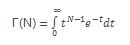
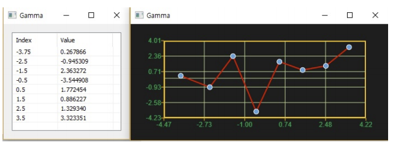

# Gamma

Ensor.Gamma\(Ensor\* pEnsor\)

#### Parameters

* Ensor\* pEnsor

Ensor.new\(\) 함수등에 의해 만들어진 포인터를 입력합니다\(data != 0,negative integer\).

#### Return Value

Ensor\* pRetEnsor : pEnsor의 Gamma 값을 가진  Ensor\*를 반환합니다.

#### Remarks

* equation:



* Г\(N+1\) = N \* Г\(N\)

#### Examples1

```lua
function MathEquation()
 	local ensor_x = ensor.new("{-3.75,-2.5,-1.5,-0.5,0.5,1.5,2.5,3.5,}")
 	local ensor_y = ensor.Gamma(ensor_x)
 
	ensor.Plot(ensor_x, ensor_y)
 	ensor.Table(ensor_y)
end 
```

#### Result



