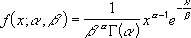
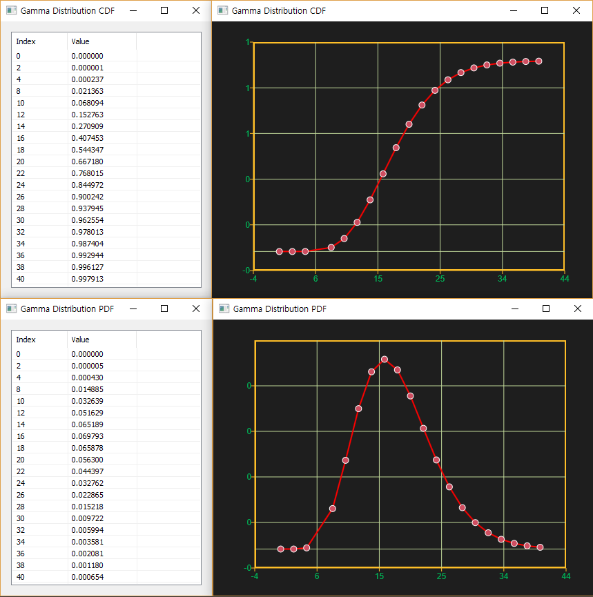

# GammaDist

Ensor.GammaDist\(Ensor\* pEnsor, double alpha,double beta,bool cumulative \)

#### Parameters

* Ensor\* pEnsor

Ensor.new\(\) 함수등에 의해 만들어진 포인터를 입력합니다.

* double alpha

감마 분포의 alpha 값을 입력합니다.

* double beta

감마 분포의 beta 값을 입력합니다.

* bool cumulative 

cumulative  : true 이면 누적분포값을 반환합니다.

cumulative  : false이면 ,확률 밀도값을 반환합니다.

#### Return Value

Ensor\* pRetEnsor : pEnsor의 엘리먼트에 맞는 갯수만큼 계산된 Ensor\*를 반환합니다.

#### Remarks

* **PDF**




* **CDF**


#### Examples1

```lua
function MathEquation()
 	local ensor_x = ensor.new("{0,2,4,8,10,12,14,16,18,20,22,24,26,28,30,32,34,36,38,40}")
	local ensor_y = ensor.GammaDist(ensor_x,9,2,false)
	local ensor_y2 = ensor.GammaDist(ensor_x,9,2,true)

	ensor.Plot(ensor_x, ensor_y)
	ensor.Plot(ensor_x, ensor_y2)
 	ensor.Table(ensor_y)
	ensor.Table(ensor_y2)
end		
```

#### Result



