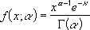
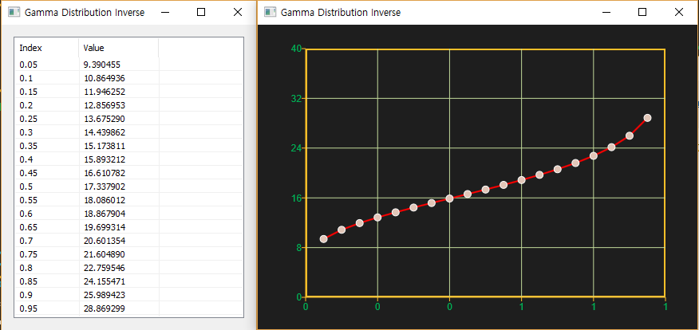

# GammaInv

Ensor.GammaInv\(Ensor\* pEnsor, double alpha,double beta\)

#### Parameters

* Ensor\* pEnsor

Ensor.new\(\) 함수등에 의해 만들어진 포인터를 입력합니다\(0 &lt;= Probability &lt;= 1\).

* double alpha

감마 분포의 alpha 값을 입력합니다.

* double beta

감마 분포의 beta 값을 입력합니다.

#### Return Value

Ensor\* pRetEnsor : pEnsor의 엘리먼트에 맞는 갯수만큼 계산된 Ensor\*를 반환합니다.

#### Remarks

* **CDF**




#### Examples1

```lua
function MathEquation()
     local ensor_x = ensor.new("{0.05,0.1,0.15,0.2,0.25,0.3,0.35,0.4,0.45,0.5,0.55,0.6,0.65,0.7,0.75,0.8,0.85,0.9,0.95,1.0}")
     local ensor_y = ensor.BetaDist(ensor_x,4,5,false)
     local ensor_y2 = ensor.BetaDist(ensor_x,4,5,true)

     ensor.Plot(ensor_x, ensor_y)
     ensor.Plot(ensor_x, ensor_y2)
     ensor.Table(ensor_y)
      ensor.Table(ensor_y2)
end
```

#### Result



