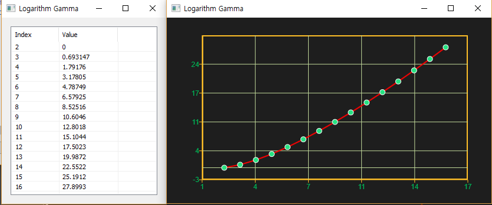

# Gamma

Ensor.Gamma\(Ensor\* pEnsor\)

#### Parameters

* Ensor\* pEnsor

Ensor.new\(\) 함수등에 의해 만들어진 포인터를 입력합니다\(data != 0,negative integer\).

#### Return Value

Ensor\* pRetEnsor : pEnsor의 Gamma Logathm값을 가진  Ensor\*를 반환합니다.

#### Remarks

* equation:


#### Examples

```lua
function MathEquation()
     local ensor_x = ensor.new("{1,2,3,4,5,6,7,8,9,10}")
    local ensor_y = ensor.GammaLn(ensor_x)

    ensor.Plot(ensor_x, ensor_y)
     ensor.Table(ensor_y)
end
```

#### Result



