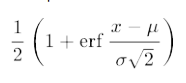
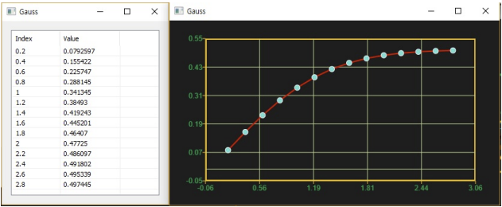

# Gauss

Ensor.Gauss\(Ensor\* pEnsor\)

#### Parameters

* Ensor\* pEnsor

Ensor.new\(\) 함수등에 의해 만들어진 포인터를 입력합니다.

#### Return Value

Ensor\* pRetEnsor : pEnsor의 Gauss 값을 가진  Ensor\*를 반환합니다.

#### Remarks

* equation:



at μ=0, σ=1

#### Examples1

```lua
function MathEquation()
     local ensor_x = ensor.new("{0.2,0.4,0.6,0.8,1.0,1.2,1.4,1.6,1.8,2.0,2.2,2.4,2.6,2.8}")
    local ensor_y = ensor.Gauss(ensor_x)

    ensor.Plot(ensor_x, ensor_y)
     ensor.Table(ensor_y)
end
```

#### Result



