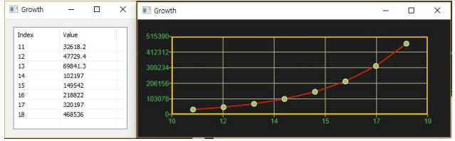

# Growth

Ensor.Growth\(Ensor\* pEnsor1, Ensor\* pEnsor2, Ensor\* pEnsor3\)

Ensor.Growth\(Ensor\* pEnsor1, Ensor\* pEnsor2, double dValue\)

#### Parameters

* Ensor\* pEnsor1

Ensor.new\(\) 함수등에 의해 만들어진 포인터를 입력합니다\(x data\).

* Ensor\* pEnsor2

Ensor.new\(\) 함수등에 의해 만들어진 포인터를 입력합니다\(y data\).

* Ensor\* pEnsor3

Ensor.new\(\) 함수등에 의해 만들어진 포인터를 입력합니다\(new x data\).

* Ensor\* dValue

Predict x scalar value.

#### Return Value

Ensor\* pRetEnsor : pEnsor2와 pEnsor3에 의해 계산된 Exponential 트렌드 식에 의해 새로은 x 데이터 pEnsor1엘러먼트를 가지고 계산된 y data가진 Ensor\*를 반환합니다.

#### Remarks

* Returns a value along a exponential trend.

* The equation for Growth is y = bm^x.

#### Examples1

```lua
function MathEquation()
	local ensor_x = ensor.new("{11,12,13,14,15,16}")
  	local ensor_y = ensor.new("{33100,47300,69000,102000,150000,220000}")
	local ensor_x_n = ensor.new("{11,12,13,14,15,16,17,18}")
	local ensor_y_n = ensor.Growth(ensor_x,ensor_x2,ensor_x3)

	ensor.Plot(ensor_x_n, ensor_y_n)
 	ensor.Table(ensor_y)
end
```

#### Result



