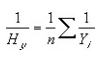
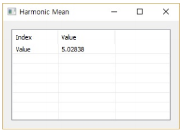

# HarMean

Ensor.HarMean\(Ensor\* pEnsor\)

Ensor.HarMean\(Ensor\* pEnsor,"column" or "row"\)

#### Parameters

* Ensor\* pEnsor

Ensor.new\(\) 함수등에 의해 만들어진 포인터를 입력합니다.

#### Return Value

Ensor\* pRetEnsor : 엘리먼트의 갯수가 1인 Ensor\*를 반환합니다.

#### Remarks

데이터포인트에서 데이터포인트들의 조평균을 반환합니다.

* The equation for the harmonic mean is:



#### Examples

```lua
function MathEquation()
 	local ensor_y = ensor.new("{4,5,8,7,11,4,3}")
	local ensor_y_m = ensor.HarMean(ensor_y)

 	ensor.Table(ensor_y_m)
end
```

#### Result



