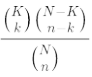
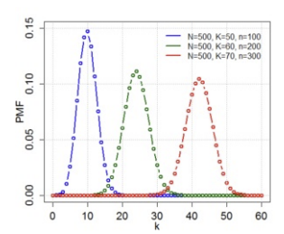
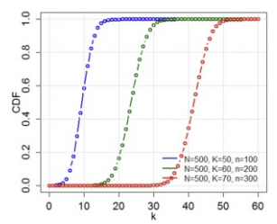
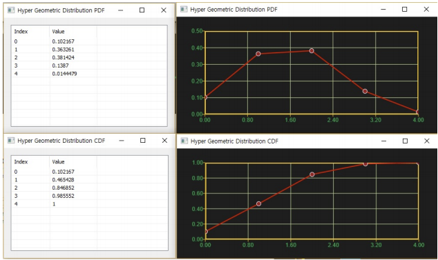

# HypGeomDist

Ensor.HypGeomDist\(Ensor\* pEnsor, int nSample,double succesK,int nPop,bool cumulative \)

#### Parameters

* Ensor\* pEnsor

Ensor.new\(\) 함수등에 의해 만들어진 포인터를 입력합니다\(sample 성공회수\).

* int  nSample

nSample 값을 입력합니다\(sample 크기\).

* double succesK

succesK 값을 입력합니다\(population  성공회수\).

* int nPop 

nPop 값을 입력합니다\(population 크기\).

* bool cumulative 

cumulative  : true 이면 누적분포값을 반환합니다.

cumulative  : false이면 ,확률 밀도값을 반환합니다.

#### Return Value

Ensor\* pRetEnsor : pEnsor의 엘리먼트에 맞는 갯수만큼 계산된 Ensor\*를 반환합니다.

#### Remarks

각 시도에서 nPop 크기의 성공확률이 succesP인 모집단에서 nTrial회수만큼 시도를 했을 때 pEnsor만큼 성공할 확률을 구합니다.

* The equation for the hypergeometric distribution is:



where:

k = sample\_s

n = number\_sample

K = population\_s

N = number\_pop



* CDF


where

is the generalized hypergeometric function



#### Examples1

```lua
function MathEquation()
 	local ensor_x = ensor.new("{0,1,2,3,4}")
	local ensor_y = ensor.HypGeomDist(ensor_x,4,8,20,false)
	local ensor_y2 = ensor.HypGeomDist(ensor_x,4,8,20,true)
	
	ensor.Plot(ensor_x, ensor_y)
	ensor.Plot(ensor_x, ensor_y2)
 	ensor.Table(ensor_y)
	ensor.Table(ensor_y2)
end
```

#### Result



