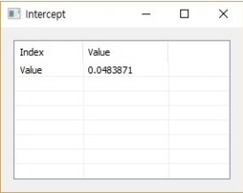

# Intercept

Ensor.Intercept\(Ensor\* pEnsor1, Ensor\* pEnsor2\)

#### Parameters

* Ensor\* pEnsor1

Ensor.new\(\) 함수등에 의해 만들어진 포인터를 입력합니다\(x data\).

* Ensor\* pEnsor2

Ensor.new\(\) 함수등에 의해 만들어진 포인터를 입력합니다\(y data\).

#### Return Value

Ensor\* pRetEnsor : x,y data에 의한 선형 함수의 y 절편을 가진 Ensor\*를 반환합니다.

#### Remarks

* The equation for the intercept of the regression line, a, is:


where the slope, b, is calculated as:


and where x and y are the sample means Average\(known\_x's\) and Average\(known\_y's\).


#### Examples1

```lua
function MathEquation()
	local ensor_y = ensor.new("{2,3,9,1,8}")
  	local ensor_x = ensor.new("{6,5,11,7,5}")
	local ensor_z = ensor.Intercept(ensor_x,ensor_y)

 	ensor.Table(ensor_z)
end
```

#### Result



