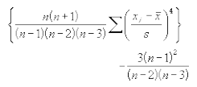

# Kurt

Ensor.Kurt\(Ensor\* pEnsor\)

#### Parameters

* Ensor\* pEnsor

Ensor.new\(\) 함수등에 의해 만들어진 포인터를 입력합니다.

#### Return Value

Ensor\* pRetEnsor : pEnsor data set의 kurtosis 값을 가진 Ensor\*를 반환합니다.

#### Remarks

* Kurtosis is defined as:



where s is the sample standard deviation.

#### Examples1

```lua
function MathEquation()
	local ensor_x = ensor.new("{3,4,5,2,3,4,5,6,4,7}")
	local ensor_y = ensor.Kurt(ensor_x)

 	ensor.Table(ensor_y)
end
```

#### Result


