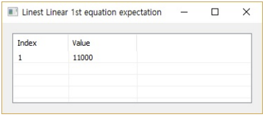
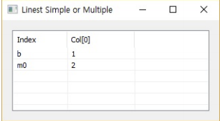
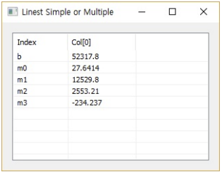
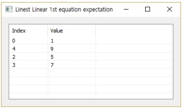

# Linest

Ensor.Linest\(Ensor\* pEnsor1, Ensor\* pEnsor2,double value\)

Ensor.Linest\(Ensor\* pEnsor1, Ensor\* pEnsor2,string option\)

Ensor.Linest\(Ensor\* pEnsor1, Ensor\* pEnsor2,Ensor\* pEnsor3\)

#### Parameters

* Ensor\* pEnsor1

Ensor.new\(\) 함수등에 의해 만들어진 포인터를 입력합니다\(x data\).

* Ensor\* pEnsor2

Ensor.new\(\) 함수등에 의해 만들어진 포인터를 입력합니다\(y data\).

* string option

string으로 option을 입력합니다\("Simple","Polynomial","Multiple"\).

* double value

예측할 x 데이터를 스칼라로 입력합니다.

* Ensor\* pEnsor3

예측할 x 데이터를 Ensor\*로 입력합니다.

#### Return Value

Ensor\* pRetEnsor : 3번째 argument에 의해 구해진 결과값를 가진 Ensor\*를 반환합니다.

#### Remarks

* double value

y = a\*x +b 로 x, y데이터을 가지고 b와a 구해서 value에 해당하는 y값을 예측하여 단일값을 가진 pEnsor\*를 반환합니다.

* string option

"Simple" : y = b + m0\*x의 식으로 x, y데이터을 가지고 b와m0를 구해서 반환합니다.

"Multiple" : y = b +   m0\*x1 + m1\*x2 + ...로 x 데이터의  column 수에 해당하는 수 만큼의 mn 값을 구하여 반환합니다.

"Polynomial = 차수" : y = b + m0\*x + m1\*x^2 + ...로 x 데이터의  차수에 해당하는 수 만큼의 mn 값을 구하여 반환합니다.

* Ensor\* pEnsor3

y = a\*x +b 로 x, y데이터을 가지고 b와a 구해서 pEnsor3의 값에 해당하는 y값을 예측하여 pEnsor3의 element 갯수 만큼의 값을 가진 pEnsor\*를 반환합니다.

#### Examples1

```lua
function MathEquation()
	local ensor_x = ensor.new("{1,2,3,4,5,6}")
	local ensor_y = ensor.new("{3100,4500,4400,5400,7500,8100}")
	local ensor_z = ensor.Linest(ensor_x,ensor_y,9)

 	ensor.Table(ensor_z)
end
```

#### Result1

Ensor.Linest\(Ensor\* pEnsor1, Ensor\* pEnsor2,double value\)에 대한 결과입니다.



#### Examples2

```lua
function MathEquation()
	local ensor_x = ensor.new("{0,4,2,3}")
	local ensor_y = ensor.new("{1,9,5,7}")	
	local ensor_z = ensor.Linest(ensor_x,ensor_y,"Simple")

 	ensor.Table(ensor_z)
end	
```

#### Result2

Ensor.Linest\(Ensor\* pEnsor1, Ensor\* pEnsor2, "Simple"\)에 대한 결과입니다.



#### Examples3

```lua
function MathEquation()
 	local ensor_x = ensor.new("/{/{2310,2,2,20},{2333,2,2,12},{2356,3,1.5,33},{2379,3,2,43},{2402,2,3,53},{2425,4,2,23},{2448,2,1.5,99},{2471,2,2,34},{2494,3,3,23},{2517,4,4,55},{2540,2,3,22/}/}")
  	local ensor_y = ensor.new("{142000,144000,151000,150000,139000,169000,126000,142900,163000,169000,149000}")
	local ensor_z = ensor.Linest(ensor_x,ensor_y,"Multiple")

 	ensor.Table(ensor_z)
end	
```

#### Result3

Ensor.Linest\(Ensor\* pEnsor1, Ensor\* pEnsor2, "Multiple"\)에 대한 결과입니다.



#### Examples4

```lua
function MathEquation()
	local ensor_x = ensor.new("{1,2,3,4}")
	local ensor_y = ensor.new("{7,24,71,160}")	
	local ensor_z = ensor.Linest(ensor_x,ensor_y,"Polynomial = 3")

 	ensor.Table(ensor_z)
end	
```

#### Result4

Ensor.Linest\(Ensor\* pEnsor1, Ensor\* pEnsor2, "Polynomial"\)에 대한 결과입니다.


#### Examples5

```lua
function MathEquation()
	local ensor_x = ensor.new("{0,4,2,3}")
	local ensor_y = ensor.new("{1,9,5,7}")	
	local ensor_z = ensor.Linest(ensor_x,ensor_y,ensor_x)

 	ensor.Table(ensor_z)
end	
```

#### Result5

Ensor.Linest\(Ensor\* pEnsor1, Ensor\* pEnsor2,Ensor\* pEnsor3\)에 대한 결과입니다.



